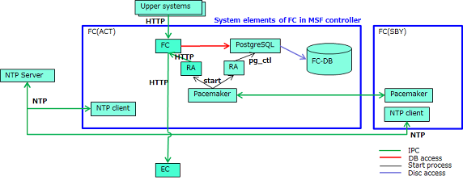

# Fabric Controller(FC)

Fabric Controller(FC) is one of the software components of Multi-Service Fabric(MSF).

FC provides the Network abstraction, managememt and the Northbound REST API interfaces.

**Network Abstraciton**

FC manages multiple switches as one cluster. FC newly defined "edge-point" as a logical ID that uniquely identified in a cluster. By associating the edge-point with the physical-IF and/or LAG-IF, FC is able to control the network with only abstracted edge-point information. Therefore, upper systems don't need to know the configuration of the network.

**Network Management**
- Overlay Network Control: upper systems can easily create a VPN by selecting edge-point and the slice network to be assigned.
- Underlay Network Control: By managing Underlay network topology using the newly defined "Logical-port", FC is able to control without regard to  the IF type(Tengig, Hundred,..) and/or switch vendor, model. Association of logical-port and edge-point is done by FC, and that of Logical-port and phisical-IF is done by EC.
- Visualization of Network topology: FC has a logical network topology.

## System Elements

- FC: Main process
- NTP client: Communicate with NTP server and sync clock
- Pacemaker: Middleware that controls redundancy function
- PostgreSQL: Database server
- RA: Exe by Pacemaker to control the redundancy
- FC-DB: Storage for Database

## How to use
- installation
    - [Simplified installation procedure](doc/fabric_controller_auto_installation_manual.md)
- build
    - [building manual](doc/fabric_controller_building_guide.md)
- API guide
    - [API index](API/controller_api_index.md)
    - [Notification index](API/notification/controller_api_notification_index.md)
    - [API list](API/controller_api.xlsx)
    - [notification list](API/notification/controller_api_notification.xlsx)

## Hardware
The following conditions are the minimum operation environment.

| item | Configuraiton |
| ---- | ---- |
| OS | CentOS7.2 x86_64 |
| CPU | 2 Core or more |
| memory | 1G or more |
| NIC | 1 port or more |

## License
**Apache 2.0**. See `LICENSE`.

## support
If you have any questions, or find any bug, let us know with GitHub issues, or please contact `msf-contact [at] lab.ntt.co.jp`.

## project
This project is a part of [Multi-Service Fabric](https://github.com/multi-service-fabric/).
