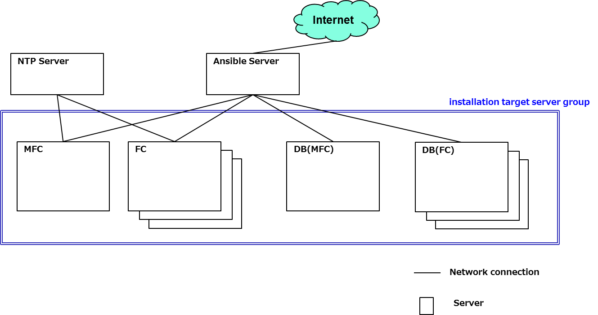

# MSF Controller (FC) Building Guide
Version 1.2

March.26.2019

Copyright (c) 2019 NTT corp. All Rights Reserved.

## Table of Contents

- [*1. Overview*](#1-overview)

- [*2. Restrictions*](#2-restrictions)

- [*3. Preconditions*](#3-preconditions)

- [*4. List of software to be installed*](#4-list-of-software-to-be-installed)

  - [*4.1 List of software to be installed on target servers*](#41-list-of-software-to-be-installed-on-target-servers)

  - [*4.2 List of software to be installed on Ansible Server*](#42-list-of-software-to-be-installed-on-ansible-server)

- [*5. Installation procedures*](#5-installation-procedures)

  - [*5.1 Download of automatic installation file*](#51-download-of-automatic-installation-file)

  - [*5.2 Change of settings per installation environment and other preparations*](#52-change-of-settings-per-installation-environment-and-other-preparations)

    - [*5.2.1 Change of settings per installation environment*](#521-change-of-settings-per-installation-environment)

    - [*5.2.2 Other preparations*](#522-other-preparations)

    - [*5.2.3 Execution of the automatic installation file (Ansible Playbook)*](#523-execution-of-the-automatic-installation-file-ansible-playbook)

- [*6. Settings of MSF controller after installation*](#6-settings-of-msf-controller-after-installation)

  - [*6.1 FC settings*](#61-fc-settings)

    - [*6.1.1 Preparation of initial data*](#611-preparation-of-initial-data)

       - [*6.1.1.1 Brief description of FC initial setting Config*](#6111-brief-description-of-fc-initial-setting-config)

       - [*6.1.1.2 Contents of FC initial setting Config*](#6112-contents-of-fc-initial-setting-config)

    - [*6.1.2 Settings during operation*](#612-settings-during-operation)

      - [*6.1.2.1 Brief description of FC system setting Config*](#6121-brief-description-of-fc-system-setting-config)

      - [*6.1.2.2 Contents of FC system setting Config*](#6122-contents-of-fc-system-setting-config)

    - [*6.1.3 Setting during operation (Extension functions)*](#613-setting-during-operation-extension-functions)

      - [*6.1.3.1 Priority routes control management function*](#6131-priority-routes-control-management-function)

        - [*6.1.3.1.1 Brief description of priority routes control management function setting Config*](#61311-brief-description-of-priority-routes-control-management-function-setting-config)

        - [*6.1.3.1.2 Contents of priority routes control management function setting Config*](#61312-contents-of-priority-routes-control-management-function-setting-config)
      
      - [*6.1.3.2 Silent fault detection function*](#6132-silent-fault-detection-function)
        
        - [*6.1.3.2.1 Brief description of silent fault detection function setting Config*](#61321-brief-description-of-silent-fault-detection-function-setting-config)

        - [*6.1.3.2.2 Contents of silent fault detection function setting Config*](#61322-contents-of-silent-fault-detection-function-setting-config)
    
      - [*6.1.3.3 Node OS upgrade function*](#6133-node-os-upgrade-function)

        - [*6.1.3.3.1 Brief description of node OS upgrade function setting Config*](#61331-brief-description-of-node-os-upgrade-function-setting-config)

        - [*6.1.3.3.2 Contents of node OS upgrade function setting Config*](#61332-contents-of-node-os-upgrade-function-setting-config)
     
      - [*6.1.3.4 Controller status notify function*](#6134-controller-status-notify-function)

        - [*6.1.3.4.1 Brief description of controller status notify function setting Config*](#61331-brief-description-of-controller-status-notify-function-setting-config)

        - [*6.1.3.4.2 Contents of controller status notify function setting Config*](#61332-contents-of-controller-status-notify-function-setting-config)

    - [*6.1.4 FC simple startup confirmation*](#614-fc-simple-startup-confirmation)

    - [*6.1.5 Status confirmation with FC startup/shutdown script*](#615-status-confirmation-with-fc-startupshutdown-script)

    - [*6.1.6 FC status confirmation (normal/abnormal)*](#616-fc-status-confirmation-normalabnormal)

    - [*6.1.7 FC status confirmation (normal/abnormal) by using getting information of execution of controller construction*](#617-fc-status-confirmation-normalabnormal-by-using-getting-information-of-execution-of-controller-construction)

- [*7. Redundancy settings*](#7-redundancy-settings)

  - [*7.1 Placement of resource agent*](#71-placement-of-resource-agent)

  - [*7.2 Pacemaker settings*](#72-pacemaker-settings)

    - [*7.2.1 Property settings of cluster*](#721-property-settings-of-cluster)

    - [*7.2.2 Default settings of resource*](#722-default-settings-of-resource)

    - [*7.2.3 Configuration settings of resource*](#723-configuration-settings-of-resource)

    - [*7.2.4 Settings of VIPcheck*](#724-settings-of-vipcheck)

    - [*7.2.5 Settings of resource agent of FC*](#725-settings-of-resource-agent-of-fc)

    - [*7.2.6 Settings of IPaddr2*](#726-settings-of-ipaddr2)

    - [*7.2.7 Settings of diskd*](#727-settings-of-diskd)

    - [*7.2.8 Settings of several constraints*](#728-settings-of-several-constraints)

## Revision History

  |Version  |Date           |Contents     |
  |:--------|:--------------|:------------|
  |1.2      |Mar.26.2019    |Third edition (MSF2018B)|
  |1.1      |Dec.07.2018    |Second edition (MSF2018A)|
  |1.0      |Mar.28.2018    |First edition (MSF2017)|

#### Notice 
MFC(Multi-Fabric Controller) is not supported on Version 1.1 (MSF2018A) and Version 1.2 (MSF2018B). If you use MFC, you have to download of automatic installation file from [MSF2017 (Version 1.0)](https://github.com/multi-service-fabric/fabric-controller/tree/MSF2017) and use it.

## 1. Overview
This manual describes the installation procedures of FC(Fabric Controller) which manages multiple cluster network and single cluster network,respectively.
In this manual, MSF controller (FC) is referred to as "FC" hereinafter.

## 2. Restrictions
- DB (PostgreSQL) client authentication settings of FC cannot be executed with this manual. Edit pg_hba.conf file of PostgreSQL based on the environment.
- Regarding the DB servers for FC, the OS security setting modifications (SELinux, Firewall) cannot be executed with procedures in this manual. Execute the OS security setting modifications based on the environment, if they are required for the connection between DB and FC.

## 3. Preconditions
Figure 3-1 shows the installation preconditions.

  
**Figure 3-1 Preconditions**

- Ansible server is required along with target servers.
- Ansible Server needs to be connected to Internet.
- Installation target server group needs to be connected via ssh from Ansible Server with root user.
- OS of Ansible Server needs to be Linux. (i.e. yum command needs to be available.)\*1

\*1 Cent OS recommended  

## 4. List of software to be installed
### 4.1 List of software to be installed on target servers
Table 4-1 shows the list of software to be installed on each server.

**Table 4-1 List of software to be installed**

|No.|Server        |Software    |Version|
|:--|:-------------|:-----------|:------|
|1  |FC     |Oracle Java    |Oracle JDK 8 Update 101 |
|2  ||Jetty|9.3.11|
|3  ||Gson|2.7|
|4  ||Jersey|2.23.2|
|5  ||Hibernate|5.0.10|
|6  ||SLF4J|1.6.1|
|7  ||Apache Log4j|2.6.2|
|8  ||Apache Commons IO|2.5|
|9  ||Apache Commons Lang|2.6|
|10 ||Apache Commons Collections|3.2.2|
|11 ||JDBC|9.4.1209|
|12 ||Apache Maven|3.5.0|
|13 ||Hipster4j|1.0.1|
|14 ||chrony|Latest|
|15 ||sysstat|Latest|
|16 ||httpd|Latest|
|17 ||Pacemaker|1.1.14-1|
|18 ||Corosync|2.3.5-1|
|19 |DB           |PostgreSQL|9.3|

### 4.2 List of software to be installed on Ansible Server
Table 4-2 shows the list of software to be installed for your reference.

**Table 4-2 List of software to be installed on Ansible Server**

|No.|Server        |Software    |Version|
|:--|:-------------|:-----------|:------|
|1  |Ansible Server|Apache Maven|3.5.0|
|2  ||Oracle Java|Oracle JDK 8 Update 101|

## 5. Installation procedures
Overview of installation procedures is shown below.
1. Download of the automatic installation file (Ansible Playbook)
2. Change of settings per installation environment and preparations
3. Execution of automatic installation file (Ansible Playbook)

### 5.1 Download of automatic installation file
Download the automatic installation file from the following URL and set the file on Ansible Server.
~~~
https://github.com/multi-service-fabric/fabric-controller/raw/master/msf-controller-install.tar.gz-aa
https://github.com/multi-service-fabric/fabric-controller/raw/master/msf-controller-install.tar.gz-ab
~~~

### 5.2 Change of settings per installation environment and other preparations
#### 5.2.1 Change of settings per installation environment
**
The following work is executed on Ansible Server  
The working user is root
**

(1) Decompression of automatic installation file and change to the working directory

~~~shell-session
# cat msf-controller-install.tar.gz-* > msf-controller-install.tar.gz
# tar zxvf msf-controller-install.tar.gz
# cd msf-controller-install
~~~

(2) IP address settings of installation target server

~~~shell-session
# vi inventory/hosts
~~~
 The sample of inventory/hosts is shown below.

~~~bash
[ansible-server]
localhost ansible_connection=local

[msf-controller_fc]
192.168.100.40          # Set the IP address of FC (set IP address of one FC per line in case of installation of several FCs)
192.168.100.50

[fc_db-server]
192.168.100.60          # Set the IP address of DB for FC (Set IP address of one DB for FC per line in case of installation of several DBs for FC)
192.168.100.70

[all:vars]
ansible_connection=paramiko
ansible_ssh_user=root
~~~

(3) Proxy settings of Ansible Server (skip this procedure if the Internet access does not require Proxy)

~~~shell-session
# vi group_vars/ansible-server.yml
~~~
The sample of group_vars/ansible-server.yml is shown below.

~~~bash
proxy_user: "username"             # Modify this based on the environment
proxy_pass: "password"             # Modify this based on the environment
proxy_server: "proxyname.xxx.org"  # Modify this based on the environment
proxy_port: "8080"                 # Modify this based on the environment
~~~

(4) Settings of user information for MSF controller and NTP server on FC Server

~~~shell-session
# vi group_vars/msf-controller_fc.yml
~~~
- The settings are common for all FCs.

The sample of group_vars/msf-controller_fc.yml is shown below.

~~~bash
msf_group_name: "msfctrl"      # Modify this as needed
msf_user_name: "msfctrl"       # Modify this as needed
msf_user_passwd: "msfctrl0123" # Modify this as needed

ntp_server: "aaa.bbb.ntp.org"  # Modify this based on the environment
~~~

(5) Settings of user information for DB, port number for DB connection, DB name for MSF controller, and role to be created on DB for FC (skip this procedure if change from default value is not necessary)

~~~shell-session
# vi group_vars/fc_db-server.yml
~~~
- The settings are common for all FCs.

The sample of group_vars/fc_db-server.yml is shown below.

~~~bash
pg_group_name: "postgres"       # Modify this as needed
pg_user_name: "postgres"        # Modify this as needed
pg_user_passwd: "postgres0123"  # Modify this as needed

pg_port: "5432"                 # Modify this as needed

db_name: "msf_fc"               # Modify this as needed

db_role_user: "msfctrl"         # Modify this as needed
db_role_pass: "msfctrl0123"     # Modify this as needed
~~~

#### 5.2.2 Other preparations
(1) Proxy settings for yum command on Ansible Server (skip this procedure if Internet access does not require Proxy)

~~~shell-session
# vi /etc/yum.conf
~~~
The sample of /etc/yum.conf is as follow.

~~~bash
proxy=http://proxyname.xxx.org:8080   # Modify this based on the environment
proxy_username=username               # Modify this based on the environment
proxy_password=password               # Modify this based on the environment
~~~

(2) Update of yum package

~~~shell-session
# yum -y update
~~~

(3) Install of ansible

~~~shell-session
# yum -y install ansible
~~~

(4) Key creation for ssh authentication

~~~shell-session
# ssh-keygen -t rsa -b 4096
Generating public/private rsa key pair.
Enter file in which to save the key (/root/.ssh/id_rsa):   # Enter
Enter passphrase (empty for no passphrase):                # Enter
Enter same passphrase again:                               # Enter
Your identification has been saved in /root/.ssh/id_rsa.
Your public key has been saved in /root/.ssh/id_rsa.pub.
~~~

- Press the Enter key with no input when you are asked the file name to be stored and passphrase for the ssh authentication key.

(5) Distribution of ssh public key to target servers.

~~~shell-session
# ssh-copy-id -i ~/.ssh/id_rsa.pub root@< server_address >
~~~
- Replace **< server_address >** with IP address of the installation target server.
- Install the ssh public key using the above command on all the installation target servers.

(6) Confirmation of ping communication with the installation target server

~~~shell-session
# ansible < server_address > -i inventory/hosts -m ping

paramiko: The authenticity of host 'server_address' can't be established.
The ssh-rsa key fingerprint is .
Are you sure you want to continue connecting (yes/no)?
yes
server_address | SUCCESS => {
    "changed": false,
    "ping": "pong"
}
~~~
- Replace **< server_address >** with IP address of the installation target server.
- Execute the communication confirmation using the above command to all the installation target servers.
- Confirm the result of the command execution is "SUCCESS".
- Input "yes" in response to the following message for the first connection with the installation target server.

~~~shell-session
Are you sure you want to continue connecting (yes/no)?
~~~

#### 5.2.3 Execution of the automatic installation file (Ansible Playbook)
**
Execute the following work in the working directory.
**

1. Execution of the automatic installation file (Ansible Playbook)

~~~shell-session
# ansible-playbook -i inventory/ msf-controller_install.yml

 ~ Omit ~

PLAY RECAP *******************************************************************************
hostname                  : ok=5    changed=1    unreachable=0    failed=0
~~~

Confirm the result of the execution of the automatic installation file (Ansible Playbook) that is shown on the console is **"failed=0"**.

## 6. Settings of MSF controller after installation
The following sections describe the settings of MSF controller after installation.

### 6.1 FC settings

This section describes the settings of FC.

#### 6.1.1 Preparation of initial data

FC initial setting Config should be edited before the first startup of the FC server.

##### 6.1.1.1 Brief description of FC initial setting Config

FC initial setting Config is shown briefly in the table 6-1.

**Table 6-1 Brief description of FC initial setting Config**

  |No.  |Config file name|Config Name|Location|
  |:----|:---------------|:----------|:-------|
  |1    |fc\_data.xml    |FC initial configuration Config | In "*FC install directory*/conf/"|

##### 6.1.1.2 Contents of FC initial setting Config

This section describes the parameters in FC initial setting Config.  
FC initial setting Config file is in xml format.  
An example of FC initial setting Config is shown below.  
Parameters in FC initial setting Config are summarized in the table 6-2.

**FC initial setting Config**
~~~xml
<?xml version="1.0" encoding="UTF-8" standalone="yes"?>
<dataConf xmlns="http://fc.msf/common/config/type/data">
    <swClustersData>
        <swClusterData>
            <swCluster>
                <swClusterId>1</swClusterId>
                <maxLeafNum>45</maxLeafNum>
                <maxSpineNum>4</maxSpineNum>
                <maxRrNum>2</maxRrNum>
                <spineStartPos>1</spineStartPos>
                <leafStartPos>51</leafStartPos>
                <rrStartPos>101</rrStartPos>
                <fcStartPos>201</fcStartPos>
                <ecStartPos>211</ecStartPos>
                <emStartPos>221</emStartPos>
                <asNum>65000</asNum>
                <ospfArea>10</ospfArea>
                <inchannelStartAddress>1.1.1.1</inchannelStartAddress>
                <outchannelStartAddress>1.1.1.1</outchannelStartAddress>
                <aggregationStartAddress>1.1.1.1</aggregationStartAddress>
                <aggregationAddressPrefix>24</aggregationAddressPrefix>
                <internalLinkNormalIgpCost>100</internalLinkNormalIgpCost>
            </swCluster>
            <rrs>
                <rr>
                    <rrNodeId>1</rrNodeId>
                    <rrRouterId>1.1.1.1</rrRouterId>
                </rr>
                <leafRr>
                    <leafRrSwClusterId>1</leafRrSwClusterId>
                    <leafRrNodeId>1</leafRrNodeId>
                    <leafRrRouterId>1.1.1.1</leafRrRouterId>
                </leafRr>
            </rrs>
        </swClusterData>
    </swClustersData>
</dataConf>
~~~

**Table 6-2 List of parameters in FC initial setting Config**

|Element |FC  |Type |Setting range |Number of elements |Description|
|:-------|:---|:----|:--------------|:------------------|:----------|
|dataConf|M    |-    |-              |1                  |Information of FC initial setting|
|&nbsp;&nbsp;swClustersData|M    |-    |-              |1                  |Information of SW cluster which is managed by FC|
|&nbsp;&nbsp;&nbsp;&nbsp;swClusterData|M    |-    |-              |1                  |Equivalent to information of a SW cluster per an element|
|&nbsp;&nbsp;&nbsp;&nbsp;&nbsp;&nbsp;swCluster|M     |-    |-              |1                  |Information of SW cluster|
|&nbsp;&nbsp;&nbsp;&nbsp;&nbsp;&nbsp;&nbsp;&nbsp;swClusterId|M    |integer|1 - 100|1 |ID of SW cluster|
|&nbsp;&nbsp;&nbsp;&nbsp;&nbsp;&nbsp;&nbsp;&nbsp;maxLeafNum|M    |integer|1 - 1000|1 |Maximum number of Leaves in SW cluster|
|&nbsp;&nbsp;&nbsp;&nbsp;&nbsp;&nbsp;&nbsp;&nbsp;maxSpineNum|M    |integer|1 - 1000|1 |Maximum number of Spines in SW cluster|
|&nbsp;&nbsp;&nbsp;&nbsp;&nbsp;&nbsp;&nbsp;&nbsp;maxRrNum|M    |integer|1 - 1000|1 |Maximum number of RRs in SW cluster|
|&nbsp;&nbsp;&nbsp;&nbsp;&nbsp;&nbsp;&nbsp;&nbsp;spineStartPos|M    |integer|1 - 1000|1 |Starting offset value of management address which is assigned at the time of Spine addition.|
|&nbsp;&nbsp;&nbsp;&nbsp;&nbsp;&nbsp;&nbsp;&nbsp;leafStartPos|M    |integer|1 - 1000|1 |Starting offset value of management address which is assigned at the time of Leaf addition.|
|&nbsp;&nbsp;&nbsp;&nbsp;&nbsp;&nbsp;&nbsp;&nbsp;rrStartPos|M    |integer|1 - 1000|1 |Starting offset of management address which is assigned to RR.|
|&nbsp;&nbsp;&nbsp;&nbsp;&nbsp;&nbsp;&nbsp;&nbsp;fcStartPos|M    |integer|1 - 1000|1 |Starting offset of management address which is assigned to FC.|
|&nbsp;&nbsp;&nbsp;&nbsp;&nbsp;&nbsp;&nbsp;&nbsp;ecStartPos|M    |integer|1 - 1000|1 |Starting offset of management address which is assigned to EC.|
|&nbsp;&nbsp;&nbsp;&nbsp;&nbsp;&nbsp;&nbsp;&nbsp;emStartPos|M    |integer|1 - 1000|1 |Starting offset of management address which is assigned to EM.|
|&nbsp;&nbsp;&nbsp;&nbsp;&nbsp;&nbsp;&nbsp;&nbsp;asNum|M    |integer|0 - 65535|1 |AS number of SW cluster|
|&nbsp;&nbsp;&nbsp;&nbsp;&nbsp;&nbsp;&nbsp;&nbsp;ospfArea|M    |integer|0 - 65535|1 |OSPF area number of SW cluster|
|&nbsp;&nbsp;&nbsp;&nbsp;&nbsp;&nbsp;&nbsp;&nbsp;inchannelStartAddress|M    |string|-|1 |Inchannel starting IP address of SW cluster.  Initiating with starting IP address, an suitable IP address is calculated automatically within MSF controller and is assigned when interface (node) is added.|
|&nbsp;&nbsp;&nbsp;&nbsp;&nbsp;&nbsp;&nbsp;&nbsp;outchannelStartAddress|M    |string|-|1 |Outchannel starting IP address of SW cluster.  Initiating with starting IP address, an suitable IP address is calculated automatically within MSF controller and is assigned when interface (node) is added.|
|&nbsp;&nbsp;&nbsp;&nbsp;&nbsp;&nbsp;&nbsp;&nbsp;aggregationStartAddress|M    |string|-|1 |Aggregation starting IP address.  Starting IP address for aggregation of paths to each node of SW cluster.|
|&nbsp;&nbsp;&nbsp;&nbsp;&nbsp;&nbsp;&nbsp;&nbsp;aggregationAddressPrefix|M    |integer|1 - 32|1 |Aggregation prefix|
|&nbsp;&nbsp;&nbsp;&nbsp;&nbsp;&nbsp;&nbsp;&nbsp;internalLinkNormalIgpCost|M    |integer|1 - 65535|1 |Normal IGP cost of internal link|
|&nbsp;&nbsp;&nbsp;&nbsp;&nbsp;&nbsp;rrs|M    |-|-|1 |RR information of SW cluster|
|&nbsp;&nbsp;&nbsp;&nbsp;&nbsp;&nbsp;&nbsp;&nbsp;rr|O    |-|-|0 and over |RR information|
|&nbsp;&nbsp;&nbsp;&nbsp;&nbsp;&nbsp;&nbsp;&nbsp;&nbsp;&nbsp;rrNodeId|M    |integer|1 - 65535|1|RR node ID of SW cluster|
|&nbsp;&nbsp;&nbsp;&nbsp;&nbsp;&nbsp;&nbsp;&nbsp;&nbsp;&nbsp;rrRouterId|M    |string|-|1|RR router ID of SW cluster|
|&nbsp;&nbsp;&nbsp;&nbsp;&nbsp;&nbsp;&nbsp;&nbsp;leafRr|O    |-|-|0 and over |RR information of Leaf's peer|
|&nbsp;&nbsp;&nbsp;&nbsp;&nbsp;&nbsp;&nbsp;&nbsp;&nbsp;&nbsp;leafRrSwClusterId|M    |integer|1 - 100|1|RR belonging cluster ID of Leaf's peer|
|&nbsp;&nbsp;&nbsp;&nbsp;&nbsp;&nbsp;&nbsp;&nbsp;&nbsp;&nbsp;leafRrNodeId|M    |integer|1 - 65535|1|RR node ID of Leaf's peer|
|&nbsp;&nbsp;&nbsp;&nbsp;&nbsp;&nbsp;&nbsp;&nbsp;&nbsp;&nbsp;leafRrRouterId|M    |string|-|1|RR router ID of Leaf's peer|

\* Legend: M: mandatory O: optional

#### 6.1.2 Settings during operation

This section describes the settings during FC operation. Edit FC system
setting Config while FC is not running. Note that any changes of FC
system setting Config while FC is running cannot be reflected in the
behavior of FC.

##### 6.1.2.1 Brief description of FC system setting Config

The brief description of FC system setting Config is shown in the table 6-3.

**Table 6-3 Brief description of system setting Config**

|No.   |Config file name   |Name of Config             |Location|
|:-----|:------------------|:--------------------------|:-------|
|1     |fc\_system.xml     |FC system setting Config   |In "*FC install directory*/conf/"|

##### 6.1.2.2 Contents of FC system setting Config

This section describes the parameters in FC system setting Config.  
FC system setting Config file is in xml format.  
An example of the FC system setting Config is shown below.  
Parameters in the FC system setting Config are summarized in the table 6-4.

**FC system setting Config**
~~~xml
<?xml version="1.0" encoding="UTF-8" standalone="yes"?>
<systemConf xmlns="http://fc.msf/common/config/type/system">
    <controller>
        <managementIpAddress>0.0.0.0</managementIpAddress>
    </controller>
    <rest>
        <server>
            <listeningAddress>0.0.0.0</listeningAddress>
            <listeningPort>18080</listeningPort>
        </server>
        <client>
            <waitConnectionTimeout>30</waitConnectionTimeout>
            <requestTimeout>600</requestTimeout>
            <responseBufferSize>2</responseBufferSize>
        </client>
        <json>
            <isPrettyPrinting>true</isPrettyPrinting>
            <isSerializeNulls>false</isSerializeNulls>
        </json>
    </rest>
    <slice>
        <l2SlicesMagnificationNum>1</l2SlicesMagnificationNum>
        <l3SlicesMagnificationNum>1</l3SlicesMagnificationNum>
        <l2MaxSlicesNum>100</l2MaxSlicesNum>
        <l3MaxSlicesNum>100</l3MaxSlicesNum>
    </slice>
    <swClustersData>
        <swClusterData>
            <swCluster>
                <swClusterId>1</swClusterId>
                <ecControlAddress>0.0.0.0</ecControlAddress>
                <ecControlPort>18080</ecControlPort>
            </swCluster>
        </swClusterData>
    </swClustersData>
    <status>
        <noticeDestInfo>
            <noticeAddress>1.1.1.1</noticeAddress>
            <noticePort>0</noticePort>
        </noticeDestInfo>
        <noticeRetryNum>5</noticeRetryNum>
        <noticeTimeout>500</noticeTimeout>
        <recvRestRequestUnitTime>3600</recvRestRequestUnitTime>
        <sendRestRequestUnitTime>3600</sendRestRequestUnitTime>
    </status>
    <failure>
        <noticeDestInfo>
            <noticeAddress>1.1.1.1</noticeAddress>
            <noticePort>0</noticePort>
            <isPhysicalUnit>true</isPhysicalUnit>
            <isClusterUnit>true</isClusterUnit>
            <isSliceUnit>true</isSliceUnit>
        </noticeDestInfo>
        <noticeRetryNum>5</noticeRetryNum>
        <noticeTimeout>500</noticeTimeout>
    </failure>
    <traffic>
        <noticeDestInfo>
            <noticeAddress>1.1.1.1</noticeAddress>
            <noticePort>0</noticePort>
            <isPhysicalUnit>true</isPhysicalUnit>
            <isClusterUnit>true</isClusterUnit>
            <isSliceUnit>true</isSliceUnit>
        </noticeDestInfo>
        <noticeRetryNum>5</noticeRetryNum>
        <noticeTimeout>500</noticeTimeout>
        <execCycle>3600</execCycle>
    </traffic>
    <qos>
        <remark_menu>af1</remark_menu>
        <remark_menu>af2</remark_menu>
        <remark_menu>af3</remark_menu>
        <remark_menu>be</remark_menu>
        <remark_menu>packet_color</remark_menu>
    </qos>
    <irb>
        <l3VniVlanIdStartPos>3900</l3VniVlanIdStartPos>
        <l3VniVlanIdEndPos>3999</l3VniVlanIdEndPos>
    </irb>
    <node>
        <lagIfIdStartPos>11</lagIfIdStartPos>
    </node>
</systemConf>
~~~

**Table 6-4 List of parameters in FC system setting Config**

|Element|FC  |Type |Setting range \* |Number of elements |Description|
|:------|:---|:----|:--------------|:------------------|:----------|
|systemConf|M    |-    |-              |1                  |Information of FC system setting|
|&nbsp;&nbsp;controller|M    |-    |-              |1                  |Controller information|
|&nbsp;&nbsp;&nbsp;&nbsp;managementIpAddress|M    |string    |-              |1                  |Management IP address of controller|
|&nbsp;&nbsp;rest|M    |-    |-              |1                  |Information of REST behavior which operates on FC|
|&nbsp;&nbsp;&nbsp;&nbsp;server|M    |-    |-              |1                  |Information of REST server behavior|
|&nbsp;&nbsp;&nbsp;&nbsp;&nbsp;&nbsp;listeningAddress|M    |string|-              |1                  |Address for REST communication|
|&nbsp;&nbsp;&nbsp;&nbsp;&nbsp;&nbsp;listeningPort|M    |integer|0 - 65535|1                  |REST listening port|
|&nbsp;&nbsp;&nbsp;&nbsp;client|M    |-    |-              |1                  |Information of REST client behavior|
|&nbsp;&nbsp;&nbsp;&nbsp;&nbsp;&nbsp;waitConnectionTimeout|M    |integer|0 and over |1                  |REST wait connection timeout (second)|
|&nbsp;&nbsp;&nbsp;&nbsp;&nbsp;&nbsp;requestTimeout|M    |integer|0 and over |1                  |REST request timeout (second)|
|&nbsp;&nbsp;&nbsp;&nbsp;&nbsp;&nbsp;responseBufferSize|M    |integer|1 and over |1                  |Buffer size of received response data for REST request(MB)|
|&nbsp;&nbsp;&nbsp;&nbsp;json|M    |-    |-              |1                  |Information of JSON behavior which is sent and received in REST|
|&nbsp;&nbsp;&nbsp;&nbsp;&nbsp;&nbsp;isPrettyPrinting|M    |boolean|true/false|1                  |Whether JSON data that FC responds to REST request is formatted in such a way of line breaking and indenting or not (true/ false)|
|&nbsp;&nbsp;&nbsp;&nbsp;&nbsp;&nbsp;isSerializeNulls|M    |boolean|true/false|1                  |In case there is a null value in JSON data that FC responds to REST request, whether parameter is described as null or not (true/ false)|
|&nbsp;&nbsp;slice|M    |-    |-              |1                  |Information of slice setting|
|&nbsp;&nbsp;&nbsp;&nbsp;l2SlicesMagnificationNum|M    |integer|1,2 |1                  |Parameter that controls maximum value of assigned L2 slice ID. Assigned range of L2 slice ID is equal to l2MaxSlicesNum multiplied by l2SlicesMagnificationNum. Example 1: If l2MaxSliceNum is 100 and l2SliceMagnificationNum is 1, then assigned range of L2 slice ID is from 1 to 100. Example 2: If l2MaxSliceNum is 100 and l2SliceMagnificationNum is 2, then assigned range of L2 slice ID is from 1 to 200.|
|&nbsp;&nbsp;&nbsp;&nbsp;l3SlicesMagnificationNum|M    |integer|1,2 |1                  |Parameter that controls maximum value of assigned L3 slice ID. Assigned range of L3 slice ID is equal to l3MaxSlicesNum multiplied by l3SlicesMagnificationNum. Example 1: If l3MaxSliceNum is 100 and l3SliceMagnificationNum is 1, then assigned range of L3 slice ID is from 1 to 100. Example 2: If l3MaxSliceNum is 100 and l3SliceMagnificationNum is 2, then assigned range of L3 slice ID is from 1 to 200.|
|&nbsp;&nbsp;&nbsp;&nbsp;l2MaxSlicesNum|M    |integer|1 - 1000 |1                  |Maximum L2 slice number|
|&nbsp;&nbsp;&nbsp;&nbsp;l3MaxSlicesNum|M    |integer|1 - 1000 |1                  |Maximum L3 slice number|
|&nbsp;&nbsp;swClustresData|M    |-    |-              |1                  |Information of SW cluster which is managed by FC|
|&nbsp;&nbsp;&nbsp;&nbsp;swClusterData|M    |- |- |1                  |Equivalent to information of a SW cluster per an element|
|&nbsp;&nbsp;&nbsp;&nbsp;&nbsp;&nbsp;swCluster|M    |- |- |1                  |Information of SW cluster|
|&nbsp;&nbsp;&nbsp;&nbsp;&nbsp;&nbsp;&nbsp;&nbsp;swClusterId|M    |integer|1 - 100|1                  |ID of SW cluster  Set the value of swClusterId of initial setting config to this element.|
|&nbsp;&nbsp;&nbsp;&nbsp;&nbsp;&nbsp;&nbsp;&nbsp;ecControlAddress|M    |string|-|1                  |EC connection address of SW cluster|
|&nbsp;&nbsp;&nbsp;&nbsp;&nbsp;&nbsp;&nbsp;&nbsp;ecControlPort|M    |integer|0 - 65535|1                  |EC connection port number of SW cluster|
|&nbsp;&nbsp;status|M    |-    |-              |1                  |Information of notification destination of system status|
|&nbsp;&nbsp;&nbsp;&nbsp;noticeDestInfo|O    |-    | - |0 and over|Information of notification destination|
|&nbsp;&nbsp;&nbsp;&nbsp;&nbsp;&nbsp;noticeAddress|M    |string |- |1|IP address of notification destination|
|&nbsp;&nbsp;&nbsp;&nbsp;&nbsp;&nbsp;noticePort|M    |integer |0 - 65535 |1|Port number of notification destination|
|&nbsp;&nbsp;&nbsp;&nbsp;noticeRetryNum|M    |integer|0 and over|1|Number of notification retry (times)|
|&nbsp;&nbsp;&nbsp;&nbsp;noticeTimeout|M    |integer|0 and over|1|Interval of notification retry (millisecond)|
|&nbsp;&nbsp;&nbsp;&nbsp;recvRestRequestUnitTime|M    |integer|0 and over|1|Unit time for counting the number of receving REST requests (second)|
|&nbsp;&nbsp;&nbsp;&nbsp;sendRestRequestUnitTime|M    |integer|0 and over|1|Unit time for counting the number of sending REST requests (second)|
|&nbsp;&nbsp;failure|M    |-    |-              |1                  |Information of notification destination of failure|
|&nbsp;&nbsp;&nbsp;&nbsp;noticeDestInfo|O    |-|-|0 and over|Information of notification destination|
|&nbsp;&nbsp;&nbsp;&nbsp;&nbsp;&nbsp;noticeAddress|M    |string|-|1|IP address of notification destination|
|&nbsp;&nbsp;&nbsp;&nbsp;&nbsp;&nbsp;noticePort|M    |integer|0 - 65535|1|Port number of notification destination|
|&nbsp;&nbsp;&nbsp;&nbsp;&nbsp;&nbsp;isPhysicalUnit|M    |boolean|true/false|1|Notification unit: Physical unit|
|&nbsp;&nbsp;&nbsp;&nbsp;&nbsp;&nbsp;isClusterUnit|M    |boolean|true/false|1|Notification unit: Cluster unit|
|&nbsp;&nbsp;&nbsp;&nbsp;&nbsp;&nbsp;isSliceUnit|M    |boolean|true/false|1|Notification unit: Slice unit|
|&nbsp;&nbsp;&nbsp;&nbsp;&nbsp;&nbsp;failureLinkNum|O    |integer|0 - 65535|1|Number of failed internal links.  In case of internal link failure, lower limit number of failed internal links to send notification.  Example: If failureLinkNum is set to 5, notification will not be sent until the number of failed internal links reaches 5.|
|&nbsp;&nbsp;&nbsp;&nbsp;noticeRetryNum|M    |integer|0 and over|1|Number of notification retry (times)|
|&nbsp;&nbsp;&nbsp;&nbsp;noticeTimeout|M    |integer|0 and over|1|Interval of notification retry (millisecond)|
|&nbsp;&nbsp;traffic|M    |-    |-              |1                  |Information of notification destination of traffic|
|&nbsp;&nbsp;&nbsp;&nbsp;noticeDestInfo|O    |-|-|0 and over|Information of notification destination|
|&nbsp;&nbsp;&nbsp;&nbsp;&nbsp;&nbsp;noticeAddress|M    |string|-|1|IP address of notification destination|
|&nbsp;&nbsp;&nbsp;&nbsp;&nbsp;&nbsp;noticePort|M    |integer|0 - 65535|1|Port number of notification destination|
|&nbsp;&nbsp;&nbsp;&nbsp;&nbsp;&nbsp;isPhysicalUnit|M    |boolean|true/false|1|Notification unit: Physical unit|
|&nbsp;&nbsp;&nbsp;&nbsp;&nbsp;&nbsp;isClusterUnit|M    |boolean|true/false|1|Notification unit: Cluster unit|
|&nbsp;&nbsp;&nbsp;&nbsp;&nbsp;&nbsp;isSliceUnit|M    |boolean|true/false|1|Notification unit: Slice unit|
|&nbsp;&nbsp;&nbsp;&nbsp;noticeRetryNum|M    |integer|0 and over|1|Number of notification retry (times)|
|&nbsp;&nbsp;&nbsp;&nbsp;noticeTimeout|M    |integer|0 and over|1|Interval of notification retry (millisecond)|
|&nbsp;&nbsp;&nbsp;&nbsp;execCycle|M    |integer|0 and over|1|Interval of acquiring traffic information (second)|
|&nbsp;&nbsp;qos|M    |-    |-              |1                  |QoS|
|&nbsp;&nbsp;&nbsp;&nbsp;remark_menu|M    |string|-              |1                  |Remark menu|
|&nbsp;&nbsp;irb|M    |-    |-              |1                  |IRB|
|&nbsp;&nbsp;&nbsp;&nbsp;l3VniVlanIdStartPos|M    |integer|0 - 4094|1                  |The minimum value of VLAN IDs assigned for the L3VNI creating  Set a value equal to or less than the value of l3VniVlanIdEndPos.|
|&nbsp;&nbsp;&nbsp;&nbsp;l3VniVlanIdEndPos|M    |integer|0 - 4094|1                  |The maximum value of VLAN IDs assigned for the L3VNI creating  Set a value equal to or greater than the value of l3VniVlanIdStartPos.|
|&nbsp;&nbsp;node|M    |-    |-              |1                  |Configuration management|
|&nbsp;&nbsp;&nbsp;&nbsp;lagIfIdStartPos|M    |integer|1 - |1                  |The minimum value of LagIF IDs assigned to each Leaf node when creating LagIF for the Edge-Point and the inter-cluster link IF.  Specify a larger value than the "Maximum number of Spines in SW cluster" parameter in FC initial setting config.|

\* If the upper limit of setting range of an attribute is not described,
its upper limit is the maximum number of integer type (2147483647).

\* Legend: M: mandatory O: optional

#### 6.1.3 Settings during operation (Extension functions)

This section describes the settings about extension functions during FC operation. 
Each extension function of FC has its own configuration file if it has any parameters. The brief description about the presence or absence of the configuration file for each extension function is shown in the table 6-5.

**Table 6-5 Brief description of the configuration files for the extension functions**

|No.   |Extension function name       |Setting initial Config |Setting during operation|
|:-----|:-----------------------------|:----------------------|:-----------------------|
|1     |Filter management             |-                 |-                  |
|2     |Priority routes control management|-             |use (see 6.1.3.1)      |
|3     |Controller file renewal       |-                 |-                  |
|4     |Silent failure detection      |-                 |use  (see 6.1.3.2)     |
|5     |Node OS upgrade               |-                 |use  (see 6.1.3.3)     |
|6     |Controller status notify      |-                 |use  (see 6.1.3.4)     |

##### 6.1.3.1 Priority routes control management function

This section describes the settings about priority routes control management function during FC operation. 
Edit setting config of this function while FC is not running. Note that any changes of setting config of this function while FC is running cannot be reflected in the behavior of FC.

##### 6.1.3.1.1 Brief description of priority routes control management function setting Config

The brief description of priority routes control management function setting Config is shown in the table 6-6.

**Table 6-6 Brief description of priority routes control management function setting Config**

|No.   |Config file name              |Name of Config             |Location|
|:-----|:-----------------------------|:--------------------------|:-------|
|1     |fc\_priorityroutes_system.xml |Priority routes control management function setting Config   |In "*FC install directory*/conf/service/priorityroutes/"|

##### 6.1.3.1.2 Contents of priority routes control management function setting Config

This section describes the parameters in priority routes control management function setting config.  
The setting config file of this function is in xml format.  
An example of the setting config of this function is shown below.
Parameters in the setting config of this function are summarized in the table 6-7.

**Priority routes control management function setting Config**
~~~xml
<?xml version="1.0" encoding="UTF-8" standalone="yes"?>
<systemConf xmlns="http://fc.msf/services/priorityroutes/common/config/type/system">
    <priorityRoutes>
        <internalLinkPriorityIgpCost>10</internalLinkPriorityIgpCost>
    </priorityRoutes>
</systemConf>

~~~

**Table 6-7 List of parameters in priority routes control management function setting Config**

|Element|Type |Setting range  |Number of elements |Description|
|:------|:----|:--------------|:------------------|:----------|
|systemConf|-    |-              |1                  |Information of FC extension functions setting|
|&nbsp;&nbsp;priorityRoutes|-    |-              |1                  |Priority routes Control function|
|&nbsp;&nbsp;&nbsp;&nbsp;internalLinkPriorityIgpCost|Integer    |1 - 65535              |1                  |Priority IGP cost of internal link|

#### 6.1.3.2 Silent failure detection function

This section describes the settings about silent failure detection function during FC operation.
Edit setting config of this function while FC is not running. Note that any changes of setting config of this function while FC is running cannot be reflected in the behavior of FC.

##### 6.1.3.2.1 Brief description of silent failure detection function setting Config

The brief description of silent failure detection function setting Config is shown in the table 6-8.

**Table 6-8 Brief description of silent failure detection function setting Config**

|No.   |Config file name              |Name of Config             |Location|
|:-----|:-----------------------------|:--------------------------|:-------|
|1     |fc\_silentfailure_system.xml  |Silent failure detection function setting Config   |In "*FC install directory*/conf/service/silentfailure/"|

##### 6.1.3.2.2 Contents of silent failure detection function setting Config

This section describes the parameters in silent failure detection function setting Config.  
The setting config file of this function is in xml format.  
An example of the setting config of this function is shown below.
Parameters in the setting config of this function are summarized in the table 6-9.

**Silent failure detection function setting Config**
~~~xml
<?xml version="1.0" encoding="UTF-8" standalone="yes"?>
<systemConf
  xmlns="http://fc.msf/services/silentfailure/common/config/type/system">
  <silentFailure>
    <noticeDestInfo>
      <noticeAddress>1.1.1.1</noticeAddress>
      <noticePort>0</noticePort>
    </noticeDestInfo>
    <noticeRetryNum>5</noticeRetryNum>
    <noticeTimeout>500</noticeTimeout>
    <pingMonitorCycle>60</pingMonitorCycle>
    <ospfNeighborMonitorCycle>60</ospfNeighborMonitorCycle>
    <enableExecutingIfBlockade>true</enableExecutingIfBlockade>
  </silentFailure>
</systemConf> 
~~~

**Table 6-9 List of parameters in silent failure detection function setting Config**

|Element|Type |Setting range  |Number of elements |Description|
|:------|:----|:--------------|:------------------|:----------|
|systemConf|-    |-              |1                  |Information of FC extension functions setting|
|&nbsp;&nbsp;silentFailure|-    |-              |1                  |Silent failure detection function|
|&nbsp;&nbsp;&nbsp;&nbsp;noticeDestInfo|-|-  |0 and over  |Information of notification destination|
|&nbsp;&nbsp;&nbsp;&nbsp;&nbsp;&nbsp;noticeAddress|string   |-  |1  |IP address of notification destination|
|&nbsp;&nbsp;&nbsp;&nbsp;&nbsp;&nbsp;noticePort   |integer  |0 - 65535  |1  |Port number of notification destination|
|&nbsp;&nbsp;&nbsp;&nbsp;noticeRetryNum   |integer  |0 -  |1  |Number of notification retry (times)|
|&nbsp;&nbsp;&nbsp;&nbsp;noticeTimeout   |integer  |0 -  |1  |Interval of notification retry (millisecond)|
|&nbsp;&nbsp;&nbsp;&nbsp;pingMonitorCycle   |integer  |0 -  |1  |Interval of monitoring communication between devices by ping command(second) If it set to 0, the monitoring is not executed.|
|&nbsp;&nbsp;&nbsp;&nbsp;ospfNeighborMonitorCycle   |integer  |0 -  |1  |Interval of monitoring OSPF neighbor status(second) If it set to 0, the monitoring is not executed.|
|&nbsp;&nbsp;&nbsp;&nbsp;enableExecutingIfBlockade   |boolean  |true/false|1  |Execution property of IF blockade This defines whether IF blockades are executed when the ping monitoring or the OSPF neighbor monitoring detects NG IFs. true: Do IF blockade false: Do not IF blockade|

##### 6.1.3.3 Node OS upgrade function

This section describes the settings about node OS upgrade function during FC operation.
Edit setting config of this function while FC is not running. Note that any changes of setting config of this function while FC is running cannot be reflected in the behavior of FC.

##### 6.1.3.3.1 Brief description of node OS upgrade function setting Config

The brief description of node OS upgrade function setting Config is shown in the table 6-10.

**Table 6-10 Brief description of node OS upgrade function setting Config**

|No.   |Config file name              |Name of Config             |Location|
|:-----|:-----------------------------|:--------------------------|:-------|
|1     |fc\_nodeosupgrade_system.xml  |Node OS upgrade function setting Config   |In "*FC install directory*/conf/service/nodeosupgrade/"|

##### 6.1.3.3.2 Contents of node OS upgrade function setting Config

This section describes the parameters in node OS upgrade function setting Config.  
The setting config file of this function is in xml format.  
An example of the setting config of this function is shown below.
Parameters in the setting config of this function are summarized in the table 6-11.

**Node OS upgrade function setting Config**
~~~xml
<?xml version="1.0" encoding="UTF-8" standalone="yes"?>
<systemConf xmlns="http://fc.msf/services/nodeosupgrade/common/config/type/system">
    <nodeOsUpgrade>
        <internalLinkDetourIgpCost>10000</internalLinkDetourIgpCost>
    </nodeOsUpgrade>
</systemConf>
~~~

**Table 6-11 List of parameters in node OS upgrade function setting Config**

|Element|Type |Setting range  |Number of elements |Description|
|:------|:----|:--------------|:------------------|:----------|
|systemConf|-    |-              |1                  |Information of FC extension functions setting|
|&nbsp;&nbsp;nodeOsUpgrade|-    |-              |1                  |Node OS upgrade function|
|&nbsp;&nbsp;&nbsp;&nbsp;internalLinkDetourIgpCost|Integer|1 - 65535|1  |Detour IGP cost(Internal link IF)|

##### 6.1.3.4 Controller status notify function

This section describes the settings about controller status notify function during FC operation. 
Edit setting config of this function while FC is not running. Note that any changes of setting config of this function while FC is running cannot be reflected in the behavior of FC.

##### 6.1.3.4.1 Brief description of controller status notify function setting Config

The brief description of controller status notify function setting Config is shown in the table 6-12.

**Table 6-12 Brief description of Controller status notify function setting Config**

|No.   |Config file name              |Name of Config             |Location|
|:-----|:-----------------------------|:--------------------------|:-------|
|1     |fc\_ctrlstsnotify_system.xml  |Controller status notify function setting Config   |In "*FC install directory*/conf/service/ctrlstsnotify/"|

##### 6.1.3.4.2 Contents of controller status notify function setting Config

This section describes the parameters in controller status notify function setting Config.  
The setting config file of this function is in xml format.  
An example of the setting config of this function is shown below.
Parameters in the setting config of this function are summarized in the table 6-13.

**Controller status notify function setting Config**
~~~xml
<?xml version="1.0" encoding="UTF-8" standalone="yes"?>
<systemConf xmlns="http://fc.msf/services/ctrlstsnotify/common/config/type/system">
    <logNotification>
        <noticeDestInfo>
            <noticeAddress>1.1.1.1</noticeAddress>
            <noticePort>0</noticePort>
            <logLevel>
                <info>false</info>
                <warning>true</warning>
                <error>true</error>
            </logLevel>
        </noticeDestInfo>
        <noticeRetryNum>5</noticeRetryNum>
        <noticeTimeout>500</noticeTimeout>
    </logNotification>
    <controllerFailureNotification>
        <noticeDestInfo>
            <noticeAddress>1.1.1.1</noticeAddress>
            <noticePort>0</noticePort>
            <monitored>
                <os>
                    <cpuUseRateThreshold>0</cpuUseRateThreshold>
                    <memoryUsageThreshold>0</memoryUsageThreshold>
                    <disk>
                        <devices>
                            <fileSystem>/tmp</fileSystem>
                            <usageThreshold>0</usageThreshold>
                        </devices>
                    </disk>
                </os>
                <controllerProcess>
                    <cpuUseRateThreshold>0</cpuUseRateThreshold>
                    <memoryUsageThreshold>0</memoryUsageThreshold>
                    <disk>
                        <usageThreshold>0</usageThreshold>
                    </disk>
                </controllerProcess>
            </monitored>
        </noticeDestInfo>
        <noticeRetryNum>5</noticeRetryNum>
        <noticeTimeout>500</noticeTimeout>
        <monitoringPeriod>0</monitoringPeriod>
    </controllerFailureNotification>
</systemConf>
~~~

**Table 6-13 List of parameters in controller status notify function setting Config**

|Element|Type |Setting range  |Number of elements |Description|
|:------|:----|:--------------|:------------------|:----------|
|systemConf|-    |-              |1                  |Information of FC extension functions setting|
|&nbsp;&nbsp;logNotification|-    |-              |1                  |Information of controller log notification|
|&nbsp;&nbsp;&nbsp;&nbsp;noticeDestInfo|-|-  |0 and over  |Information of controller log notification destination|
|&nbsp;&nbsp;&nbsp;&nbsp;&nbsp;&nbsp;noticeAddress|string   |-  |1  |IP address of notification destination|
|&nbsp;&nbsp;&nbsp;&nbsp;&nbsp;&nbsp;noticePort   |integer  |0 - 65535  |1  |Port number of notification destination|
|&nbsp;&nbsp;&nbsp;&nbsp;&nbsp;&nbsp;LogLevel   |-  | -   |1  |The logging level about which you want to be notified.|
|&nbsp;&nbsp;&nbsp;&nbsp;&nbsp;&nbsp;&nbsp;&nbsp;info   |boolean  |true/false|1  |Do or don't notify information log.|
|&nbsp;&nbsp;&nbsp;&nbsp;&nbsp;&nbsp;&nbsp;&nbsp;warning   |boolean  |true/false|1  |Do or don't notify warning log|
|&nbsp;&nbsp;&nbsp;&nbsp;&nbsp;&nbsp;&nbsp;&nbsp;error   |boolean  |true/false|1  |Do or don't notify error log|
|&nbsp;&nbsp;&nbsp;&nbsp;noticeRetryNum   |integer  |0 -  |1  |Number of notification retry (times)|
|&nbsp;&nbsp;&nbsp;&nbsp;noticeTimeout   |integer  |0 -  |1  |Interval of notification retry (millisecond)|
|&nbsp;&nbsp;&nbsp;&nbsp;controllerFailureNotification   |-  | - |1  |Information of controller failure notification|
|&nbsp;&nbsp;&nbsp;&nbsp;&nbsp;&nbsp;noticeDestInfo|-|-  |0 and over  |Information of controller failure notification destination|
|&nbsp;&nbsp;&nbsp;&nbsp;&nbsp;&nbsp;&nbsp;&nbsp;noticeAddress|string   |-  |1  |IP address of notification destination|
|&nbsp;&nbsp;&nbsp;&nbsp;&nbsp;&nbsp;&nbsp;&nbsp;noticePort   |integer  |0 - 65535  |1  |Port number of notification destination|
|&nbsp;&nbsp;&nbsp;&nbsp;&nbsp;&nbsp;&nbsp;&nbsp;monitored   |-  | -   |1  |Monitored information|
|&nbsp;&nbsp;&nbsp;&nbsp;&nbsp;&nbsp;&nbsp;&nbsp;&nbsp;&nbsp;os   |-  | -   |1  |Operation system monitoring information|
|&nbsp;&nbsp;&nbsp;&nbsp;&nbsp;&nbsp;&nbsp;&nbsp;&nbsp;&nbsp;&nbsp;&nbsp;cpuUseRateThreshold|float  | 0 - 100   |1  |Threshold of CPU usage(%) If it set to 0, the monitoring is not executed. |
|&nbsp;&nbsp;&nbsp;&nbsp;&nbsp;&nbsp;&nbsp;&nbsp;&nbsp;&nbsp;&nbsp;&nbsp;memoryUsageThreshold|integer  | 0 -  |1  |Threshold of memory in use(KB) If it set to 0, the monitoring is not executed.|
|&nbsp;&nbsp;&nbsp;&nbsp;&nbsp;&nbsp;&nbsp;&nbsp;&nbsp;&nbsp;&nbsp;&nbsp;&nbsp;&nbsp;disk|-  | -  |1  |Information of disk used space|
|&nbsp;&nbsp;&nbsp;&nbsp;&nbsp;&nbsp;&nbsp;&nbsp;&nbsp;&nbsp;&nbsp;&nbsp;&nbsp;&nbsp;&nbsp;&nbsp;devices|-  | -  |0 and over  |Device information|
|&nbsp;&nbsp;&nbsp;&nbsp;&nbsp;&nbsp;&nbsp;&nbsp;&nbsp;&nbsp;&nbsp;&nbsp;&nbsp;&nbsp;&nbsp;&nbsp;&nbsp;&nbsp;fileSystem|string  | -  |1  |Target file system|
|&nbsp;&nbsp;&nbsp;&nbsp;&nbsp;&nbsp;&nbsp;&nbsp;&nbsp;&nbsp;&nbsp;&nbsp;&nbsp;&nbsp;&nbsp;&nbsp;&nbsp;&nbsp;usageThreshold|integer  | 0 -  |1  |Threshold of disk used space(KB) If it set to 0, the monitoring is not executed.|
|&nbsp;&nbsp;&nbsp;&nbsp;&nbsp;&nbsp;&nbsp;&nbsp;&nbsp;&nbsp;controllerProcess |-  | -   |1  |Process monitoring information|
|&nbsp;&nbsp;&nbsp;&nbsp;&nbsp;&nbsp;&nbsp;&nbsp;&nbsp;&nbsp;&nbsp;&nbsp;cpuUseRateThreshold|float  | 0 - 100   |1  |Threshold of CPU usage(%) If it set to 0, the monitoring is not executed.|
|&nbsp;&nbsp;&nbsp;&nbsp;&nbsp;&nbsp;&nbsp;&nbsp;&nbsp;&nbsp;&nbsp;&nbsp;memoryUsageThreshold|integer  | 0 -  |1  |Threshold of memory in use(KB) If it set to 0, the monitoring is not executed.|
|&nbsp;&nbsp;&nbsp;&nbsp;&nbsp;&nbsp;&nbsp;&nbsp;&nbsp;&nbsp;&nbsp;&nbsp;disk|-  | -  |1  |Information of disk used space The target file system will be retrieved from the log4j config|
|&nbsp;&nbsp;&nbsp;&nbsp;&nbsp;&nbsp;&nbsp;&nbsp;&nbsp;&nbsp;&nbsp;&nbsp;&nbsp;&nbsp;&nbsp;&nbsp;usageThreshold|integer  | 0 -  |1  |Threshold of disk used space(KB) If it set to 0, the monitoring is not executed.|
|&nbsp;&nbsp;&nbsp;&nbsp;&nbsp;&nbsp;noticeRetryNum   |integer  |0 -  |1  |Number of notification retry (times)|
|&nbsp;&nbsp;&nbsp;&nbsp;&nbsp;&nbsp;noticeTimeout   |integer  |0 -  |1  |Interval of notification retry (millisecond)|
|&nbsp;&nbsp;&nbsp;&nbsp;&nbsp;&nbsp;monitoringPeriod   |integer  |0 -  |1  |Monitoring cycle(second) If it set to 0, the monitoring is not executed.|

\* Legend: M: mandatory O: optional

#### 6.1.4 FC simple startup confirmation

This section gives the simple FC startup confirmation methods.

(1) Change FC Configs appropriately.

(2) Execute the following command after changing to the directory where
    FC startup/shutdown script resides.

**FC startup**
~~~console
$ sh fc_ctl.sh start
~~~

Command prompts for both FC normal startup and FC startup failed are
described here.

In the case of FC normal startup, the command prompt is as follows.  
(Nothing is shown except for the prompt "$".)

~~~console
$
~~~

In the case of FC startup failed, the command prompt is as follows.

~~~console
ERROR. foo
$
~~~

\* "foo" explains either why FC can't startup correctly or what the
status of FC is.  
When FC cannot startup correctly, it would be likely that either the
Config setting or network setting is not correctly configured.

(3) Shutdown FC.  
    Change the working directory to the directory where FC startup/shutdown
    script resides and execute the following command.

**FC shutdown**
~~~console
$ sh fc_ctl.sh stop
~~~

Command prompts for both FC normal shutdown and FC shutdown failed are
described here.

In the case of FC normal shutdown, the command prompt is as follows.

**FC shutdown**
~~~console
INFO. FabricController stopped.
$
~~~

In the case of FC shutdown failed, the command prompt is as follows.

~~~console
ERROR. bar
$
~~~

\* "bar" explains either why FC cannot shutdown correctly or what the
status of FC is.

In the case of FC shutdown failed (FC process exists), execute the following command. This command sends SIGKILL signal to FC process. If the command is executed, the DB server may be illegal.

~~~console
$ sh fc_ctl.sh forcestop
~~~

#### 6.1.5 Status confirmation with FC startup/shutdown script

This section gives the procedure for status confirmation with FC
startup/shutdown script.  
This procedure gives status confirmation of FC startup, whether a
process is running or not.  
Change the working directory to the directory where FC startup/shutdown
script resides and then execute the following command.

**FC status**
~~~console
$ sh fc_ctl.sh status
~~~

FC startup status can be determined based on the result of the above
command (standard output log). The standard output logs are summarized
in the table 6-14.

**Table 6-14 FC startup status**

|FC startup status |Standard output log|Remarks|
|:-----------------|:------------------|:------|
|Running (normal)  |INFO. FabricController\[pid=PID\] is running.|PID shows actual pid of FC.|
|Running (abnormal: double startup)|WARN. FabricController is running (two or more applications are running).|More than or equal to 2 FCs are running. In order to get back normal condition, it is necessary to shutdown the FC that started up by mistake. In this case, since it is not possible to shutdown FC with FC startup/shutdown script, kill command is required to shutdown the FC.|
|Not running       |INFO. FabricController is not running.|-|

#### 6.1.6 FC status confirmation (normal/abnormal) by getting controller state.

This section describes how to validate FC status by using getting controller state REST request.
In order to validate FC status, the REST message in the table 6-15 needs to
be sent to management address of the FC.

**Table 6-15 REST request for getting controller state**

|method|URI                     |
|:-----|:-----------------------|
|GET   |/v1/internal/MSFcontroller/status|

FC status is validated by the response code of the REST message sent
above. However, if there is no response, either the FC isn't running or
there are transmission errors.  
Table 6-16 summarizes response codes.

**Table 6-16 List of response codes of getting controller state**

|Response code|Status of FC|
|:------------|:-----------|
|200          |normal      |
|500          |abnormal    |

When the response code is 200, relevant body field of its response
consists of the following information shown in the table 6-17.

**Table 6-17 Response body field of getting controller state**

|body parameter name|Brief description of body parameter|body parameter value| Brief description of body parameter|
|:------------------|:----------------------------------|--------------------|------------------------------------|
|service\_status    |Service status                     |start-up in progress|Start-up is in progress             |
|                   |                                   |running             |Running                             |
|                   |                                   |shutdown in progress|Shutdown is in progress             |
|                   |                                   |system switching    |System switching is in progress     |
|blockade\_status   |Blockade status        |blockade            |Under blockade                      |
|                   |                                   |none                |No blockade                         |

#### 6.1.7 FC status confirmation (normal/abnormal) by getting the controller renewal state

This section describes how to validate FC status by using getting the controller renewal state REST request.
Please note that, in order to check the status of the FC by this procedure, the FC must include the controller file renewal function.
In order to validate FC status, the REST message in the table 6-18 needs to be sent to management address of the FC.

**Table 6-18 REST request for getting the controller renewal state**

|method|URI                     |
|:-----|:-----------------------|
|GET   |/v1/manage/renewal|

FC status is validated by the response code of the REST message sent
above. However, if there is no response, either the FC isn’t running or 
there are transmission errors.
Table 6-19 summarizes response codes.

**Table 6-19 List of response codes of getting the controller renewal state**

|Response code|Status of FC|
|:------------|:-----------|
|200          |normal      |
|500          |abnormal    |

When the response code is 200, relevant body field of its response
consists of the following information shown in the table 6-20.

**Table 6-20 Response body field of getting the controller renewal state**

|body parameter name|Brief description of body parameter|body parameter value| Brief description of body parameter|
|:----------|:---------------|:-------------|:----------------|
|controller\_renewal\_statuses|Controller renewal statuses|||
|&nbsp;&nbsp;cluster\_id      |Cluster ID managed by the controller|||
|&nbsp;&nbsp;renewal\_status  |Renewal status|renewal_in_progress|renewal in progress|
|                             |              |none               |no renewal|

## 7. Redundancy settings

FC redundancy is executed by Pacemaker. This section describes the FC
redundancy settings. To install Pacemaker and make the basic settings,
please refer to the official page of Pacemaker.

### 7.1 Placement of resource agent

Resource agent of FC is placed in a designated directory.  
Resource agent of FC resides in msf-controller.tar.gz.  
File name of resource agent of FC is “fc”.

(1) Resource agent of FC is placed in 0-system node and 1-system node.
    Note that this execution needs to be carried out with root
    privileges.

~~~console
$ sudo cp -p ~/msf-controller/bin/fc /usr/lib/ocf/resource.d/heartbeat/fc
~~~

(2) Grant an execution right and an ownership (root) to the resource
    agent file of FC in 0-system node and 1-system node.

~~~console
$ sudo cd /usr/lib/ocf/resource.d/heartbeat/
$ sudo chmod 755 fc
$ sudo chown root:root fc
~~~

### 7.2 Pacemaker settings

This section describes how to configure Pacemaker with some examples.

### 7.2.1 Property settings of cluster

Property settings of cluster are shown in the table 7-1.  
FC invalidates the STONITH function.

**Table 7-1 Settings of cluster property**

  |Item             |Value   |Brief description                                |Remarks                  |
  |:----------------|:-------|:------------------------------------------------|:------------------------|
  |no-quorum-policy |Ignore  |Resource assignment based on the number of nodes |-                        |
  |stonith-enabled  |false   |Handling of failed node (STONITH control)        |STONITH is not used.     |

#### 7.2.2 Default settings of resource

Default settings of resource are shown in the table 7-2.

**Table 7-2 Default settings of resource**

 |Item                 |Value     |Brief description                      |Remarks                         |
 |:--------------------|:---------|:--------------------------------------|:-------------------------------|
 |resource-stickiness  |INFINITY  |Resource assignment                    |No automatic failback           |
 |migration-threshold  |1         |Number of allowable failed conditions  |Failover with one failed event  |

#### 7.2.3 Configuration settings of resource

Configuration settings of resource are shown in the table 7-3.  
Settings of various resource agents are explained in section [7.2.4](#724-settings-of-vipcheck) ,
[7.2.5](#725-settings-of-resource-agent-of-fc) , [7.2.6](#726-settings-of-ipaddr2) , and [7.2.7](#727-settings-of-diskd) for reference.

**Table 7-3 Configuration settings of resource**

 |Resource agent         |Type of resource  |Brief description            |Necessity of group settings  |Startup sequence within group (reverse sequence for shutdown)|
 |:----------------------|:-----------------|:----------------------------|:----------------------------|:------------------------------------------------------|
 |VIPcheck               |Primitive         |Virtual IP check             |YES                          |1|
 |Resource agent for FC  |Primitive         |FC process monitoring        |                             |2|
 |IPaddr2                |Primitive         |Assignment of virtual IP     |                             |3|
 |diskd                  |Clone             |Monitoring of internal disk  |NO                           |-|

#### 7.2.4 Settings of VIPcheck

Example of OCF parameters settings of VIPcheck are shown in the table 7-4.

**Table 7-4 Examples of OCF parameters settings of VIPcheck**

 |OCF parameter  |Brief description         |Settings example |
 |:--------------|:-------------------------|:----------------|
 |target\_ip     |Virtual IP to be checked  |192.168.10.100   |
 |count          |Number of checks          |1                |
 |wait           |Waiting time (second)     |10               |

Examples of settings for operation of VIPcheck are shown in the table 7-5.

**Table 7-5 Examples of settings for operation of VIPcheck**

 |Operation  |Timeout value (second)  |Monitoring interval (second)  |Behavior with failed conditions  |Start-up delay time (second)|
 |:----------|:-----------------------|:-----------------------------|:--------------------------------| :----------------------------|
 |start      |90                      |0                             |restart                          |6|

#### 7.2.5 Settings of resource agent of FC

Table 7-6 explains OCF parameter of FC resource agent with setting
examples.

**Table 7-6 Brief description and setting examples of FC resource agent**

 |OCF parameter    |Brief description                       |Setting example                                  |
 |:----------------|:---------------------------------------|:------------------------------------------------|
 |host\_0          |Host name of 0-system of FC             |FC1-1                                            |
 |host\_1          |Host name of 1-system of FC             |FC1-2                                            |
 |fc\_system\_xml  |Location of setting Config about FC system basic function    |/home/msfctrl/msf-controller/conf/fc\_system.xml |
 |fc\_ctl          |Location of FC startup/shutdown script  |/home/msfctrl/msf-controller/bin/fc\_ctl.sh      |
 |fc\_username     |User name of FC                         |msfctrl                                          |

Configuration examples of operations of FC resource agent are described
in the table 7-7.

**Table 7-7 Setting examples of operations of FC resource agent**

 |Operation  |Timeout value (second)  |Monitoring interval (second)  |Behavior with failed conditions  |Start-up delay time (second)
 |:----------|:-----------------------|:-----------------------------|:--------------------------------|:-----------------------------|
 |start      |60                      |0                             |restart                          |No settings|
 |monitor    |60                      |60                            |restart                          |No settings|
 |stop       |3600                    |0                             |block                            |No settings|

#### 7.2.6 Settings of IPaddr2

Table 7-8 explains OCF parameter of IPaddr2 with configuration examples.

**Table 7-8 Setting examples of OFC parameter of IPaddr2**

 |OCF parameter  |Brief description                 |Configuration example |
 |:--------------|:---------------------------------|:---------------------|
 |ip             |Virtual IP address                |192.168.10.100        |
 |nic            |IF that sets virtual IP address   |enp0s99               |
 |cidr\_netmask  |Subnetmask of virtual IP address  |24                    |

Setting examples of operations of IPaddr2 are described in the table 7-9.

**Table 7-9 Setting examples of operations of IPaddr2**

 |Operation  |Timeout value (second)  |Monitoring interval (second)  |Behavior with failed conditions  |Start-up delay time (second)           |
 |:----------|:-----------------------|:-----------------------------|:--------------------------------|:------------------------------|
 |start      |60                      |0                             |restart                          |No settings|
 |monitor    |60                      |10                            |restart                          |No settings|
 |stop       |60                      |0                             |ignore                           |No settings|

#### 7.2.7 Settings of diskd

Table 7-10 explains OCF parameter of diskd with setting examples.

**Table 7-10 Setting examples of OFC parameter of diskd**

 |OCF parameter  |Brief description               |Setting example             |
 |:--------------|:-------------------------------|:---------------------------|
 |name           |Monitoring object name          |diskcheck\_status\_internal |
 |device         |Disk name of monitoring object  |/dev/sda1                   |
 |interval       |Monitoring interval (second)    |10                          |

Setting examples of operations of diskd are described in the table 7-11.

**Table 7-11 Setting examples of operations of diskd**

 |Operation  |Timeout value (second)  |Monitoring interval (second)  |Behavior with failed conditions  |Start-up delay time (second) |
 |:----------|:-----------------------|:-----------------------------|:--------------------------------|:----------------------------|
 |start      |60                      |0                             |restart                          |No settings|
 |monitor    |60                      |10                            |restart                          |No settings|
 |stop       |60                      |0                             |ignore                           |No settings|

#### 7.2.8 Settings of several constraints

This manual describes the settings of resource constraints with grpFC,
which is making resource ID grouped, and clnDiskd for Clone resource
among resource settings shown in the table 7-3.  
Settings are described based on the environment definition file “pm\_crmgen\_env.xls” included in the Peacemaker tool for edit the configuration "pm_crmgen(https://github.com/linux-ha-japan/pm_crmgen) ".

##### 7.2.8.1 Settings of resource placement constraints

Setting examples of resource placement constraints are described in
Table 7-12.

**Table 7-12 Setting examples of resource placement constraints**

 |Resource ID  |Score  |bool op (and/or)|Conditions attribute name    |Conditions    |Conditions value  |Role       |
 |:------------|:------|:---------------|:----------------------------|:-------------|:-----------------|:----------|
 |grpFC        |-inf   |or              |diskcheck\_status\_internal  |not\_defined  |                  |No settings|
 |             |       |                |                             |eq            |ERROR             |No settings|

##### 7.2.8.2 Settings of resource colocation constraints

Setting examples of resource colocation constraints are described in
Table 7-13.

**Table 7-13 Setting examples of resource colocation constraints**

 |Control related Resource ID |Resource ID of Control object |Score (Weighting) |Role of constraint related resource |Role of constraint object resource|
 |:---------------------------|:-----------------------------|:-----------------|:-----------------------------------|:---------------------------------|
 |grpFC                       |clnDiskd                      |inf               |No settings                         |No settings                       |

##### 7.2.8.3 Settings of resource start-up sequence constraints

Setting examples of resource start-up sequence constraints are described
in the table 7-14.

**Table 7-14 Setting examples of resource start-up sequence constraints**

 |Starter resource ID  |Subsequent resource ID  |Score (Weighting)  |Starter resource action  |Subsequent resource action  |Shutdown sequence         |
 |:--------------------|:-----------------------|:------------------|:------------------------|:---------------------------|:-------------------------|
 |clnDiskd             |grpFC                   |0                  |No settings              |No settings                 |Same sequence as start-up |
