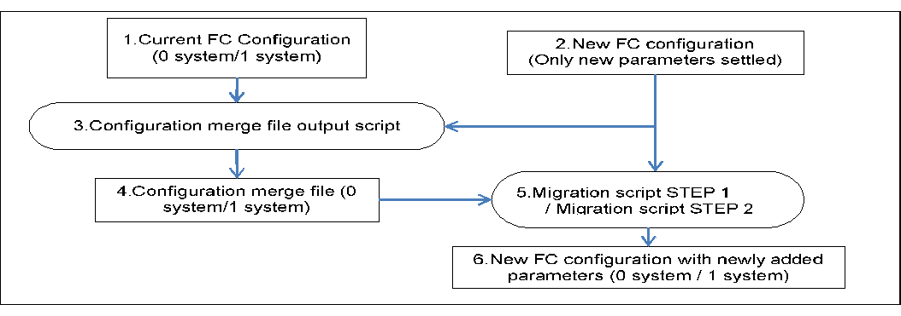

# Fabric Controller File Update Manual
Version 1.0

March.26.2019

Copyright (c) 2019 NTT corp. All Rights Reserved.

## Table of Contents

- [*1. Introduction*](#1-introduction)

- [*2. FC file update procedure*](#2-fc-file-update-procedure)

  - [*2.1 Update procedure without using controller file-update-function*](#21-update-procedure-without-using-controller-file-update-function)

    - [*2.1.1 Update procedure summary*](#211-update-procedure-summary)

    - [*2.1.2 Update procedure details*](#212-update-procedure-details)

  - [*2.2 Update procedure using the controller file update function*](#22-update-procedure-using-the-controller-file-update-function)

    - [*2.2.1 Update procedure summary*](#221-update-procedure-summary)

    - [*2.2.2 Update procedure details*](#222-update-procedure-details)

      - [*2.2.2.1 Preparatory operations*](#2221-preparatory-operations)

        - [*2.2.2.1.1 Install required packages*](#22211-install-required-packages)

        - [*2.2.2.1.2 Setup DB authentication file*](#22212-setup-db-authentication-file)

        - [*2.2.2.1.3 Permission setting for DB connection user*](#22213-permission-setting-for-db-connection-user)

        - [*2.2.2.1.4 Decompress script for file update*](#22214-decompress-script-for-file-update)

        - [*2.2.2.1.5 Modify the settings of file updating script*](#22215-modify-the-settings-of-file-updating-script)

        - [*2.2.2.1.6 Modifying the update file settings*](#22216-modifying-the-update-file-settings)

        - [*2.2.2.1.7 Creating configuration merge file*](#22217-creating-configuration-merge-file)

        - [*2.2.2.1.8 Install required packages (FC)*](#22218-install-required-packages-fc)

        - [*2.2.2.1.9 OS setting (FC)*](#22219-os-setting-fc)

      - [*2.2.2.2 File update procedure*](#2222-file-update-procedure)

        - [*2.2.2.2.1 Transition of renewal status to renewal in progress*](#22221-transition-of-renewal-status-to-renewal-in-progress)

        - [*2.2.2.2.2 Check operation execution state*](#22222-check-operation-execution-state)

        - [*2.2.2.2.3 Execution of the migration script STEP 1*](#22223-execution-of-the-migration-script-step-1)

        - [*2.2.2.2.4 Execute switchover (0 system node to 1 system node)*](#22224-execute-switchover-0-system-node-to-1-system-node)

        - [*2.2.2.2.5 Execution of the migration script STEP 2*](#22225-execution-of-the-migration-script-step-2)

      - [*2.2.2.3 Rollback procedure*](#2223-rollback-procedure)

        - [*2.2.2.3.1 Transition of renewal status to none*](#22231-transition-of-renewal-status-to-none)

        - [*2.2.2.3.2 Execution of migration rollback script*](#22232-execution-of-migration-rollback-script)

- [*Appendix A Installation method of FC*](#appendix-a-installation-method-of-fc)

  - [*A.1 Installation method of libraries*](#a1-installation-method-of-libraries)
    
    - [*A.1.1 Preparation of Java libraries*](#a11-preparation-of-java-libraries)

      - [*A.1.1.1 JDK installation*](#a111-jdk-installation)

      - [*A.1.1.2 Set Gson library*](#a112-set-gson-library)

      - [*A.1.1.3 Set Jetty library*](#a113-set-jetty-library)

      - [*A.1.1.4 Set JDBC library*](#a114-set-jdbc-library)

      - [*A.1.1.5 Set Apache Commons IO library*](#a115-set-apache-commons-io-library)

      - [*A.1.1.6 Set Apache Commons Lang library*](#a116-set-apache-commons-lang-library)

      - [*A.1.1.7 Set Apache Commons Collections library*](#a117-set-apache-commons-collections-library)

      - [*A.1.1.8 Set Hibernate library*](#a118-set-hibernate-library)

      - [*A.1.1.9 Set Jersey library*](#a119-set-jersey-library)

      - [*A.1.1.10 Set Log4J library*](#a1110-set-log4j-library)

      - [*A.1.1.11 Set Hipster4J library*](#a1111-set-hipster4j-library)

  - [*A.2 FC installation*](#a2-fc-installation)

    - [*A.2.1 Installation of the FC main application*](#a21-installation-of-the-fc-main-application)

- [*Appendix B Pacemaker - Switchover procedure*](#appendix-b-pacemaker---switchover-procedure)

  - [*B.1 Switchover (0 system node to 1 system node)*](#b1-switchover-0-system-node-to-1-system-node)

  - [*B.2 Switch-back (1 system node to 0 system node)*](#b2-switch-back-1-system-node-to-0-system-node)


## Revision History

  |Version  |Date           |Contents     |
  |:--------|:--------------|:------------|
  |1.0      |Mar.26.2019    |First edition (MSF2018B)|

## 1. Introduction

This document describes the file update method of the MSF controller (FC) (hereinafter described as FC). 
In this document, it is assumed that FC installation and redundancy settings
 are completed as described in the *Fabric Controller Auto Installation Manual*. 
Also, some procedures described in this document refer to the *Fabric 
Controller Auto Installation Manual*, so please prepare this manual.

## 2. FC file update procedure

This chapter describes the FC file-update-procedure. There are two ways to update the file, one using the file-update-function of the controller and one not using it.

**Table 2‑1 File update procedure list**

|Controller file-update-function|DB-Schema modification|Procedure summary|
|:------------------------------|:---------------------|:-------------------------------|
|Do not use|No|All FC file update operations are executed manually by the MSF maintainer. This section describes the update procedure assuming that there is no DB schema change in the file update.|
|Use       |Yes / No|The MSF maintainer executes the FC file update by semi-automatic operation using the script of the controller file update function. This procedure can be applied to both cases with and without DB schema changes before and after updating the file.|

### 2.1 Update procedure without using controller file-update-function
#### 2.1.1 Update procedure summary

The following table shows the summary of the FC file update operation without using the controller file update function.

**Table 2‑2 Summary of the FC file update operation without using the controller file update function**

|No.<br>&nbsp;|0 system node<br>State|<br>APP|1 system node<br>State|<br>APP|Operation item<br>&nbsp;|
|--:|:------------|:--|:------------|:---|:-------------|
|1  |*running*|*Old*|*not running* &rarr; *standby*|*Old*|Change 1 system node to standby state|
|2  |*running*|*Old*|*standby*                 |*Old*|Backup the old files of 1 system node|
|3  |*running*|*Old*|*standby*                 |*Old* &rarr; *New*|Install new files on 1 system node|
|4  |*running*|*Old*|*standby* &rarr; *not running* |*New*|Change 1 system node to *Online* state|
|5  |*running* &rarr; *not running*|*Old*|*not running* &rarr; *running*|*New*|Switchover from 0 system node to 1 system Node|
|6  |*not running* &rarr; *standby*|*Old*|*running*|*New*|Change 0 system node to standby state|
|7  |*standby*|*Old*|*running*|*New*|Change 0 system node to standby state|
|8  |*standby*|*Old* &rarr; *New*|*running*|*New*|Install new files on 0 system node|
|9  |*standby* &rarr; *not running*|*New*|*running*|*New*|Change 0 system node to *Online* state|
|10 |*not running* &rarr; *running*|*New*|*running* &rarr; *not running*|*New*|Switchover from 1 system node to 0 system node|
|11 |*running*|*New*|*not running*|*New*|Check redundancy state|

#### 2.1.2 Update procedure details

This section describes the file update procedure without the controller 
file-update-function. In this document, the FC installation directory (= any path) 
is assumed to be ~/msf-controller. 
Also, describes the 0 system node as *srv01* and the 1 system node as *srv02*. 
The new file name is expressed as msf-controller.tar.gz (tar-compressed storage file of FC).

\*The line starting with #-prompt is executed as a root user and the 
line starting with $-prompt is executed by a FC operation user.

(1) After checking the redundancy status of the 1 system node, change the 1 system node to the standby state.

~~~shell-session
# crm_mon -fA -1
: (snip)

Online: [ srv01 srv02 ]
: (snip)
Resource Group: grpFC
vipCheck	(ocf::heartbeat: VIPcheck):	Started srv01
prmFC	(ocf::heartbeat:fc):		Started srv01
prmIp	(ocf::heartbeat:Ipaddr2):		Started srv01
: (snip)
~~~

\*Check items: Resource Group: Check that the display content of grpFC is the 0 system node *Started srv01*.

~~~shell-session
# crm_standby -U srv02 -v on
# crm_mon -fA -1
: (snip)
Node srv02: standby
Online: [ srv01 ]

Resource Group: grpFC
vipCheck	(ocf::heartbeat: VIPcheck):	Started srv01
prmFC		(ocf::heartbeat:fc):		Started srv01
prmIp	(ocf::heartbeat:Ipaddr2):		Started srv01
~~~

\*Check items: Check that the status of the 1 system node is standby state.

(2) Backup the old files on the 1 system node. In this example, 
the old files in the msf-controller directory are backed up in the msf-controller.old directory.

~~~shell-session
$ cd ~
$ mv msf-controller msf-controller.old
$ mkdir msf-controller
~~~

(3) Install the new version of FC to the 1 system node.  
First, prepare the Java library required for FC installation according to 
[*A.1.1 Preparation of Java libraries*](#a11-preparation-of-java-libraries)*(A.1.1.2 to A.1.1.11)* 
in [Appendix A Installation method of FC](#appendix-a-installation-method-of-fc).  
Next, execute the installation according to the procedure described in 
[*A.2.1 installation of the FC main application*](#a21-installation-of-the-fc-main-application).  
After installation is complete, edit various configuration file settings
for 1 node by referring to *6.1 FC setting* in the *Fabric Controller Auto Installation Manual*.

(4) After checking the redundancy status at the 1 system node, change the 1 system node to the *Online* status.

~~~shell-session
# crm_mon -fA -1
: (snip)

Node srv02: standby
Online: [ srv01 ]

Resource Group: grpFC
vipCheck	(ocf::heartbeat: VIPcheck):	Started srv01
prmFC	(ocf::heartbeat:fc):		Started srv01
prmIp	(ocf::heartbeat:Ipaddr2):		Started srv01
: (snip)
~~~

\*Check items: Check that the status of the 1 system node is standby state. 

~~~shell-session
# crm_standby -U srv02 -v off
# crm_mon -fA -1
: (snip)

Online: [ srv01 srv02 ]
: (snip)
Resource Group: grpFC
vipCheck	(ocf::heartbeat: VIPcheck):	Started srv01
prmFC	(ocf::heartbeat:fc):		Started srv01
prmIp	(ocf::heartbeat:Ipaddr2):		Started srv01
: (snip)
~~~

\*Check items: Confirm that the status of the 1 system node is *Online* state. 

(5) At the 0 system node, execute the switchover procedure from the 0 system 
node to the 1 system node.  
For details of the switchover procedure, refer to [*B.1 Switchover 
(0 system node to 1 system node)*](#b1-switchover-0-system-node-to-1-system-node) in [Appendix B Pacemaker - Switchover procedure](#appendix-b-pacemaker---switchover-procedure).
By executing the switchover procedure, the FC updated with the new files is 
started on the 1 system node.

(6) After checking the redundancy status at the 0 system node, change the 0 system node to the standby state.

~~~shell-session
# crm_mon -fA -1
: (snip)

Online: [ srv01 srv02 ]
: (snip)
Resource Group: grpFC
vipCheck	(ocf::heartbeat: VIPcheck):	Started srv02
prmFC	(ocf::heartbeat:fc):		Started srv02
prmIp	(ocf::heartbeat:Ipaddr2):		Started srv02
: (snip)
~~~

\*Check items: Resource Group: Check that the display content of grpFC is 1 system node *Started srv02*.

~~~shell-session
# crm_standby -U srv01 -v on
# crm_mon -fA -1
: (snip)
Node srv01: standby
Online: [ srv02 ]

Resource Group: grpFC
vipCheck	(ocf::heartbeat: VIPcheck):	Started srv02
prmFC	(ocf::heartbeat:fc):		Started srv02
prmIp	(ocf::heartbeat:Ipaddr2):		Started srv02
~~~

\*Check items: Confirm that the status of the 0 system node is standby state.

(7) Backup the old files located on the 0 system node. In this example, the old files in the msf-controller directory are backuped in the msf-controller.old directory.

~~~shell-session
$ cd ~
$ mv msf-controller msf-controller.old
$ mkdir msf-controller
~~~

(8) Install the new version of FC to the 0 system node.  
First, prepare the Java library required for FC installation according to 
[*A.1.1 Preparation of Java libraries*](#a11-preparation-of-java-libraries)*(A.1.1.2 to A.1.1.11)*. 
Next, execute the installation according to the procedure described in 
[*A.2.1 installation of the FC main application*](#a21-installation-of-the-fc-main-application). 
After installation is complete, edit various configuration file settings for 
0 system node by referring to *6.1 FC setting* in the *Fabric Controller Auto Installation Manual*.

(9) After checking the redundancy status at the 0 system node, change the 0 system node to the *Online* state.

~~~shell-session
# crm_mon -fA -1
: (snip)

Node srv01: standby
Online: [ srv02 ]

Resource Group: grpFC
vipCheck	(ocf::heartbeat: VIPcheck):	Started srv02
prmFC	(ocf::heartbeat:fc):		Started srv02
prmIp	(ocf::heartbeat:Ipaddr2):		Started srv02
: (snip)
~~~

\*Check items: Check that the status of the 0 system node is standby state. 

~~~shell-session
# crm_standby -U srv01 -v off
# crm_mon -fA -1
: (snip)

Online: [ srv01 srv02 ]
: (snip)
Resource Group: grpFC
vipCheck	(ocf::heartbeat: VIPcheck):	Started srv02
prmFC	(ocf::heartbeat:fc):		Started srv02
prmIp	(ocf::heartbeat:Ipaddr2):		Started srv02
: (snip)
~~~

\*Check items: Check that the status of the 0 system node is *Online* state.

(10) At the 0 system node, execute the switch-back procedure from 
the 1 system node to the 0 system node.  
For details of the switch-back procedure, refer to 
[*B.2 Switch-back (1 system node to 0 system node)*](#b2-switch-back-1-system-node-to-0-system-node).  
By executing the switch-back procedure, the FC updated with the new files 
is started on the 0 system node.  

(11) Check the redundancy status at the 0 system node or the 1 system node.

~~~shell-session
# crm_mon -fA -1
: (snip)

Online: [ srv01 srv02 ]
: (snip)
Resource Group: grpFC
vipCheck	(ocf::heartbeat: VIPcheck):	Started srv01
prmFC	(ocf::heartbeat:fc):		Started srv01
prmIp	(ocf::heartbeat:Ipaddr2):		Started srv01
: (snip)
~~~

\*Check items: Resource Group: Check that the display content of grpFC is 0 system node *Started srv01*.

### 2.2 Update procedure using the controller file update function

In the update procedure using the controller file update function, the file can be updated with the combination of the FC release versions shown in the table below. In this procedure, it is assumed that FC release version of MSF2018B supports the controller file update function.

**Table 2‑3 Updatable FC version correspondence table**

|No.|Version before updating|Version after updating|Remarks                |
|--:|:----------------------|:---------------------|:----------------------|
|1  |MSF2017                |MSF2018B              |-                      |
|2  |MSF2018A               |MSF2018B              |-                      |
|3  |MSF2018B               |MSF2018B              |Update for BugFix, etc.|

#### 2.2.1 Update procedure summary

The table 2-4 shows the summary of the FC file update operation using the controller file update function.

**Table 2-4 Summary of the FC file update operation using the controller file update function**

|No.<br>&nbsp;|0 system node<br>State|<br>APP|1 system node<br>State|<br>APP|Operation item<br>&nbsp;|
|--:|:------------|:--|:------------|:---|:-------------|
|1-1|-|-|-|-|Preparation for the file update procedure.<br>1. Install required packages<br>2. Prepare file update scripts<br>3. Modify settings in the file update scripts<br>4. Modify settings of the update files<br>5. Create the configuration merge file|
|2-1|*running*|*Old*|*not running*|*Old*|Change the renewal status to *Renewal in progress*.|
|2-2|*running*|*Old*|*not running*|*Old*|Confirm the operation state|
|2-3|*running*|*Old*|*not running*|*Old* &rarr; *New*|Execution of the migration script.<br>STEP 1<br>In case of success: Execute No 2 - 4, 2 - 5<br>In case of failure: Execute No 3 - 1, 3 - 2<br>|
|2-4|*running* &rarr; *not running*|*Old*|*not running* &rarr; *running*|*New*|Switchover (0 system node &rarr; 1 system node)|
|2-5|*not running*|*Old* &rarr; *New*|*running*|*New*|Execution of the migration script STEP 2.|
|3-1|*running*|*Old*|*not running*|*New* / *Old*|Change the renewal status to *none*.|
|3-2|*running*|*Old*|*not running*|*New* / *Old* &rarr; *Old*|Execution of the migration rollback script.|

#### 2.2.2 Update procedure details

This section describes the file update procedure when using the controller file update function. Basically, this file update procedure is executed on the controller file update script execution server (hereinafter simply as script execution server). The script execution server is an arbitrary Linux (CentOS 7) server, and it must be able to connect with each FC server and DB server to be updated.

In this document, the FC installation directory (= any path) is assumed to be ~/msf-controller. The new file name to be released is expressed as msf-controller.tar.gz (tar-compressed FC files). Also, describe the 0 system node as *srv01* and the 1 system node as *srv02*.

\*#-prompt is executed as a root user and $-prompt is executed by a file update operation user.

##### 2.2.2.1 Preparatory operations

In the update procedure using the controller file update function, the scripts for updating the controller files are executed. At that time, preparatory operations are necessary before executing those scripts. Table 2-5 shows the necessary preparatory operations.

**Table 2‑5 Preparatory operation list**

|No.|Operation item|Operation description         |
|--:|:-------------|:-----------------------------|
|1|Install required packages|Install the required packages for script execution on the script execution server.|
|2|Setup the DB authentication file|Setup a file to skip password authentication when connecting from the script execution server to the database.|
|3|Set the permissions of the DB connection user|Set the permissions so that the DB connection user for executing the file update script can create the database.|
|4|Preparation of the scripts for file update|Prepare the scripts on the script execution server.|
|5|Modify the file-update script settings|Since each setup script describes the setting values necessary for connection to each server and update operations, the setting values must be changed according to various environments.|
|6|Modify the update-file setting|Re-create the release file by modifying the script settings and configuration definition values included in the new file to be released (msf-controller.tar.gz) for the release environment.|
|7|Create a configuration merge file |If it is not sufficient to modify the configuration according to the release environment in No. 6, create a configuration merge file for config value modification for each FC. The configuration merge file is used to automatically modify the configuration value when executing the file update script.|
|8|Install required packages (FC)|Install the packages required by FC when updating the files.|

###### 2.2.2.1.1 Install required packages

Install the following packages to the script execution server. 

(1) Install *sshpass*  
  - Package URL: [*https://centos.pkgs.org/7/centos-extras-x86\_64/sshpass-1.06-2.el7.x86\_64.rpm.html*](https://centos.pkgs.org/7/centos-extras-x86_64/sshpass-1.06-2.el7.x86_64.rpm.html)  
  - Package file name:  
    sshpass-1.06-2.el7.x86\_64.rpm  
  - Installation procedure:  
    Download the rpm file to any directory on the script execution server.
    Here, the rpm file directory is assumed to be *~/rpm/*. Go to the rpm file directory and install it.  

~~~shell-session
# mkdir -p ~/rpm
# cd ~/rpm/
# rpm -ivh sshpass-1.06-2.el7.x86_64.rpm
~~~

(2) Install *expect*  
  - Package URL:  
    [*https://centos.pkgs.org/7/centos-x86\_64/expect-5.45-14.el7\_1.x86\_64.rpm.html*](https://centos.pkgs.org/7/centos-x86\_64/expect-5.45-14.el7\_1.x86\_64.rpm.html)  
    [*https://centos.pkgs.org/7/centos-x86\_64/tcl-8.5.13-8.el7.x86\_64.rpm.html*](https://centos.pkgs.org/7/centos-x86_64/tcl-8.5.13-8.el7.x86_64.rpm.html)  
  - Package file name:  
    expect-5.45-14.el7\_1.x86\_64.rpm  
  - Installation procedure:  
    Download the rpm file to any directory on the script execution server. 
    Here, the rpm file directory is assumed to be *~/rpm/*. Go to the rpm file directory and install it.  

~~~shell-session
# mkdir -p ~/rpm
# cd ~/rpm/
# rpm -ivh expect-5.45-14.el7_1.x86_64.rpm tcl-8.5.13-8.el7.x86_64.rpm 
~~~

(3) Install *Java8*  
  - Package URL:  
    [*https://www.java.com/ja/download/*](https://www.java.com/ja/download/)
  - Package file name:  
    jre-8uXXX-linux-x64.rpm  
    \*XXX indicates an of java
  - Installation procedure:  
    Download the rpm file to any directory on the script execution server. 
    Here, the rpm file directory is assumed to be *~/rpm/*. Go to the rpm file directory and install it. 

~~~shell-session
# mkdir -p ~/rpm
# cd ~/rpm/
# rpm -ivh jre-8uXXX-linux-x64.rpm
~~~

(4) Install *xmlstarlet*  
  - Package URL:  
    [*https://centos.pkgs.org/7/epel-x86\_64/xmlstarlet-1.6.1-1.el7.x86\_64.rpm.html*](https://centos.pkgs.org/7/epel-x86_64/xmlstarlet-1.6.1-1.el7.x86_64.rpm.html)
    [*https://centos.pkgs.org/7/centos-x86\_64/libxslt-1.1.28-5.el7.x86\_64.rpm.html*](https://centos.pkgs.org/7/centos-x86\_64/libxslt-1.1.28-5.el7.x86\_64.rpm.html)
  - Package file name:  
    xmlstarlet-1.6.1-1.el7.x86\_64.rpm
  - Installation procedure:  
    Download the rpm file to any directory on the script execution server. 
    Here, the rpm file directory is assumed to be *~/rpm/*. Go to the rpm file directory and install it. 

~~~shell-session
# mkdir -p ~/rpm
# cd ~/rpm/
# rpm -ivh xmlstarlet-1.6.1-1.el7.x86_64.rpm libxslt-1.1.28-5.el7.x86_64.rpm
~~~

(5) Install *httpd*  
  - Package URLs:  
    [*https://centos.pkgs.org/7/centos-x86\_64/httpd-2.4.6-88.el7.centos.x86\_64.rpm.html*](https://centos.pkgs.org/7/centos-x86_64/httpd-2.4.6-88.el7.centos.x86_64.rpm.html)  
    [*https://centos.pkgs.org/7/centos-x86\_64/mailcap-2.1.41-2.el7.noarch.rpm.html*](https://centos.pkgs.org/7/centos-x86_64/mailcap-2.1.41-2.el7.noarch.rpm.html)  
    [*https://centos.pkgs.org/7/centos-x86\_64/apr-1.4.8-3.el7\_4.1.x86\_64.rpm.html*](https://centos.pkgs.org/7/centos-x86_64/apr-1.4.8-3.el7_4.1.x86_64.rpm.html)  
    [*https://centos.pkgs.org/7/centos-x86\_64/apr-util-1.5.2-6.el7.x86\_64.rpm.html*](https://centos.pkgs.org/7/centos-x86_64/apr-util-1.5.2-6.el7.x86_64.rpm.html)  
    [*https://centos.pkgs.org/7/centos-x86\_64/httpd-tools-2.4.6-88.el7.centos.x86\_64.rpm.html*](https://centos.pkgs.org/7/centos-x86_64/httpd-tools-2.4.6-88.el7.centos.x86_64.rpm.html)  
  - Package file names:  
    httpd-2.4.6-88.el7.centos.x86\_64.rpm  
    mailcap-2.1.41-2.el7.noarch.rpm  
    apr-1.4.8-3.el7\_4.1.x86\_64.rpm  
    apr-util-1.5.2-6.el7.x86\_64.rpm  
    httpd-tools-2.4.6-88.el7.centos.x86\_64.rpm  
  - Installation procedure:  
    Download the rpm files to any directory on the script execution server. 
    Here, the rpm file directory is assumed to be *~/rpm/*. Go to the rpm file directory and install it. 

~~~shell-session
# mkdir -p ~/rpm
# cd ~/rpm/
# rpm -ivh httpd-2.4.6-88.el7.centos.x86_64.rpm mailcap-2.1.41-2.el7.noarch.rpm apr-1.4.8-3.el7_4.1.x86_64.rpm apr-util-1.5.2-6.el7.x86_64.rpm httpd-tools-2.4.6-88.el7.centos.x86_64.rpm
~~~

###### 2.2.2.1.2 Setup DB authentication file

When connecting from the script execution server to the PostgreSQL DB on the DB server, password authentication is required depending on the DB security settings. The following describes how to create and setup a file to skip the authentication.

(1) Create .pgpass file  
Login to the script execution server as the file update operation user, then create the *. pgpass* file under the home directory and change the permission to 600.

~~~shell-session
$ cd ~/
$ touch .pgpass
$ chmod 600 .pgpass
~~~

(2) Setting of authentication information  
Set the DB user name and the DB user password in *. pgpass* file. In the following example, assume that the DB user name is *msfctrl* and the DB user password is *msfctrl123*.

~~~shell-session
$ vi .pgpass
== Add the following text to the file ==
*:*:*:msfctrl:msfctrl123
== End of text ==
~~~

###### 2.2.2.1.3 Permission setting for DB connection user

Since the script executes the DB creation process after updating the file, the DB connection user must be able to create the DB. The following describes the procedure for setting DB creation permission for DB connection users.

(1) Login to the DB server  
Login to the DB server as the DB server connection OS user. 

(2) Confirm DB creation permission  
Execute the following command to check DB creation permission of DB connection user. Here, the DB connection user is assumed to be *msfctrl*. If the value of *usecreatedb* is *f*, execute the (3) and (4) since the DB creation permission is not given. If it is *t*, there is nothing to do.

~~~shell-session
$ psql -Upostgres
postgres=# select usename , usecreatedb from pg_user;
usename | usecreatedb
----------+-------------
 postgres | t
 msfctrl  | f
~~~

(3) Set DB creation permission  
Set DB creation permission for DB connection user.

~~~shell-session
postgres=# alter user msfctrl createdb;
ALTER ROLE
~~~

(4) Confirm DB creation permission setting  
Confirm that DB creation permission is set. Confirm that *usecreatedb* has changed to *t*. 

~~~shell-session
postgres=# select usename , usecreatedb from pg_user;
usename | usecreatedb
----------+-------------
 postgres | t
 msfctrl  | t
(2 lines)

postgres=# \q
$
~~~

###### 2.2.2.1.4 Decompress script for file update
Decompress the file update scripts on the script execution server. The decompress destination is an arbitrary directory, but here it is assumed to be under ~/script.

~~~shell-session
$ mkdir -p ~/script
(Transfer the msf-controller-mainte-script.tar.gz file to ~/script directory using scp/sftp etc. )
$ cd ~/script
$ tar zxvf msf-controller-mainte-script.tar.gz
~~~

The decompressed scripts are located under *mainte/services/renewal*. 

Create a directory corresponding to BACKUP\_DESTINATION\_PATH used in the file update script 

~~~shell-session
$ mkdir -p ~/backup
~~~

###### 2.2.2.1.5 Modify the settings of file updating script
Modify the settings of the decompressed file update scripts. The setting scripts are shown in Table 2-6.

**Table 2‑6 List of scripts to modify settings**

|No.|Script name|Script summary               |
|--:|:----------|:----------------------------|
|1  |get\_operations.sh |Operation list acquisition script.<br>Using the operation list acquisition request result to the running FC, the script checks whether or not the currently executing operations exist.|
|2  |fc\_migration\_step1.sh|FC transition script STEP 1.<br>Execute old file backup of FC on 1 system node, update to new file, backup of old DB data, and update to new DB schema.|
|3  |fc\_migration\_step2.sh|FC transition script STEP 2.<br>After the switchover, old file backup on the 0 system node and update to the new files are executed.|
|4  |fc\_migration\_rollback.sh|FC migration rollback script.<br>A script for restoring to the pre-migration state when processing fails during the execution of FC migration script STEP 1 (after the old file backup of FC succeeded).<br>Restore old FC files of 1 system node and delete new DB.|

(1) Changing the settings of get\_operations.sh  
A sample setting of get\_operations.sh is shown below. 
Table 2-7 lists the setting values of get\_operations.sh.

~~~bash
(snip)
# Setting value
#################################
HOST=1.1.1.1
PORT=80
#################################
(snip)
~~~

**Table 2‑7 Setting value list of get\_operations.sh**

|No.|Parameter name|Setting value|
|--:|:-------------|:--------------------------|
|1|HOST|The destination IP address of the FC (0 system node) for operation list acquisition request.|
|2|PORT|The destination port number of the FC (0 system node) for operation list acquisition request.|

(2) Changing the settings of fc\_migration\_step1.sh  
A sample setting of fc\_migration\_step1.sh is shown below. 
Table 2-8 lists the setting values of fc\_migration\_step1.sh.

~~~bash
(snip)
# Setting value (FC backup)
#################################
BACKUP_TARGET_HOST_ADDR=1.1.1.1
BACKUP_TARGET_HOST_USER=username
BACKUP_TARGET_HOST_PASS=password
BACKUP_TARGET_PATH=/home/msfctrl/msf-controller
BACKUP_DESTINATION_HOST_ADDR=1.1.1.1
BACKUP_DESTINATION_HOST_USER=username
BACKUP_DESTINATION_HOST_PASS=password
BACKUP_DESTINATION_PATH=/home/msfctrl/backup
#################################

# Setting value (FC restore)
#################################
BACKUP_HOST_ADDR=$BACKUP_DESTINATION_HOST_ADDR
BACKUP_HOST_USER=$BACKUP_DESTINATION_HOST_USER
BACKUP_HOST_PASS=$BACKUP_DESTINATION_HOST_PASS
BACKUP_ARCHIVE_FILE_PATH=/home/msfctrl/release/msf-controller-new.tar.gz
RESTORE_HOST_ADDR=$BACKUP_TARGET_HOST_ADDR
RESTORE_HOST_USER=$BACKUP_TARGET_HOST_USER
RESTORE_HOST_PASS=$BACKUP_TARGET_HOST_PASS
RESTORE_PATH=$BACKUP_TARGET_PATH
REPLACE_CONF=replace_conf_step1
#################################

# Setting value (DB backup)
#################################
BACKUP_DB_HOST_ADDR=1.1.1.1
BACKUP_DB_HOST_USER=username
BACKUP_DB_HOST_PASS=password
BACKUP_DB_NAME=old_dbname
BACKUP_DB_USER=db_username
BACKUP_PATH=$BACKUP_DESTINATION_PATH
#################################

# Setting value (DB restore)
#################################
RESTORE_DB_HOST_ADDR=$BACKUP_DB_HOST_ADDR
RESTORE_DB_HOST_USER=$BACKUP_DB_HOST_USER
RESTORE_DB_HOST_PASS=$BACKUP_DB_HOST_PASS
RESTORE_DB_NAME=new_dbname
RESTORE_DB_USER=$BACKUP_DB_USER
ALTER_SQL=fc_migration_MSF2018BtoMSF2018B.sql
#ALTER_SQL=fc_migration_MSF2017toMSF2018B.sql
#ALTER_SQL=fc_migration_MSF2018AtoMSF2018B.sql
################################# 
(snip)
~~~

**Table 2‑8 Setting value list of fc\_migration\_step1.sh**

|No.|Parameter name                  |Setting value               |
|--:|:------------------------------|:-------------------------------------|
|1  |BACKUP\_TARGET\_HOST\_ADDR      |IP address of the old file backup target FC (1 system node).|
|2  |BACKUP\_TARGET\_HOST\_USER      |OS user name of the old file backup target FC (1 system node).|
|3  |BACKUP\_TARGET\_HOST\_PASS      |OS user password of the old file backup target FC (1 system node).|
|4  |BACKUP\_TARGET\_PATH            |Absolute path of the old file installed directory.|
|5  |BACKUP\_DESTINATION\_HOST\_ADDR |IP address of the backup server for the old files.|
|6  |BACKUP\_DESTINATION\_HOST\_USER |OS user name of the backup server for the old files.|
|7  |BACKUP\_DESTINATION\_HOST\_PASS |OS user password of the backup server for the old files.|
|8  |BACKUP\_DESTINATION\_PATH       |Absolute path of the backup directory for the old files. (File name not included)|
|9  |BACKUP\_HOST\_ADDR              |IP address of the server storing the new files to be released to the FC (1 system server).|
|10 |BACKUP\_HOST\_USER              |OS user name for connecting to the server storing the new files to be released to the FC (1 system server).|
|11 |BACKUP\_HOST\_PASS              |OS user password of the server storing the new files to be released to the FC (1 system server).|
|12 |BACKUP\_ARCHIVE\_FILE\_PATH     |Absolute path (including file name) of the new file location to be released to FC (1 system server).|
|13 |RESTORE\_HOST\_ADDR             |IP address for connecting FC (1 system node) to be released for new files.|
|14 |RESTORE\_HOST\_USER             |OS user name for connecting FC (1 system node) to be released for new files.|
|15 |RESTORE\_HOST\_PASS             |OS user password for connecting FC (1 system node) to be released for new files.|
|16 |RESTORE\_PATH                   |Absolute path to the new file release directory.|
|17 |REPLACE\_CONF                   |The configuration merge file name for file update of 1 system node FC (For details on how to create the file and its description, see [2.2.2.1.7](#22217-creating-configuration-merge-file)).<br>This file location is in the same directory as fc\_migration\_step1.sh.|
|18 |BACKUP\_DB\_HOST\_ADDR          |IP address for backup DB server connection|
|19 |BACKUP\_DB\_HOST\_USER          |OS user name for backup DB server connection|
|20 |BACKUP\_DB\_HOST\_PASS          |OS user password for backup DB server connection|
|21 |BACKUP\_DB\_NAME                |DB name to be backed up|
|22 |BACKUP\_DB\_USER                |DB user name for backup DB connection|
|23 |BACKUP\_PATH                    |The destination path of the backup DB data file. (The DB data files are saved in the specified server with *BACKUP\_HOST\_ADDR*)|
|24 |RESTORE\_DB\_HOST\_ADDR         |The IP address of the DB server where the DB is created after schema update.|
|25 |RESTORE\_DB\_HOST\_USER         |OS user name of the DB server that creates the DB to which the FC connects after updating the file.|
|26 |RESTORE\_DB\_HOST\_PASS         |OS user password of the DB server that creates the DB to which the FC connects after updating the file.|
|27 |RESTORE\_DB\_NAME               |DB name to which the FC connects after file update.<br>\*Please be sure to set this setting value different from *BACKUP\_DB\_NAME*.|
|28 |RESTORE\_DB\_USER               |DB user name for DB connection to which FC connects after file update.|
|29 |ALTER\_SQL                      |The SQL file name for DB schema change.<br>Set the following file for each update pattern No. described in Table 2-3.<br>No1: fc\_migration\_MSF2017toMSF2018B.sql<br>No2: fc\_migration\_MSF2018AtoMSF2018B.sql<br>No3: fc\_migration\_MSF2018BtoMSF2018B.sql|

(3) Modifiy the setting of fc\_migration\_step2.sh  
The following sample shows the setting values of fc\_migration\_step2.sh.
Table 2-9 lists the setting values of fc\_migration\_step2.sh.

~~~bash
(snip)
# Setting value (FC backup)
#################################
BACKUP_TARGET_HOST_ADDR=1.1.1.1
BACKUP_TARGET_HOST_USER=username
BACKUP_TARGET_HOST_PASS=password
BACKUP_TARGET_PATH=/home/msfctrl/msf-controller
BACKUP_DESTINATION_HOST_ADDR=1.1.1.1
BACKUP_DESTINATION_HOST_USER=username
BACKUP_DESTINATION_HOST_PASS=password
BACKUP_DESTINATION_PATH=/home/msfctrl/backup
#################################

# Setting value (FC restore)
#################################
BACKUP_HOST_ADDR=$BACKUP_DESTINATION_HOST_ADDR
BACKUP_HOST_USER=$BACKUP_DESTINATION_HOST_USER
BACKUP_HOST_PASS=$BACKUP_DESTINATION_HOST_PASS
BACKUP_ARCHIVE_FILE_PATH=/home/msfctrl/release/msf-controller-new.tar.gz
RESTORE_HOST_ADDR=$BACKUP_TARGET_HOST_ADDR
RESTORE_HOST_USER=$BACKUP_TARGET_HOST_USER
RESTORE_HOST_PASS=$BACKUP_TARGET_HOST_PASS
RESTORE_PATH=$BACKUP_TARGET_PATH
REPLACE_CONF=replace_conf_step2
#################################
(snip)
~~~

**Table 2‑9 List of setting values of fc\_migration\_step2.sh**

|No.|Parameter name                  |Setting value               |
|--:|:-------------------------------|:--------------------------------------------------|
|1  |BACKUP\_TARGET\_HOST\_ADDR      |IP address for connecting the old file backup target FC (0 system node).|
|2  |BACKUP\_TARGET\_HOST\_USER      |OS user name for connecting the old file backup target FC (0 system node).|
|3  |BACKUP\_TARGET\_HOST\_PASS      |OS user password for connecting the old file backup target FC (0 system node).|
|4  |BACKUP\_TARGET\_PATH            |Absolute path to the installation directory of the old files.|
|5  |BACKUP\_DESTINATION\_HOST\_ADDR |IP address for connecting to the backup server of the old files.|
|6  |BACKUP\_DESTINATION\_HOST\_USER |OS user name for connecting to the backup server of the old files. |
|7  |BACKUP\_DESTINATION\_HOST\_PASS |OS user password for connecting to the backup server of the old files.|
|8  |BACKUP\_DESTINATION\_PATH       |Absolute path to the backup directory of the old files.|
|9  |BACKUP\_HOST\_ADDR              |IP address for connecting to the server storing the new files to be released to the FC (0 system server).|
|10 |BACKUP\_HOST\_USER              |OS user name for connecting to the server storing the new files to be released to the FC (0 system server).|
|11 |BACKUP\_HOST\_PASS              |OS user password for connecting to the server storing the new files to be released to the FC (0 system server).|
|12 |BACKUP\_ARCHIVE\_FILE\_PATH     |Absolute path (including file name) of the save destination of the new files to be released to FC (0 system server). |
|13 |RESTORE\_HOST\_ADDR             |IP address for connecting FC (0 system node) to be released for new files.|
|14 |RESTORE\_HOST\_USER             |OS user name for connecting FC (0 system node) to be released for new files.|
|15 |RESTORE\_HOST\_PASS             |OS user password for connecting FC (0 system node) to be released for new files.|
|16 |RESTORE\_PATH                   |Absolute path to the new file release directory.|
|17 |REPLACE\_CONF                   |The configuration merge file name for file update of 0 system node FC (For details on how to create the file and its description, see [2.2.2.1.7](#22217-creating-configuration-merge-file)).<br>This file location is in the same directory as fc\_migration\_step2.sh.|

(4) Modify the values of fc\_migration\_rollback.sh  
A sample setting of fc\_migration\_rollback.sh is shown below. 
Table 2-10 lists the setting values of fc\_migration\_rollback.sh. 

~~~bash
(snip)
# Setting value (FC file restore)
#################################
BACKUP_HOST_ADDR=1.1.1.1
BACKUP_HOST_USER=username
BACKUP_HOST_PASS=password
ARCHIVE=/home/msfctrl/backup/FabricController_yyyymmdd_hhmmss.tar.gz
BACKUP_ARCHIVE_FILE_PATH=$ARCHIVE
RESTORE_HOST_ADDR=1.1.1.1
RESTORE_HOST_USER=username
RESTORE_HOST_PASS=password
RESTORE_PATH=/home/msfctrl/msf-controller
REPLACE_CONF=replace_conf_rollback
#################################

# Setting value (new DB delete)
#################################
RESTORE_DB_HOST_ADDR=1.1.1.1
RESTORE_DB_HOST_USER=username
RESTORE_DB_HOST_PASS=password
RESTORE_DB_NAME=new_dbname
RESTORE_DB_USER=db_username
################################# 
(snip)
~~~

**Table 2‑10 Setting value list of fc\_migration\_rollback.sh**

|No. |Parameter name                  |Setting value               |
|---:|:-------------------------------|:--------------------------------------------------|
|1   |BACKUP\_HOST\_ADDR      |IP address for connecting to the server backing up the old files. (Set the same value as *BACKUP_DESTINATION_HOST_ADDR* in fc\_migration\_step1.sh.)|
|2   |BACKUP\_HOST\_USER      |OS user name for connecting to the server backing up the old files. (Set the same value as *BACKUP_DESTINATION_HOST_USER* in fc\_migration_step1.sh.)|
|3   |BACKUP\_HOST\_PASS      |OS user password for connecting to the server backing up the old files. (Set the same value as *BACKUP\_DESTINATION\_HOST\_PASS* in fc\_migration\_step1.sh.)|
|4   |ARCHIVE                 |Absolute path to the old files that was backed up when fc\_migration\_step1.sh was executed. (Including file name)<br>(The target file is output to the directory indicated by *BACKUP\_DESTINATION\_PATH* in fc\_migration\_step1.sh.)|
|5   |RESTORE\_HOST\_ADDR     |IP address for connecting to the release target FC (1 system node) for the new file.<br>(Set the same value as *BACKUP_TARGET_HOST_ADDR* in fc\_migration\_step1.sh.)|
|6   |RESTORE\_HOST\_USER     |OS user name for connecting to the release target FC (1 system node) for new files. (Set the same value as *BACKUP\_TARGET\_HOST_USER* in fc\_migration\_step1.sh.)|
|7   |RESTORE\_HOST\_PASS     |OS user password for connecting to the release target FC (1 system node) for new files.<br>(Set the same value as *BACKUP\_TARGET\_HOST\_USER* in fc\_migration\_step1.sh.)|
|8   |RESTORE\_PATH           |Absolute path of the directory to restore the old file.<br>(Set the same value as *BACKUP\_TARGET\_PATH* in fc\_migration\_step1.sh.)|
|9   |REPLACE\_CONF           |The configuration merge file name used to restore the 1 system node FC file.<br>(Refer to [2.2.2.1.7](#22217-creating-configuration-merge-file) for the creation method of this file and the description content).<br>Place this file in the same directory as fc\_migration\_rollback.sh.<br>\* Specify an empty file in fc\_migration\_rollback.sh|
|10  |RESTORE\_DB\_HOST\_ADDR |IP address for connecting to the DB server that creates the DB after updating the schema.<br>(Set the same value as *RESTORE\_DB\_HOST\_ADDR* in fc\_migration\_step1.sh.)|
|11  |RESTORE\_DB\_HOST\_USER |OS user name for connecting to the DB server that creates the DB to which the FC connects after updating the file. (Set the same value as *RESTORE\_DB\_HOST\_USER* specified in fc\_migration\_step1.sh.)|
|12  |RESTORE\_DB\_HOST\_PASS |OS user password for connecting to the DB server that creates the DB to which the FC connects after updating the file. (Set the same value as *RESTORE\_DB\_HOST\_PASS* specified in fc\_migration\_step1.sh.)|
|13  |RESTORE\_DB\_NAME       |DB name that FC connects after file update.<br>(Set the same value as *RESTORE\_DB\_NAME* in fc\_migration\_step1.sh)|
|14  |RESTORE\_DB\_USER       |DB user name for connecting to the DB to which the FC connects after file update.<br>(Set the same value as *RESTORE\_DB\_USER* in fc\_migration\_step1.sh)|

###### 2.2.2.1.6 Modifying the update file settings

First, temporarily decompress the new file to be released (msf-controller.tar.gz) 
to the work directory on the script execution server, then modify the setting and recreate it.
Also, place the created release files on the directory path specified by each script.
Here, the temporary directory for creating update files for each node is assumed to be (~/work).

(1) Preparation of Java library  
Prepare various Java libraries required for FC installation according to the instructions 
in A.1.1.2 to A.1.1.11 described in [*A.1.1 Preparation of Java libraries*](#a11-preparation-of-java-libraries)) 
in [Appendix A Installation method of FC](#appendix-a-installation-method-of-fc). 

(2) Transfer the FC new file to be released to the work directory on the script execution server.  
  - Destination directory:  ~/work/  
  - New file name: msf-controller.tar.gz

(3) Modify the contents of the transferred FC file  
Execute steps (2) - (5) of [*A.2.1 installation of the FC main application*](#a21-installation-of-the-fc-main-application).
However, substitute *~/work* for *~/msf-controller* which is the installation directory described in the appendix.

(4) Get the configuration of the current FC.  
Get the configuration file on the 0 FC server.

~~~shell-session
$ cd ~/work 
$ scp -rp <FC operation user>@<0 system FC IP address>:~/msf-controller/conf ./conf_0_system
~~~

Next, get the configuration files on the 1 system FC server.

~~~shell-session
$ cd ~/work 
$ scp -rp <FC operation user>@<1 system FC IP address>:~/msf-controller/conf ./conf_1_system
~~~

(5) Edit various configuration settings.  
Settings of various configuration files included in the *conf* directory are preset values. 
Among these preset values, the setting values are changed only for parameters that do not exist in the configuration acquired in (4).  
Parameter settings included in the current FC configuration file are described in *Creating configuration merge file* in [2.2.2.1.7](#22217-creating-configuration-merge-file), so they are not described here.  
Please refer to *6.1 FC setting* in the *Fabric Controller Auto Installation Manual* for the config file to edit and the contents.

(6) Creating a modified compressed file.  
In this example, the compressed file name of the modified configuration files is represented as msf-controller-new.tar.gz.

~~~shell-session
$ cd ~/work 
$ tar zcvf msf-controller-new.tar.gz bin conf lib
~~~

(7)  Place the modified compressed file  
Place the modified compressed file into the two paths specified by FC migration script STEP1 (fc\_migration\_step1.sh) and FC migration script STEP2 (fc\_migration\_step2.sh).  
\* If both scripts show the same server or the same path, the placement is only once.  

Placement location (2 places):  
  - File path of *BACKUP\_ARCHIVE\_FILE\_PATH* on the server indicated by *BACKUP\_HOST\_ADDR* described in the FC migration script STEP 1 (fc\_migration\_step 1.sh) (see Table 2-8).  
  - File path of *BACKUP\_ARCHIVE\_FILE\_PATH* on the server indicated by *BACKUP\_HOST\_ADDR* described in the FC migration script STEP 2 (fc\_migration\_step 2.sh) (see Table 2-9).  

###### 2.2.2.1.7 Creating configuration merge file

The new configuration files created in [2.2.2.1.6](#22216-modifying-the-update-file-settings) 
do not contain the setting values 
of the current parameter included in the configuration of the current FC. 
Therefore, the file update script of the controller file update function updates 
these parameters to the current setting values. 
The configuration merge file is required for the update processing. 
This section shows the procedure for outputting this configuration merge file using 
the configuration merge file output script.  
Figure 2-1 shows the relationship between various configuration files and scripts.

  
**Figure 2‑1 Relationship between various configuration files and scripts**

  1. Current configuration file used by FC (0 system / 1 system) before file update. It corresponds to the file obtained in [2.2.2.1.6](#22216-modifying-the-update-file-settings) (4).  
  2. For configuration files used by FC after file update, only new parameters that do not exist in the configuration before file update are set. It corresponds to the file created in [2.2.2.1.6](#22216-modifying-the-update-file-settings) (5).  
  3. Configuration merging file output script. It corresponds to the script file shown in Table 2-11.  
  4. Output file of the configuration merging file script. When executing the migration script STEP 1 / migration script STEP 2, for the current parameters that have not been changed in the new configuration from the current configuration, the same values as the current configuration are set to the new configuration.  
  5. It is an update script of the FC file. Refer to [2.2.2.2.3](#22223-execution-of-the-migration-script-step-1) and [2.2.2.2.5](#22225-execution-of-the-migration-script-step-2) for the execution procedure of this script.  
  6. Configuration file used by FC after file update.  

Table 2-11 shows the configuration merge file output script. 
The configuration merge file output script is located in the path *mainte/services/renewal* 
of the file update script decompressed in [2.2.2.1.4](#22214-decompress-script-for-file-update). 

**Table 2‑11 configuration merge file output script**

|No.|Script name|Script summary|
|--:|:----------|:------------------------------------------|
|1  |merge.sh   |If there is a difference by comparing the two specified configuration files, the script outputs a file to replace the corresponding value.|

A sample of merge.sh file contents is shown below.  
Table 2-12 lists the setting values of merge.sh.  

~~~bash
(snip)
# Setting value
#################################
old="oldfc"
new="newfc"
out="re.out"
################################# 
(snip)
~~~

**Table 2‑12 Setting list of merge.sh**

|No.|Parameter name |Setting value               |
|--:|:--------------|:--------------------------------------------------|
|1  |old            |Specify the path to the directory of the configuration files containing the replacement setting values. The directory path is represented by a relative path from the directory of merge.sh. When a difference is detected as a result of comparison processing execution, the setting value of the difference detected in this directory is output as the replacement target in the configuration merge file.|
|2  |new            |Specify the directory path including the configuration file directory to be compared. The directory path is represented by a relative path from the directory of merge.sh. The corresponding configuration value in this directory is used only for comparison. Therefore, even if a difference is detected, it will not be output to the configuration merge file. |
|3  |out            |Specify the name of the configuration merge file.<br>The output destination is the same directory of merge.sh.|

The procedure for outputting the configuration merge file is shown below.  
The configuration merge file is created for the FC on the 0 system node and for the FC on the 1 system node.

(1) Placement of new FC Configuration  
Place the new FC configuration edited in [2.2.2.1.6](#22216-modifying-the-update-file-settings) (5) on the specified path so that the configuration merging file output script can read.

~~~shell-session
$ cd ~/script/mainte/services/renewal
$ mkdir newfc
$ cd ~/work
$ cp -rp conf ~/script/mainte/services/renewal/newfc/conf
~~~

(2) Placement of current FC Configuration (0 system).  
Place the 0 system current FC configuration acquired in 
[*2.2.2.1.5*](#22215-modify-the-settings-of-file-updating-script) *(4)* 
on the specified path in the following example so that the configuration merging file output script can be read.  
\* For 1 system configuration, copy *conf\_1\_system* instead of *conf\_0\_system*.

~~~shell-session
$ cd ~/script/mainte/services/renewal
$ rm -rf oldfc
$ mkdir oldfc
$ cd ~/work
$ cp -rp conf_0_system ~/script/mainte/services/renewal/oldfc/conf
~~~

(3) Output of configuration file for 0 system node  
Execute the configuration merge file output script and output the configuration merge file.

~~~shell-session
$ cd ~/script/mainte/services/renewal
$ sh merge.sh
~~~

(4) Modify configuration merge file for 0 system node.  
Edit output contents of the configuration merge file output by merge.sh.  
Edit using the replacement function of vi editor.  
In this example, the output file name of the configuration merge file is assumed to be *re.out.*

~~~shell-session
$ cd ~/script/mainte/services/renewal
$ vi re.out
Execute the following command
「:%s/newfc\/conf\///g」
~~~

(5) Modify the URL for DB connection in the configuration merge file.  
Similarly in (4), modify the output contents of the configuration merge file.  
In the FC after updating the file, the connection DB name should be set to the new DB name created by the migration script STEP 1, not the DB name that was connected before updating the file.  
Modify the DB connection destination setting in *re.out* to the new DB name.  
In the following example, set the DB name connected by FC before file update as *msf\_fc*, and the DB name connected by FC after file update as *msf\_fc\_2*.  
The connection DB names of FC before file update and FC after file update are specified in *BACKUP\_DB\_NAME* and *RESTORE\_DB\_NAME* in Table 2-8, respectively.  

~~~shell-session
$ cd ~/script/mainte/services/renewal
$ vi re.out
== Modify the file contents as follows (Represented in red) ==
== Before modification ==
XML "hibernate-configuration[1]/session-factory[1]/property[@name='hibernate.connection.url']" "jdbc:postgresql://xxx.xxx.xxx.xxx:5432/msf_fc" hibernate.cfg.xml
== After modification ==
XML "hibernate-configuration[1]/session-factory[1]/property[@name='hibernate.connection.url']" "jdbc:postgresql://xxx.xxx.xxx.xxx:5432/msf_fc_2" hibernate.cfg.xml
== End of modification ==
~~~

(6) Replacement of configuration merge file name for 0 system node.  
Replace with the name specified in *REPLACE\_CONF* in the migration script STEP 2.  
An example of a rename to *replace\_conf\_step 2* is shown below. 

~~~shell-session
$ mv re.out replace_conf_step2
~~~

For the configuration merge file for 1 system node, 
replace with the name (replace\_conf\_step1) specified 
in *REPLACE\_CONF* of the migration script STEP 1.

(7) Creating the configuration merge file for 1 system node.  
Also execute steps (2) - (6) for the setting value specific to the 1 system node FC.  

##### 2.2.2.1.8 Install required packages (FC)

This procedure is executed when the pre-update version of FC is MSF2017 or MSF2018A.  
In case of MSF2018B, there is nothing to do.  

(1) Installing the httpd package on the 1 system node  
Refer to [2.2.2.1.1](#22211-install-required-packages) (5) and install *httpd* package on 1 system FC server.  

(2) Installing the httpd package on the 0 system node  
Refer to [2.2.2.1.1](#22211-install-required-packages) (5) and install *httpd* package on 0 system FC server.  

##### 2.2.2.1.9 OS setting (FC)

This procedure is executed when the pre-update version of FC is MSF2017 or MSF2018A.  
In case of MSF2018B, there is nothing to do.  

(1) Login to the 1 system node and setup it so that the wheel group can execute the sudo command without entering the password.

~~~shell-session
$ su -
# visudo
== Modify the file contents in two lines as follow (Represented in red) ==
== Modify 1 ==
== Before ==
Defaults    requiretty
== After ==
# Defaults    requiretty
== End of modify ==

== Modify 2 ==
== Before ==
## Allows people in group wheel to run all commands
%wheel  ALL=(ALL)       ALL

## Same thing without a password
# %wheel   ALL=(ALL)       NOPASSWD: ALL
== After ==
## Allows people in group wheel to run all commands
# %wheel  ALL=(ALL)       ALL

## Same thing without a password
%wheel   ALL=(ALL)       NOPASSWD: ALL
== End of modify ==

# exit
~~~

\*Logout after modify.

(2) Login to the 0 system node and setup it so that the wheel group can execute the sudo command without entering the password. 

~~~shell-session
$ su -
# visudo
== Modify the file contents in two lines as follow (Represented in red)==
== Modify 1 ==
== Before ==
Defaults    requiretty
== After ==
# Defaults    requiretty
== End of modify ==

== Modify 2 ==
== Before ==
## Allows people in group wheel to run all commands
%wheel  ALL=(ALL)       ALL

## Same thing without a password
# %wheel   ALL=(ALL)       NOPASSWD: ALL
== After ==
## Allows people in group wheel to run all commands
# %wheel  ALL=(ALL)       ALL

## Same thing without a password
%wheel   ALL=(ALL)       NOPASSWD: ALL
== End of modify ==

# exit
~~~

\*Logout after modify.

#### 2.2.2.2 File update procedure

The update procedure when using the controller file update function is described.
Here, it is assumed that various preparations in [2.2.2.1](#2221-preparatory-operations) have been completed.  

##### 2.2.2.2.1 Transition of renewal status to *renewal in progress*

This procedure is executed only when FC version before file update is *MSF2018B*.
Send *CTL renewal execution* REST-IF request to the running FC, and change the renewal status of FC to *renewal in progress*.

(1) Specify the parameters in the table below and send *CTL renewal execution* request to the FC.

**Table 2‑13 Parameter list of CTL execution request**

|No. |Parameter type      |Parameter name |Setting value |
|----|--------------------|---------------|--------------|
|1   |Optional parameters |controller     |*unspecified* |
|2   |Optional parameters |cluster        |*unspecified* |
|3   |Request parameters  |action         |*start*       |

(2) Check response code  
Check that the response code 200 OK is returned and that the response parameter renewal\_status is *renewal_in_progress*.

##### 2.2.2.2.2 Check operation execution state

The operation list acquisition script checks whether there is asynchronous operations being executed in the running FC.

(1) Execution of operation list acquisition script (get_operations.sh)  
Execute the operation list acquisition script as shown below.

~~~shell-session
$ cd ~/script/mainte/services/renewal
$ sh get_operations.sh
~~~

(2) Check the execution results  
After execution, the result message is output to standard output and log file *get_operations.sh.log*. Please check that the output result does not include the asynchronous operations being executed. Table 2-14 lists the major log messages output by the operation list acquisition script. 

**Table 2‑14 List of output messages of operation list acquisition script**

|No.|Output message            |Workaround                         |
|--:|:-------------------------|:----------------------------------|
|1  |There no asynchronous being executed.|Indicates that asynchronous operations are not being executed. Proceed to the next step.|
|2  |There are asynchronous operations being executed.|Indicates the existence of running asynchronous operations. Please wait until asynchronous operations are completed.<br>After that, execute the operation list acquisition script again and reconfirm that asynchronous operations are not executed.|
|3  |The operation to acquire operation list failed.|Operation list acquisition request has failed. Please check the running state of FC and FC connection destination IP address and port number in *get\_operations.sh*.|

##### 2.2.2.2.3 Execution of the migration script STEP 1

Execution of the migration script STEP 1 updates the FC file of the 1 system node and creates a new schema DB.  

(1) Execution of the migration script STEP 1 (fc\_migration_step 1.sh)  
Execute the migration script STEP 1 as shown below. 

~~~shell-session
$ cd ~/script/mainte/services/renewal
$ sh fc_migration_step1.sh
~~~

(2) Check the execution results
After the script execution, the result message is output to standard output and log file *fc\_migration\_step1.sh.log*. Check the output result and confirm that the processing was successful. Table 2-15 lists the major log messages output by the migration script STEP 1. 


**Table 2‑15 Output message list of migration script STEP 1**

|No.|Output message            |Workaround                         |
|--:|:-------------------------|:----------------------------------|
|1  |FC migration script Step 1 completed normally.|FC migration script STEP 1 completed normally.<br>Proceed to the next step.|
|2  |Backup of the controller file was successfully completed.|Indicates the success of the old file backup of the FC on the 1 system node (see Table 2-16 for the backed up files). If this message is output but the FC migration script STEP 1 fails afterwards, it is possible to switch back to the pre-migration state by executing the FC migration rollback script.|
|3  |Online node information acquisition failed.|Indicates a failure to check the status of each node from Pacemaker. Please check the redundancy state of Pacemaker.|
|4  |There are no nodes online with FC not running.|Indicates invalid status of each node acquired from Pacemaker. Please check the redundancy state of Pacemaker.|
|5  |Failed to change the node to the standby state.|Indicates a state change failure to Pacemaker. Please check the redundancy state of Pacemaker.|
|6  |Failed to back up the controller file.|Indicates a failure of the old file backup of the FC on the 1 system node. Confirm the setting information (FC backup) specified in the migration script STEP 1.|
|7  |Failed to restore the controller file.|Indicates a failure to update the file of the 1 system node FC. Confirm the setting information (FC restore) specified in the migration script STEP 1.|
|8  |Failed to back up the DB.|Indicates a backup failure of the running DB. Confirm the setting information (DB backup) specified in the migration script STEP 1 and the state of DB.|
|9  |Failed to restore the DB.|Indicates a failure to create a new DB running after updating the file. Confirm the setting information (DB restore) specified in the migration script STEP 1 and the DB status.|
|10 |Failed to transfer the DB-update SQL.|Indicates a failure to transfer the SQL file for updating the DB schema to the DB server. Confirm the setting information (DB restore) specified in the migration script STEP 1.|
|11 |Failed to update the DB schema.|Indicates a failure to update the DB schema for the new DB. Confirm the setting information (DB restore) specified in the migration script STEP 1 and the DB status.|
|12 |Failed to transfer the update SQL.|Indicates a failure to transfer the updating SQL file of the renewal state to the DB server. Confirm the setting information (DB restore) specified in the migration script STEP 1.|
|13 |Failed to update DB to the renewal status.|Indicates a failure in update processing to the renewal status for the new DB. Confirm the setting information (DB restore) specified in the migration script STEP1 and the DB status.|
|14 |Failed to change the node to online.|Indicates a failure to change the system state to Pacemaker. Please check the redundancy state of Pacemaker.|


(3) Confirm the backup files
If the execution of the migration script STEP 1 succeeds, the backup files shown in Table 2-16 will be created.


**Table 2‑16 Backup file list of migration script STEP 1**

|No.|File name |Target server|Destination directory|Summary                                                  |
|--:|:---------|:------------|:--------------------|:--------------------------------------------------------|
|1  |FabricController<br>\_&lt;date and time&gt;.tar.gz|The server specified by *BACKUP\_DESTINATION<br>\_HOST\_ADDR*|Path specified by *BACKUP\_DESTINATION<br>\_PATH*|Old file of 1 node FC.<br>The backup date, hour, minute, and second are set in the &lt;date and time&gt; of the file name.|
|2  |dbBackup<br>\_&lt;date and time&gt;.sql|The server specified by *BACKUP\_HOST\_ADDR*|Path specified by *BACKUP\_PATH*|DB data backup file before file update.<br>The backup date, hour, minute, and second are set in the &lt;date and time&gt; of the file name.|

##### 2.2.2.2.4 Execute switchover (0 system node to 1 system node)

The switchover procedure differs depending on whether FC version before file update is *MSF2018B* or not.

A) If the FC version number before the file update is *MSF2018B*.

  1. Specify the parameters in the table below and send a *CTL system switching instruction* request to the FC

**Table 2‑17 Parameter list of CTL system switching instruction request**

|No.|Parameter type     |Parameter name |Setting value|
|--:|:------------------|:--------------|:------------|
|1  |Optional parameters|controller     |*fc*         |
|2  |Optional parameters|cluster        |*unspecified*|

  2. Check the response code.
    Check that the response code is *200 OK*.

  3. Confirm that the system has switched.
    By executing (5) in [*B.1 Switchover (0 system node to 1 system node)*](#b1-switchover-0-system-node-to-1-system-node), confirm that FC of 1 node is running.

B) If the FC version number before file update is other than *MSF2018B*  
By executing [*B.1 Switchover (0 system node to 1 system node)*](#b1-switchover-0-system-node-to-1-system-node), switch the 1 system node to the running node.

##### 2.2.2.2.5 Execution of the migration script STEP 2

If the migration script STEP 1 succeeds, executing the migration script STEP 2 updates the FC files of the 0-system node.

(1) Execution of the migration script STEP 1 (fc\_migration\_step 2.sh)  
Execute the migration script STEP 2 as follows.

~~~shell-session
$ cd ~/script/mainte/services/renewal
$ sh fc_migration_step2.sh
~~~~

(2) Confirm execution result  
The script outputs the execution result message to the standard output and the log file *fc\_migration\_step2.sh.log*. 
Check the output result and confirm that the processing was successful.

Table 2-18 shows the major log messages output by the migration script STEP 2.

**Table 2‑18 Output message list of the migration script STEP 2**

|No.|Output message            |Workaround                         |
|--:|:-------------------------|:----------------------------------|
|1  |FC migration script Step 2 completed normally.|FC migration script Step 2 completed normally.|
|2  |Failed to acquire online host information.    |Indicates a failure to check the system status of each node from Pacemaker.<br>Please check the redundancy state of Pacemaker.|
|3  |Failed to change the node to the state.|Indicates a failure in the state change operation to Pacemaker. Please check the redundancy state of Pacemaker.|
|4  |Failed to backup controller file.|Indicates a failure of the old file backup of the 0 system node FC. Please check the setting information (FC backup) specified in the migration script STEP 2.|
|5  |Failed to restore controller file.|Indicates a failure to update on the 0 system node FC. Confirm the setting information (FC restore) specified in the migration script STEP 2.|
|6  |Failed to change the node to the online state.|Indicates a failure of the state change operation to Pacemaker. Please check the redundancy state of Pacemaker.|

(3) Confirm backup file
If the execution of the migration script STEP 2 succeeds, the backup file shown in Table 2-19 will be created.  

**Table 2‑19 Backup file list of migration script STEP 2**

|No.|File name |Backup server|Backup directory|Summary           |
|--:|:---------|:------------|:---------------|:-----------------|
|1  |FabricController<br>\_&lt;date and time&gt;.tar.gz|Specified server by *BACKUP\_DESTINATION<br>\_HOST\_ADDR*|Path specified by *BACKUP\_DESTINATION<br>\_PATH* |Old file of 0 node FC.<br>The backup date, hour, minute, and second are set in the &lt;date and time&gt; of the file name.|

#### 2.2.2.3 Rollback procedure

This section describes the procedure for rolling back to the pre-script 
execution state when the migration script STEP 1 in [2.2.2.2.3](#22223-execution-of-the-migration-script-step-1) fails 
while executing the controller file update function. 

##### 2.2.2.3.1 Transition of renewal status to *none*

This procedure is executed only when FC version before file update is *MSF2018B*.  
Transmit *CTL renewal execution* REST-IF request to running FC, and change the renewal status of FC to *none*. 


(1) Specify the parameters in the table below and send *CTL renewal execution* request to the FC.  

**Table 2‑20 Parameter list CTL renewal execution request**

|No.|Parameter type     |Parameter name|Setting value |
|--:|:------------------|:-------------|:-------------|
|1  |Optional parameters|controller    |*unspecified* |
|2  |Optional parameters|cluster       |*unspecified* |
|3  |Request parameters |action        |*stop*        |

(2) Confirm response code
Confirm that the response code is *200 OK* and the response parameter renewal_status is *none*.

##### 2.2.2.3.2 Execution of migration rollback script

Execute the migration rollback script to roll back the FC file of 
the 1 system node to the old version and delete the DB of the new schema.  
In order to execute this procedure, backup of the controller file of the 
1 system node must be completed when STEP 1 of the migration script of 
[2.2.2.2.3](#22223-execution-of-the-migration-script-step-1) is executed.  
(There must be *old file of 1 node FC* of No. 1 in Table 2-16.)


(1) Modify migration rollback script setting value  
Modify the settings of the migration rollback script (see Table 2-10). 
Specifically, set the old file path of the 1 system node FC backed up by the migration script STEP 1 to *ARCHIVE*.


(2) Modify migration rollback script setting value  
Modify the settings of the migration rollback script (see Table 2-10). 
Specifically, set the old file path of the 1 system node FC backed up by the migration script STEP 1 to *ARCHIVE*.

~~~shell-session
$ cd ~/script/mainte/services/renewal
$ sh fc_migration_rollback.sh
~~~

(3) Confirm the execution result  
By executing the script, the result message is output to the standard output and the log file *fc\_migration\_rollback.sh.log*.  

Check the output result and confirm that the processing was successful.  
Table 2-21 shows the major log messages output by the migration rollback script.


**Table 2‑21 Output message list of migration rollback script**

|No.|Output message            |Workaround                         |
|--:|:-------------------------|:----------------------------------|
|1  |The rollback process was completed normally.|The FC migration rollback script was completed normally.|
|2  |Failed to get online node information.|Indicates the failure of Pacemaker to check the system status of each node.<br>Please check the redundancy state of Pacemaker.|
|3  |Failed to change the node to the standby state.|Indicates a failure of the system state change operation to Pacemaker.<br>Please check the redundancy state of Pacemaker.|
|4  |Failed to delete the DB.|Indicates a failure to delete the new DB for use after updating the file.<br>Confirm the setting information (new DB deletion) and DB state specified in the migration rollback script.|
|5  |Failed to acquire information of the Pacemaker.|Indicates a failure of processing to acquire each piece of information from Pacemaker. Please check the redundancy state of Pacemaker.|
|6  |Failed to restore controller file.|Indicates a failure to switch back to the old file of the FC on the 1 system node. Please check the setting information (FC file switch back) specified in the migration rollback script.|
|7  |Failed to change the node to the online state.|Indicates a failure of the state change operation to Pacemaker. Please check the redundancy state of Pacemaker.|

-----

## Appendix A Installation method of FC

### A.1 Installation method of libraries
This appendix refers to a working user as general user *msfctrl*. Replace
this with appropriate user based on your environment.

#### A.1.1 Preparation of Java libraries
This section gives the instructions for installing the JDK and deploying
Java libraries.  
In the example below, Java libraries are placed under *\~/java\_lib/*.  
Directory configuration under *\~/java\_lib/* is shown below.
```
/home/msfctrl				Home directory for working user
└-- java_lib				 Preparation directory for Java library
    ├-- gson				 Store directory for Gson library
    ├-- jetty				Store directory for Jetty library
    ├-- postgresql		   Store directory for JDBC library
    ├-- apache-commons	   Store directory for Apache Commons library
    ├-- hibernate		    Store directory for Hibernate library
    ├-- jersey			   Store directory for Jersey library
    ├-- log4j			    Store directory for Log4J library
    └-- hipster4j			Store directory for Hipster4J library
```

##### A.1.1.1 JDK installation
(1) Download rpm file of JDK from <http://www.oracle.com/>.  
    \* In the example below, the downloaded rpm file is referred to as
    *jdk-8u101-linux-x64.rpm*.  
    \* Use JDK 8 update 101 or later version. However, JDK 9 or later
    version is not applicable for current FC server.

(2) Set the downloaded rpm file to an arbitrary location on FC server.  
    In the example below, the rpm file is set under *\~/rpm/*.

(3) Change the working directory to the rpm directory and install JDK.
~~~shell-session
$ cd ~/rpm/
$ sudo rpm -ivh jdk-8u101-linux-x64.rpm
~~~

(4) Set Java version as default.  
    \* Select a number of /usr/java/jdk1.8.0\_101/jre/bin/java.
~~~shell-session
$ sudo alternatives --config java
~~~

##### A.1.1.2 Set Gson library

(1) Download gson-2.7.jar from
    <https://repo1.maven.org/maven2/com/google/code/gson/gson/2.7/>.

(2) Set the downloaded gson-2.7.jar to an arbitrary location on FC
    server.  
    In the example below, the file is set under *\~/download/*.

(3) Place gson-2.7.jar under *\~/java\_lib/gson/*.
~~~shell-session
$ cd ~/download/
$ mkdir -p ~/java_lib/gson/
$ mv gson-2.7.jar ~/java_lib/gson/
~~~

##### A.1.1.3 Set Jetty library

(1) Download jetty-distribution-9.3.11.v20160721.tar.gz from
    <http://archive.eclipse.org/jetty/9.3.11.v20160721/dist/>.

(2) Set the downloaded jetty-distribution-9.3.11.v20160721.tar.gz to the
    arbitrary location on FC server.  
    In the example below, the file is set under *\~/download/*.

(3) Unzip jetty-distribution-9.3.11.v20160721.tar.gz and place a lib
    directory in the unzipped directory under *\~/java\_lib/jetty/*.

~~~shell-session
$ cd ~/download/
$ tar xvfz jetty-distribution-9.3.11.v20160721.tar.gz
$ cd jetty-distribution-9.3.11.v20160721/
$ mkdir -p ~/java_lib/jetty/
$ mv lib ~/java_lib/jetty/
~~~

##### A.1.1.4 Set JDBC library

(1) Download postgresql-9.4.1209.jar from
    <https://jdbc.postgresql.org/download.html>.

(2) Set the downloaded postgresql-9.4.1209.jar to an arbitrary location
    on FC server.  
    In the example below, the file is set under *\~/download/*.

(3) Set postgresql-9.4.1209.jar under *\~/java\_lib/postgresql*.
~~~shell-session
$ cd ~/download/
$ mkdir -p ~/java_lib/postgresql/
$ mv postgresql-9.4.1209.jar ~/java_lib/postgresql/
~~~

##### A.1.1.5 Set Apache Commons IO library

(1) Download commons-io-2.5-bin.tar.gz from
<https://commons.apache.org/proper/commons-io/download_io.cgi>.

(2) Set the downloaded commons-io-2.5-bin.tar.gz to an arbitrary location on FC server.
In the example below, the file is set under *\~/download/*.

(3) Unzip commons-io-2.5-bin.tar.gz and place commons-io-2.5.jar in the unzipped directory under
*\~/java_lib/apache-commons/*.

~~~shell-session
$ cd ~/download/
$ tar xvfz commons-io-2.5-bin.tar.gz
$ cd commons-io-2.5/
$ mkdir -p ~/java_lib/apache-commons/
$ mv commons-io-2.5.jar ~/java_lib/apache-commons/
~~~

##### A.1.1.6 Set Apache Commons Lang library
(1) Download commons-lang-2.6-bin.tar.gz from <https://commons.apache.org/proper/commons-lang/download_lang.cgi>.

(2) Set the downloaded commons-lang-2.6-bin.tar.gz to an arbitrary location on FC server.  
In the example below, the file is set under *\~/download/*.

(3) Unzip commons-lang-2.6-bin.tar.gz and place commons-lang-2.6.jar in the unzipped directory under *\~/java_lib/apache-commons/*.

~~~shell-session
$ cd ~/download/
$ tar xvfz commons-lang-2.6-bin.tar.gz
$ cd commons-lang-2.6/
$ mkdir -p ~/java_lib/apache-commons/
$ mv commons-lang-2.6.jar ~/java_lib/apache-commons/
~~~

##### A.1.1.7 Set Apache Commons Collections library
(1) Download commons-collections-3.2.2-bin.tar.gz from
<https://commons.apache.org/proper/commons-collections/download_collections.cgi>.

(2) Set the downloaded commons-collections-3.2.2-bin.tar.gz to an arbitrary location on FC server.
In the example below, the file is set under *\~/download/*.

(3) Unzip commons-collections-3.2.2-bin.tar.gz and place commons-collections-3.2.2.jar 
in the unzipped directory under *\~/java_lib/apache-commons/*.

~~~shell-session
$ cd ~/download/
$ tar xvfz commons-collections-3.2.2-bin.tar.gz
$ cd commons-collections-3.2.2/
$ mkdir -p ~/java_lib/apache-commons/
$ mv commons-collections-3.2.2.jar ~/java_lib/apache-commons/
~~~

##### A.1.1.8 Set Hibernate library

Prepare a main unit and additional library for Hibernate library.

(1) Download hibernate-release-5.0.10.Final.tgz from 
<https://sourceforge.net/projects/hibernate/files/hibernate-orm/5.0.10.Final/hibernate-release-5.0.10.Final.tgz/download>.

(2) Set the downloaded hibernate-release-5.0.10.Final.tgz to an arbitrary location on FC server.  
    In the example below, the file is set under *\~/download/*.

(3) Unzip hibernate-release-5.0.10.Final.tgz and place a lib directory  
    in the unzipped directory under *\~/java\_lib/hibernate/*.
~~~shell-session
$ cd ~/download/
$ tar xvfz hibernate-release-5.0.10.Final.tgz
$ cd hibernate-release-5.0.10.Final/
$ mkdir -p ~/java_lib/hibernate
$ mv lib ~/java_lib/hibernate/
~~~

(4) Add a necessary library to Hibernate.  
    Download slf4j-nop-1.6.1.jar from
    <https://sourceforge.net/projects/unirods/files/lib/slf4j-nop-1.6.1.jar/download>.

(5) Set the downloaded file to an arbitrary location on FC server.  
    In the example below, the file is set under *\~/download/*.

(6) Set slf4j-nop-1.6.1.jar under *~/java_lib/hibernate/lib/optional/ehcache/*.

~~~shell-session
$ cd ~/download/
$ mkdir -p ~/java_lib/hibernate/lib/optional/ehcache/
$ mv slf4j-nop-1.6.1.jar ~/java_lib/hibernate/lib/optional/ehcache/
~~~

##### A.1.1.9 Set Jersey library

(1) Download jaxrs-ri-2.23.2.tar.gz from  
    <http://repo1.maven.org/maven2/org/glassfish/jersey/bundles/jaxrs-ri/2.23.2/>.


(2) Set the downloaded jaxrs-ri-2.23.2.tar.gz to an arbitrary location
    on FC server.  
    In the example below, the file is set under *\~/download/*.

(3) Unzip jaxrs-ri-2.23.2.tar.gz and place all files and directories in
    the unzipped directory under *\~/java\_lib/jersey/*.
~~~shell-session
$ cd ~/download/
$ tar xvfz jaxrs-ri-2.23.2.tar.gz
$ cd jaxrs-ri/
$ mkdir -p ~/java_lib/jersey/
$ mv * ~/java_lib/jersey/
~~~

##### A.1.1.10 Set Log4J library

(1) Download apache-log4j-2.6.2-bin.tar.gz from
    <http://archive.apache.org/dist/logging/log4j/2.6.2/>.

(2) Set the downloaded apache-log4j-2.6.2-bin.tar.gz to an arbitrary
    location on FC server.  
    In the example below, the file is set under *\~/download/*.

(3) Unzip apache-log4j-2.6.2-bin.tar.gz and place
    log4j-1.2-api-2.6.2.jar, log4j-api-2.6.2.jar, log4j-core-2.6.2.jar
    in the unzipped directory under *\~/java\_lib/log4j/*.
~~~shell-session
$ cd ~/download/
$ tar xvfz apache-log4j-2.6.2-bin.tar.gz
$ cd apache-log4j-2.6.2-bin/
$ mkdir -p ~/java_lib/log4j/
$ mv log4j-1.2-api-2.6.2.jar ~/java_lib/log4j/
$ mv log4j-api-2.6.2.jar ~/java_lib/log4j/
$ mv log4j-core-2.6.2.jar ~/java_lib/log4j/
~~~

##### A.1.1.11 Set Hipster4J library
(1) Download hipster-all-1.0.1.jar from
    <http://central.maven.org/maven2/es/usc/citius/hipster/hipster-all/1.0.1/>.

(2) Change the name of the file from hipster-all-1.0.1.jar to hipster-all-1.0.1-all.jar 
    and set the file to an arbitrary location on FC server.  
    In the example below, the file is set under *\~/download/*.

(3) Place hipster-all-1.0.1-all.jar under *\~/java\_lib/hipster4j/*.
~~~shell-session
$ cd ~/download/
$ mkdir -p ~/java_lib/hipster4j/
$ mv hipster-all-1.0.1-all.jar ~/java_lib/hipster4j/

~~~

### A.2 FC installation

FC installation methods are described below.

#### A.2.1 Installation of the FC main application

(1) Set tar file (msf-controller.tar.gz) of FC to the installation
    directory.

(2) Unzip tar file of FC.  
    \* To reinstall the FC server, first, delete all directories in the
    installed directory extracted from the archive before. Then extract
    the archive to it again.
~~~shell-session
$ cd ~/msf-controller/
$ tar xvfz ~/msf-controller/msf-controller.tar.gz
~~~

(3) Change the name of log output setting file.  
~~~shell-session
$ cd ~/msf-controller/conf
$ mv fc_log4j2.xml log4j2.xml
~~~

(4) Copy the java libraries to the *lib* directory.
~~~shell-session
$ cp -r ~/java_lib/* ~/msf-controller/lib/
~~~

(5) Grant permission to the script files in the unzipped
    directory.
~~~shell-session
$ cd ~/msf-controller/bin/
$ chmod 755 fc_ctl.sh
$ chmod 755 fc_sby_ip_get.sh
$ chmod 755 fc_sby_top_cmd.sh
$ chmod 755 fc_sby_df_cmd.sh
~~~

If the controller file renewal function is used, 
grant permission to the following script files in the unzipped directory.

~~~shell-session
$ cd ~/msf-controller/bin/services/renewal
$ chmod 755 fc_switch_over.sh 
$ chmod 755 fc_switch_over_impl.sh
~~~

-----

## Appendix B Pacemaker - Switchover procedure

### B.1 Switchover (0 system node to 1 system node)

(1) After checking the redundancy status at the 0 system node, change the 0 system node to the standby state.

~~~shell-session
# crm_mon -fA -1
: (snip)

Online: [ srv01 srv02 ]
: (snip)
Resource Group: grpFC
vipCheck	(ocf::heartbeat: VIPcheck):	Started srv01
prmFC	(ocf::heartbeat:fc):		Started srv01
prmIp	(ocf::heartbeat:Ipaddr2):		Started srv01
: (snip)
~~~
\*Check items: Check that the status of the 0 system node is online state.  
\*Check items: Resource Group: Check that the display content of grpFC is 0 system node *Started srv01*.

~~~shell-session
# crm_standby -U srv01 -v on
~~~

(2) After checking the redundancy status at the 0 system node, change the 0 system node to the *Online* state.

~~~shell-session
# crm_mon -fA -1
: (snip)
Node srv01: standby
Online: [ srv02 ]

Resource Group: grpFC
vipCheck	(ocf::heartbeat: VIPcheck):	Started srv02
prmFC	(ocf::heartbeat:fc):		Started srv02
prmIp	(ocf::heartbeat:Ipaddr2):		Started srv02
~~~

\*Check items: Confirm that the status of the 0 system node is standby state.  
\*Check items: Resource Group: Check that the display content of grpFC is 1 system node *Started srv02*.

~~~shell-session
# crm_standby -U srv01 -v off
~~~

(3) check the redundancy status at the 0 system node

~~~shell-session
# crm_mon -fA -1
: (snip)

Online: [ srv01 srv02 ]
: (snip)
Resource Group: grpFC
vipCheck	(ocf::heartbeat: VIPcheck):	Started srv02
prmFC	(ocf::heartbeat:fc):		Started srv02
prmIp	(ocf::heartbeat:Ipaddr2):		Started srv02
: (snip)
~~~

\*Check items: Check that the status of the 0 system node is *Online* state.  
\*Check items: Resource Group: Check that the display content of grpFC is 1 system node *Started srv02*.

### B.2 Switch-back (1 system node to 0 system node)

(1) After checking the redundancy status at the 0 system node, 
move the resource to the 0 system node.  

~~~shell-session
# crm_mon -fA -1
: (snip)

Online: [ srv01 srv02 ]
: (snip)
Resource Group: grpFC
vipCheck	(ocf::heartbeat: VIPcheck):	Started srv02
prmFC	(ocf::heartbeat:fc):		Started srv02
prmIp	(ocf::heartbeat:Ipaddr2):		Started srv02
: (snip)
~~~

\*Check items: Check that the status of the 1 system node is *Online* state.  
\*Check items: Resource Group: Check that the display content of grpFC is 1 system node *Started srv02*.

~~~shell-session
# crm_resource -M -r grpFC -N srv01 -f -Q
~~~

(2) Check the redundancy status at the 0 system node.  

~~~shell-session
# crm_mon -fA -1
: (snip)

Online: [ srv01 srv02 ]
: (snip)
Resource Group: grpFC
vipCheck	(ocf::heartbeat: VIPcheck):	Started srv01
prmFC	(ocf::heartbeat:fc):		Started srv01
prmIp	(ocf::heartbeat:Ipaddr2):		Started srv01
: (snip)
Negative location constraints:
cli-ban-grpFC-on-srv02 prevents grpFC from running on srv02
: (snip)
~~~
\*Check items: Resource Group: Check that the display content of grpFC is 0 system node *Started srv01*.  
\*Check items: Negative location constraints: Check that the display content is *cli-ban-grpFC-on-srv02 prevents grpFC from running on srv02*.

(3) Remove the constraint which prevent the resource from running on 1 system node.

~~~shell-session
# crm_resource -U -r grpFC
~~~

(4) Check the redundancy status at the 0 system node.  

~~~shell-session
# crm_mon -fA -1
: (snip)

Online: [ srv01 srv02 ]
: (snip)
Resource Group: grpFC
vipCheck	(ocf::heartbeat: VIPcheck):	Started srv01
prmFC	(ocf::heartbeat:fc):		Started srv01
prmIp	(ocf::heartbeat:Ipaddr2):		Started srv01
: (snip)
Negative location constraints:
: (snip)
: (snip)
~~~
\*Check items: Negative location constraints: Check that the display content 
is nothing (*cli-ban-grpFC-on-srv02 prevents grpFC from running on srv02* is not displayed).
