# GUI User Guide
Version 1.0

March.26.2019

Copyright (c) 2019 NTT corp. All Rights Reserved.

## Table of Contents
- [*1. Overview*](#1-overview)

  - [*1.1 Introduction*](#11-introduction)

  - [*1.2 Conditions of GUI tool operation*](#12-conditions-of-gui-tool-operation)

  - [*1.3 Preparation of GUI tool environment*](#13-preparation-of-gui-tool-environment)

    - [*1.3.1 Config Editing*](#131-config-editing)

    - [*1.3.2 Web server publishing*](#132-web-server-publishing)

- [*2. Login*](#2-login)

  - [*2.1 Login screen*](#21-login-screen)

  - [*2.2 Login user*](#22-login-user)

- [*3. Main screen*](#3-main-screen)

  - [*3.1 Screen layout*](#31-screen-layout)

  - [*3.2 Network display mode*](#32-network-display-mode)

    - [*3.2.1 Multi-cluster display mode*](#321-multi-cluster-display-mode)

    - [*3.2.2 Fabric network display mode*](#322-fabric-network-display-mode)

    - [*3.2.3 Node display mode*](#323-node-display-mode)

  - [*3.3 Controller display mode*](#33-controller-display-mode)

    - [*3.3.1 Controller display mode(MFC, FC, EC, EM)*](#331-controller-display-mode-mfc-fc-ec-em)

- [*4. Monitoring menu*](#4-monitoring-menu)

  - [*4.1 Traffic display*](#41-traffic-display)

  - [*4.2 Controller status display*](#42-controller-status-display)

- [*5. Service setting menu*](#5-service-setting-menu)

  - [*5.1 Slice*](#51-slice)

    - [*5.1.1 Slice addition*](#511-slice-addition)

    - [*5.1.2 Slice modification*](#512-slice-modification)

    - [*5.1.3 Slice deletion*](#513-slice-deletion)

  - [*5.2 CP*](#52-cp)

    - [*5.2.1 CP addition*](#521-cp-addition)

    - [*5.2.2 CP modification*](#522-cp-modification)

    - [*5.2.3 CP deletion*](#523-cp-deletion)

- [*6. Infrastructure setting menu*](#6-infrastructure-setting-menu)

  - [*6.1 Cluster*](#61-cluster)

    - [*6.1.1 Cluster addition*](#611-cluster-addition)

    - [*6.1.2 Cluster deletion*](#612-cluster-deletion)

    - [*6.1.3 Inter-cluster link IF addition*](#613-inter-cluster-link-if-addition)

    - [*6.1.4 Inter-cluster link IF deletion*](#614-inter-cluster-link-if-deletion)

    - [*6.1.5 LagIF member link addition*](#615-lagif-member-link-addition)

    - [*6.1.6 LagIF member link deletion*](#616-lagif-member-link-deletion)

    - [*6.1.7 Priority group node addition*](#617-priority-group-node-addition)

    - [*6.1.8 Priority group node deletion*](#618-priority-group-node-deletion)

    - [*6.1.9 Intra-cluster link IF priority modification*](#619-intra-cluster-link-if-priority-modification)

  - [*6.2 Device information*](#62-device-information)

    - [*6.2.1 Device information registration*](#621-device-information-registration)

    - [*6.2.2 Device information deletion*](#622-device-information-deletion)

  - [*6.3 Leaf*](#63-leaf)

    - [*6.3.1 Leaf addition*](#631-leaf-addition)

    - [*6.3.2 Leaf modification*](#632-leaf-modification)

    - [*6.3.3 Leaf deletion*](#633-leaf-deletion)

  - [*6.4 Spine*](#64-spine)

    - [*6.4.1 Spine addition*](#641-spine-addition)

    - [*6.4.2 Spine deletion*](#642-spine-deletion)

  - [*6.5 Interface*](#65-interface)

    - [*6.5.1 Physical IF modification*](#651-physical-if-modification)

    - [*6.5.2 Physical IF ACL addition*](#652-physical-if-acl-addition)
    
    - [*6.5.3 Physical IF ACL deletion*](#653-physical-if-acl-deletion)

    - [*6.5.4 BreakoutIF addition*](#654-breakoutif-addition)

    - [*6.5.5 BreakoutIF deletion*](#655-breakoutif-deletion)

    - [*6.5.6 LagIF addition*](#656-lagif-addition)

    - [*6.5.7 LagIF deletion*](#657-lagif-deletion)

    - [*6.5.8 LagIF ACL addition*](#658-lagif-acl-addition)

    - [*6.5.9 LagIF ACL deletion*](#659-lagif-acl-deletion)

    - [*6.5.10 IF shutdown modification*](#6510-if-shutdown-modification)

  - [*6.6 Edge-point*](#66-edge-point)

    - [*6.6.1 Edge-point registration*](#661-edge-point-registration)

    - [*6.6.2 Edge-point deletion*](#662-edge-point-deletion)

- [*7. Maintenance menu*](#7-maintenance-menu)

  - [*7.1 Switch*](#71-switch)

    - [*7.1.1 Node OS upgrade*](#711-node-os-upgrade)

- [*8. Construction setting menu*](#8-construction-setting-menu)

  - [*8.1 Switch*](#81-switch)

    - [*8.1.1 Node detour, detour reset*](#811-node-detour-detour-reset)

- [*9. Detailed information display*](#9-detailed-information-display)

  - [*9.1 Cluster information*](#91-cluster-information)

  - [*9.2 Empty physical IF information*](#92-empty-physical-if-information)

  - [*9.3 IF information*](#93-if-information)

    - [*9.3.1 Physical IF information*](#931-physical-if-information)

    - [*9.3.2 breakoutIF information*](#932-breakoutif-information)

    - [*9.3.3 LagIF information*](#933-lagif-information)

  - [*9.4 Logical port information*](#94-logical-port-information)

  - [*9.5 Link information*](#95-link-information)

    - [*9.5.1 Inter-cluster link IF information*](#951-inter-cluster-link-if-information)

    - [*9.5.2 Intra-cluster link IF information*](#952-intra-cluster-link-if-information)

  - [*9.6 Slice information*](#96-slice-information)

    - [*9.6.1 L2Slice information*](#961-l2slice-information)

    - [*9.6.2 L3Slice information*](#962-l3slice-information)

  - [*9.7 Node information*](#97-node-information)

  - [*9.8 Traffic information*](#98-traffic-information)

    - [*9.8.1 IF traffic information*](#981-if-traffic-information)

    - [*9.8.2 L2CP traffic information*](#982-l2cp-traffic-information)

    - [*9.8.3 L3CP traffic information*](#983-l3cp-traffic-information)

  - [*9.9 Failure information*](#99-failure-information)

    - [*9.9.1 Node failure information*](#991-node-failure-information)

    - [*9.9.2 IF failure information*](#992-if-failure-information)

    - [*9.9.3 Slice failure information*](#993-slice-failure-information)

  - [*9.10 Controller information*](#910-controller-information)

- [*10. Notification*](#10-notification)

  - [*10.1 Failure notification*](#101-failure-notification)

  - [*10.2 CPU use rate threshold excess notification*](#102-cpu-use-rate-threshold-excess-notification)

  - [*10.3 Node OS upgrade notification*](#103-node-os-upgrade-notification)

  - [*10.4 Various notifications*](#104-various-notifications)

## Revision History

  |Version  |Date           |Contents      |
  |:--------|:--------------|:-------------|
  |1.1      |Mar.26.2019    |Second edition|
  |1.0      |Mar.28.2018    |First edition |


## 1. Overview

### 1.1 Introduction
This manual describes the operation procedures of MSF controller with MSF controller GUI tool (hereinafter it is referred to as "GUI tool").

GUI tool provides the Web screen for information acquisition and settings via Northbound IF of MFC and FC (if no MFC). It also connects to the event receiving server which is caching event notifications, acquires notifications information from the MSF controller, and displays it.

  
**Figure 1-1 Overview**

### 1.2 Conditions of GUI tool operation
Set the GUI tool on the arbitrary Web server and access to it through Web browser.<br>
The GUI tool runs on Google Chrome ver. 64 or later.

### 1.3 Preparation of GUI tool environment

Set the GUI tool on Web server and prepare the environment for GUI tool operation through Web browser on MSF GUI client terminal.

The following is a sample screenshot of the GUI tool on the Web.

  
**Figure 1-2 MSF GUI and MFC configuration**

The procedures to publish the GUI tool on the web are as follows.
1. Config Editing
2. Web server publishing

#### 1.3.1 Config Editing
Edit the config of GUI tool to connect the tool with MFC.
1. Decompress tar file "msf-gui_browser.tar.gz" of GUI tool to the arbitrary location.
2. Open "js/Config.js" with text editor.
3. Modify the REST communication class setting "HOST:" of "Config.js" to MFC management server address:port.
4. Modify the REST communication class setting "EVENTSERVER:" of "Config.js" to the event receiving server address:port.

**Config.js**
```
Rest: {
    MFC: {
        HOST: "http://192.168.56.150:20000",
        EVENTSERVER: "http://192.168.56.150:8080",
    ~ Omit ~    
    },
```

#### 1.3.2 Web server publishing
This section gives the procedures of GUI tool publishing.
1. Deploy a packages prepared in the step [1.3.1 Config Editing](#131-config-editing) in the publishing folder on the Web server.
2. Start Web server (e.g. Apache httpd).

## 2. Login
### 2.1 Login screen
Log in by entering your user name and password.

  
**Figure 2-1 Login screen**

**Table 2-1 Login screen**

|No.  |Item        |Description|
|----:|:-----------|:------------|
|1    |Username    |Enter the user name.|
|2    |Password    |Enter the password.|
|3    |Login button  |Check username and password. Transit to the Main screen if authenticated.|

### 2.2 Login user
Usernames and passwords that are available for login are as follows.

**Table 2-2 Login user type**

|No.  |User name and password                     |User type (displayed on Web browser screen)|
|----:|:------------------------------------------|:-----------------------------------------|
|1    |User name: "a"<br>Password: "a"            |FirstB Administrator|
|2    |User name: "user1"<br>Password: "user1"    |FirstB Monitoring Staff|
|3    |User name: "user2"<br>Password: "user2"    |FirstB Device Maintainer|
|4    |User name: "user3"<br>Password: "user3"    |FirstB SO Staff|
|5    |User name: "user4"<br>Password: "user4"    |MiddleB Administrator|
|6    |User name: "user5"<br>Password: "user5"    |MiddleB Monitoring Staff|
|7    |User name: "user6"<br>Password: "user6"    |MiddleB SO Staff|
|8    |User name: "debug\_"<br>Password: "debug\_"|Developer|  

\*It is assumed that FirstB indicates telecommunication infrastructure provider.  
\*It is assumed that MiddleB indicates ISP provider.

## 3. Main screen
Main screen is a screen displayed after login.

### 3.1 Screen layout
  
**Figure 3-1 Main screen**

**Table 3-1 Main screen**

|No.  |Item        |Description|
|----:|:-------------|:------------|
|1    |Side menu |Select the menu to be operated.<br> Displayed menu is different depending on the authority of your account.|
|2    |Tab          |Switch the display of Figure area between Network display mode and Controller display mode.|
|3    |Menu bar   |Menu bar is displayed when Figure area is network display mode. Switch the screen and select the Slice to be displayed.|
|4    |Login information     |It displays the information of logged in user. <br> When Logout button is pressed, the Main screen is closed to transit to the login screen.|
|5    |Figure area      |It displays the figure that describes the network topology and the node status. It displays the multi-fabric network structure when logged in.|
|6    |Detailed screen       |The information on the selected figure in Figure area is displayed. The Detailed screen is described in [9. Detailed information display](#9-detailed-information-display).|

### 3.2 Network display mode
When Network display mode is selected with tab, the Figure area switches to the network display screen.

")  
**Figure 3-2 Tab (network display mode)**

Network display screen switches between the following 3 types of View displays by menu bar operation.

- Multi-cluster display mode
- Fabric network display mode
- Node display mode

#### 3.2.1 Multi-cluster display mode
It displays the multi-cluster network topology.
Each object indicates the abstracted fabric network, respectively.

  
**Figure 3-3 Multi-cluster display screen**

**Table 3-2 Multi-cluster display screen**

|No.  |Item               |Description|
|----:|:-----------------|:------------|
|1    |Map menu     |It displays the multi-fabric network topology.|
|2    |Cluster menu   |It displays the number of registered clusters. <br> The screen is transit to Fabric network display screen of the specified cluster by selecting the submenu.|
|3    |Equipment menu       |It is not available for Multi-cluster display screen|
|4    |L2 Slice menu |It displays the number of currently registered L2 Slices.<br>Submenu displays the icon indicating Slice display color, Slice name and the number of CPs.|
|5    |L3 Slice menu |It displays the number of currently registered L3 Slices.<br>Submenu displays the icon indicating Slice display color, Slice name and the number of CPs.|
|6    |Cluster          |Cluster is shown with a hexagonal figure.<br>Exclamation-triangle icon is displayed when there is failure information in the cluster.|
|7    |CP                |CP is shown with a circle under the hexagon. The circles will be omitted for the sixth CP and over.|
|8    |Inter-cluster link   |Inter-cluster link is shown with lines connected between the hexagons.|
|9    |Slice          |Slice information is shown with polygon surrounding the cluster figure when you select the display-on with L2/L3 Slice menu. <br>Only the Slices that one or more CPs belong to can be displayed on this screen.<br>Exclamation-triangle icon is displayed when there is Slice failure information. The maximum number of Slices that can be displayed is 5 for L2/L3 respectively. If the Slices belongs to multiple clusters, the Slice ID is shown at the center of the figure. In the case of the Slice with a single Slice, it displays the Slice ID in the upper right of the figure.|
|10   |Legend         |It displays the legend of traffic use rate.|

#### 3.2.2 Fabric network display mode
It displays the fabric network topology.

  
**Figure 3-4 Fabric network display screen**

**Table 3-3 Fabric network display screen**

|No.  |Item              |Description|
|----:|:-----------------|:------------|
|1    |Map menu     |The screen is transit to Multi-cluster display screen by selecting this menu.|
|2    |Cluster menu   |It displays the number of currently registered clusters.<br>The screen is transit to Fabric network display screen of the specified cluster by selecting this submenu.|
|3    |Equipment menu       |It displays the number of currently registered nodes.<br>The screen is transit to Node display screen of the specified node by selecting this menu.|
|4    |L2 Slice menu |It displays the number of currently registered L2 Slices.<br>The number after the menu name shows the number of L2Slices on the cluster that the node belongs to.|
|5    |L3 Slice menu |It displays the number of currently registered L3 Slices.<br>The number after the menu name shows the number of L3Slices on the cluster that the node belongs to.|
|6    |Slice          |Slice information is displayed.<br> Only Leaf that has CP belongs to the selected Slice is displayed.<br> Exclamation-triangle icon is displayed when there is Slice failure information.|
|7    |Topology          |It displays the network topology. Info-circle icon is displayed for the node when the node is not running.<br>The node is shown with red frame border when there is node failure information.<br>Exclamation-triangle icon is displayed for the node when there is IF failure information.<br>Double-up-arrows icon is displayed for the node when it belongs to the priority node group.<br>Split-arrows icon is displayed for the node when it is detoured around.<br>Timer icon is displayed for the node when it is waiting for the node OS upgrade.<br>Under-construction icon is displayed for the node when the node OS upgrade is being executed on it.<br>Red-x icon icon is displayed for the node when the node OS upgrade on it was failed.|
|8    |Legend         |It displays the legends of traffic use rate and the node status icons.|

#### 3.2.3 Node display mode
It displays the front view and the rear view of node.
It displays both the front view and the rear view of switch used in fabric network.

  
**Figure 3-5 Node display screen**


**Table 3-4 Node display screen**

|No.  |Item               |Description|
|----:|:-----------------|:------------|
|1    |Map menu     |The screen is transit to Multi-cluster display screen by selecting the menu.|
|2    |Cluster menu   |It displays the number of currently registered clusters.<br>The screen is transit to Fabric network display screen of the specified cluster by selecting the submenu.|
|3    |Equipment menu       |It displays the number of currently registered nodes.<br>The screen is transit to Node display screen of the specified node by selecting the submenu.|
|4    |L2 Slice menu |It cannot be selected on the Node display screen. The number after the menu name shows the number of L2Slices on the cluster that the node belongs to.|
|5    |L3 Slice menu |It cannot be selected on the Node display screen. The number after the menu name shows the number of L3Slices on the cluster that the node belongs to.|
|6    |Front view            |It displays the front view of the node.<br> Red frame border is shown for the Front view when there is a node failure.|
|7    |Rear view            |It displays the rear view of the node.|
|8    |Port     |It displays the port of physical IF.<br>Each port is displayed in four colors depending on IF types: physical IF, breakout IF, Lag IF, and unused physical IF.<br>Exclamation-triangle icon is displayed for the node when there is IF failure information about that.|

### 3.3 Controller display mode
Figure area transits to Controller display screen when the Controller display mode tab is selected.

")  
**Figure 3-6 Tab (Controller display mode)**

#### 3.3.1 Controller display mode (MFC, FC, EC, EM)
The controllers (MFC, FC, EC, EM) are shown in the figure below.

  
**Figure 3-7 Controller display screen**

**Table 3-5 Controller display screen**

|No.  |Item        |Description|
|----:|:-----------|:------------|
|1    |Controller |It displays the controllers (MFC, FC, EC, EM) as squares.|

## 4. Monitoring menu
The following monitoring menus can be selected from the side menu of Main screen.

- [Traffic display](#41-traffic-display)
- [Controller status display](#42-controller-status-display)

### 4.1 Traffic display
When you press the Show Traffic menu button, the button turns blue and the periodic collection of traffic information from MFC starts.<br>
When you press the same button again, the traffic information collection stops.

  
**Figure 4-1 Show Traffic menu button**

On the Multi-cluster screen, the inter-cluster link lines are shown with animation and the color of the lines changes based on the traffic volume during the traffic information collection.<br>
Press the Traffic toggle button on the upper part of the detailed screen, then list of detail information about IF traffic and L2/L3CP traffic will be displayed.<br>

")  
**Figure 4-2 Multi-cluster display screen (during traffic information collection)**

On the Fabric network screen, the intra-cluster link lines of the topology layer (lines between Leafs and Spines) are shown with animation and the color of the lines changes based on the IF traffic volume during traffic information collection. CP lines of the Slice layer (outbound Leaf line) are also shown with animation and the color of the lines changes based on the CP traffic volume. For L2CPs, it does not blink.<br>
Press the Traffic toggle button on the upper part of the detailed screen, then list of detail information about IF traffic and L2/L3CP traffic will be displayed.<br>

")  
**Figure 4-3 Fabric network display screen (during traffic information collection)**

### 4.2 Controller status display
When you press the Controller Info menu button, the button turns blue and the periodic collection of controller status from MFC starts.<br>
When you press the same button again, the controller status collection stops.

  
**Figure 4-4 Controller Info menu button**

During collecting controllers status, press the Controller toggle button on the upper part of the detailed screen for the controller mode screen, then list of detail information about controllers status will be displayed.

")  
**Figure 4-5 Controller display screen (during controller status collection)**

## 5. Service setting menu
The following service setting menus can be selected from the side menu of Main screen.

- [Slice addition](#511-slice-addition)
- [Slice modification](#512-slice-modification)
- [Slice deletion](#513-slice-deletion)
- [CP addition](#521-cp-addition)
- [CP modification](#522-cp-modification)
- [CP deletion](#523-cp-deletion)

### 5.1 Slice

#### 5.1.1 Slice addition
Add a Slice.<br>
When you press the Slice add menu button, Select Slice Type dialog box opens.

  
**Figure 5-1 Slice add menu button**

When you select the "Slice Type" (L2 Slice / L3 Slice) on the Select Slice Type dialog box and press the select button, Slice Add dialog box opens.

  
**Figure 5-2 Select Slice Type dialog box**

When you enter parameters on the Slice Add dialog box and press the deploy button, Slice addition request is sent to MFC.

")  
**Figure 5-3 Slice Add dialog box (L2 Slice)**

")  
**Figure 5-4 Slice Add dialog box (L3 Slice)**

#### 5.1.2 Slice modification
Modify the remark menu value of the Slice.<br>
When you select a Slice and press the Slice modify menu button, Slice Modify dialog box opens.

  
**Figure 5-5 Slice modify menu button**

When you press the deploy button on the Slice Modify dialog box, Slice modification request is sent to MFC.

  
**Figure 5-6 Slice Modify dialog box**

#### 5.1.3 Slice deletion
Delete a Slice.<br>
When you select a Slice on Multi-cluster display screen or Fabric network display screen and press the Slice delete menu button, Slice Delete dialog box opens.

  
**Figure 5-7 Slice delete menu button**

When you press the deploy button on the Slice Delete dialog box, Slice deletion request is sent to MFC.

  
**Figure 5-8 Slice Delete dialog box**

### 5.2 CP
#### 5.2.1 CP addition
Add a CP.<br>
When you press the CP add menu button, Create CP Option dialog box opens.

\*Not selected: The CP option dialog box opens, and you can select L2 / L3.  
\*L2 slice is selected: The CP option dialog box doesn't open. The CP Add dialog box (L2CP) opens directly.  
\*L3 slice is selected: The CP Option dialog box (Slice TypeL3) opens.

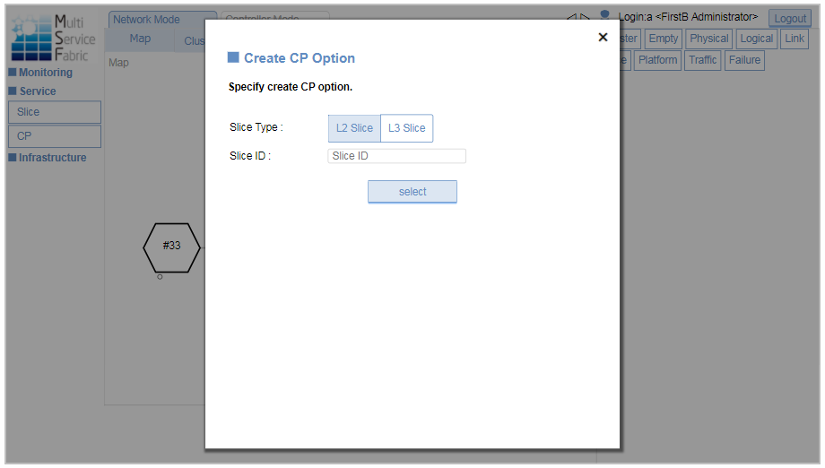  
**Figure 5-9 CP add menu button**

When you select the option on the Create CP Option dialog box and press the select button, CP Add dialog box opens.

")  
**Figure 5-10 Create CP Option dialog box (Not selected, Slice TypeL2)**

")  
**Figure 5-11 Create CP Option dialog box (Not selected, Slice TypeL3)**

")  
**Figure 5-12 Create CP Option dialog box (Slice TypeL3)**

When you enter parameters and press the deploy button on the Create CP Option dialog box, CP add request is sent to MFC.  
\*When you press the up/down-pointing triangle on the dialog box, the CP add parameter input fields open or close. Multiple items can be input.

")  
**Figure 5-13 CP Add dialog box (e.g. L2CP)**

")  
**Figure 5-14 CP Add dialog box (e.g. L3CP)**

#### 5.2.2 CP modification
Modify the QoS option of a CP.<br>
When you select a Slice and press the CP modify menu button, CP Modify dialog box opens.

  
**Figure 5-15 CP modify menu button**

When you enter parameters on the CP Modify dialog box and press the deploy button, CP modification request is sent to MFC.

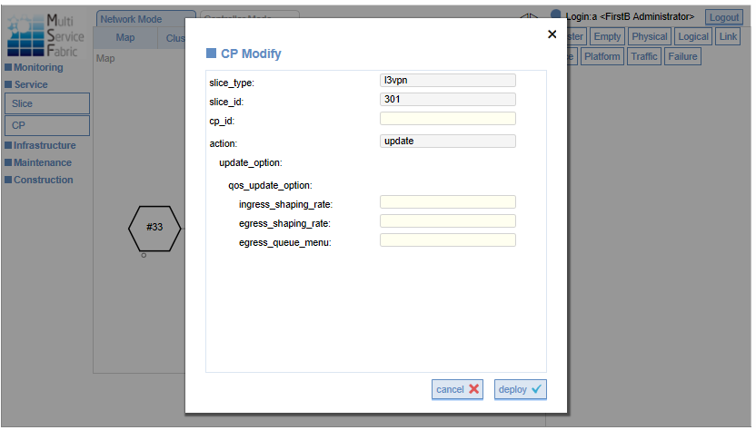  
**Figure 5-16 CP Modify dialog box**

#### 5.2.3 CP deletion
Delete a CP.<br>
When you select a Slice and press the CP delete menu button, CP Delete dialog box opens.

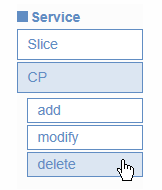  
**Figure 5-17 CP delete menu button**

When you enter parameters on the CP Delete dialog box and press the deploy button, CP deletion request is sent to MFC.  
\*When you press the up/down-pointing triangle on the dialog box, the CP delete parameter input fields open or close. Multiple items can be input.

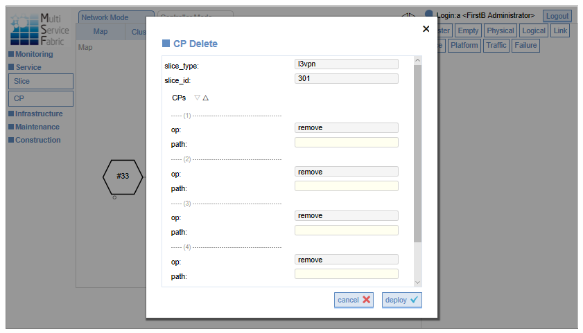  
**Figure 5-18 CP Delete dialog box**

## 6. Infrastructure setting menu
The following infrastructure setting menus can be selected from the side menu of Main screen.

- [Cluster addition](#611-cluster-addition)
- [Cluster deletion](#612-cluster-deletion)
- [Inter-cluster link IF addition](#613-inter-cluster-link-if-addition)
- [Inter-cluster link IF deletion](#614-inter-cluster-link-if-deletion)
- [LagIF member link addition](#615-lagif-member-link-addition)
- [LagIF member link deletion](#616-lagif-member-link-deletion)
- [Priority group node addition](#617-priority-group-node-addition)
- [Priority group node deletion](#618-priority-group-node-deletion)
- [Intra-cluster link IF priority modification](#619-intra-cluster-link-if-priority-modification)
- [Device information registration](#621-device-information-registration)
- [Device information deletion](#622-device-information-deletion)
- [Leaf addition](#631-leaf-addition)
- [Leaf modification](#632-leaf-modification)
- [Leaf deletion](#633-leaf-deletion)
- [Spine addition](#641-spine-addition)
- [Spine deletion](#642-spine-deletion)
- [Physical IF modification](#651-physical-if-modification)
- [Physical IF ACL addition](#652-physical-if-acl-addition)
- [Physical IF ACL deletion](#653-physical-if-acl-deletion)
- [breakoutIF addition](#654-breakoutif-addition)
- [breakoutIF deletion](#655-breakoutif-deletion)
- [LagIF addition](#656-lagif-addition)
- [LagIF deletion](#657-lagif-deletion)
- [LagIF ACL addition](#658-lagif-acl-addition)
- [LagIF ACL deletion](#659-lagif-acl-deletion)
- [IF shutdown modification](#6510-if-shutdown-modification)
- [edge-point registration](#661-edge-point-registration)
- [edge-point deletion](#662-edge-point-deletion)

### 6.1 Cluster
#### 6.1.1 Cluster addition
Add a cluster.<br>
When you press the Cluster add menu button, SW Cluster Add dialog box opens.

  
**Figure 6-1 Cluster add menu button**

When you enter parameters on the SW Cluster Add dialog box and press the deploy button, SW cluster addition request is sent to MFC.

  
**Figure 6-2 SW Cluster Add dialog box**

#### 6.1.2 Cluster deletion
Delete a cluster.<br>
When you select a cluster on the Multi-cluster display screen and press the Cluster delete menu button, SW Cluster Delete dialog box opens.

  
**Figure 6-3 Cluster delete menu button**

When you press the deploy button on the SW Cluster Delete dialog box, SW cluster deletion request is sent to MFC.

  
**Figure 6-4 SW Cluster Delete dialog box**

#### 6.1.3 Inter-cluster link IF addition
Add an inter-cluster link IF.<br>
When you select a cluster and press the Cluster add link menu button, Select IF Type dialog box opens.

  
**Figure 6-5 Cluster add link menu button**

When you select the IF Type and press the select button on the Select IF Type dialog box, Inter-Cluster Link Add dialog box opens.

  
**Figure 6-6 Select IF Type dialog box**

When you press the deploy button on the Inter-Cluster Link Add dialog box, inter-cluster link IF addition request is sent to MFC.

")  
**Figure 6-7 Inter-Cluster Link Add dialog box (Physical IF)**

")  
**Figure 6-8 Inter-Cluster Link Add dialog box (breakoutIF)**

")  
**Figure 6-9 Inter-Cluster Link Add dialog box (LagIF)**

#### 6.1.4 Inter-cluster link IF deletion
Delete an inter-cluster link IF.<br>
When you select an inter-cluster link IF and press the Cluster delete link menu button, ClusterLinkIfs Delete dialog box opens.

  
**Figure 6-10 Cluster delete link menu button**

When you press the deploy button on the ClusterLinkIfs Delete dialog box, inter-cluster link IF deletion request is sent to MFC.

  
**Figure 6-11 ClusterLinkIfs Delete dialog box**

#### 6.1.5 LagIF member link addition
Add physical IFs and breakoutIFs to the links that make up a LAG IF.<br>
When you select a node (Leaf/Spine) on the Fabric network display screen and press the Cluster add Lag member link menu button, the Add Lag Member Link dialog box opens.

  
**Figure 6-12 Cluster add Lag member link menu button**

For the physical IFs on the Add Lag Member Link dialog box, only the IFs whose speed is set are displayed.
When you select the links for addition on the Add Lag Member Link dialog box and press the deploy button, the Lag member link addition request is sent to MFC.

\*When you press the white up/down-pointing triangle on the dialog box, it opens and closes the selectable physical IFs or breakout IFs one by one.  
\*When you press the black up/down-pointing triangle on the dialog box, it opens and closes all selectable physical IFs or breakout IFs.  
\*Please note that information about whether or not the displayed IFs are already members of the target Lag is not displayed.

  
**Figure 6-13 Add Lag Member Link dialog box**

#### 6.1.6 LagIF member link deletion
Delete physical IFs or breakoutIFs from the links that make up the LAG IF.<br>
When you select a node (Leaf/Spine) on the Fabric network display screen and press the Cluster delete Lag member link menu button, the Delete Lag Member Link dialog box opens.

  
**Figure 6-14 Cluster delete Lag member link menu button**

For the physical IFs on the Delete Lag Member Link dialog box, only the IFs whose speed is set are displayed.
When you select the links for deletion on the Delete Lag Member Link dialog box and press the deploy button, the Lag member link deletion request is sent to MFC.

\*When you press the white up/down-pointing triangle on the dialog box, it opens and closes the selectable physical IFs or breakout IFs one by one.  
\*When you press the black up/down-pointing triangle on the dialog box, it opens and closes all selectable physical IFs or breakout IFs.  
\*Please note that information about whether or not the displayed IFs are already members of the target Lag is not displayed.  

  
**Figure 6-15 Delete Lag Member Link dialog box**

#### 6.1.7 Priority group node addition
Add nodes (Leaf/Spine) to the priority node group. <br>
When you press the Cluster add priority group menu button on the Fabric network display screen of the target cluster, the Priority Group Add dialog box opens.

  
**Figure 6-16 Cluster add priority group menu button**


When you enter parameters on the Priority Group Add dialog box and press the deploy button, the node addition request to the priority node group is sent to the MFC.  
\*When you press the up/down-pointing triangle on the dialog box, parameter input fields open and close. Multiple items can be input.

  
**Figure 6-17 Priority Group Add dialog box**

#### 6.1.8 Priority group node deletion
Delete nodes (Leaf/Spine) from the priority node group. <br>
When you press the Cluster delete priority group menu button on the Fabric network display screen of the target cluster, the Priority Group Delete dialog box opens.

  
**Figure 6-18 Cluster delete priority group menu button**

When you enter parameters on the Priority Group Delete dialog box and press the deploy button, the node deletion request from the priority node group is sent to the MFC.<br>
\*When you press the up/down-pointing triangle on the dialog box, parameter input fields open and close. Multiple items can be input.

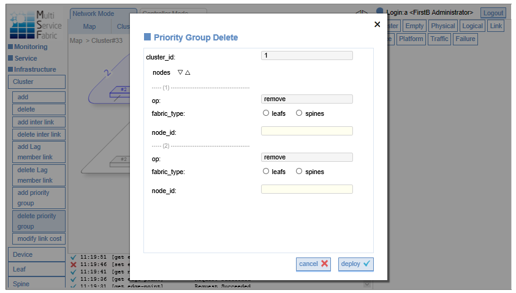  
**Figure 6-19 Priority Group Delete dialog box**

#### 6.1.9 Intra-cluster link IF priority modification
Modify the priority (IGP cost) of an intra-cluster link IF. <br>
When you select a node (Leaf/Spine) on the Fabric network display screen and press the Cluster modify link cost menu button, the Link Cost Modify dialog box opens.

  
**Figure 6-20 Cluster modify link cost menu button**

When you enter parameters on the Link Cost Modify dialog box and press the deploy button, the priority of intra-cluster link IF modification request is sent to the MFC.<br>
\*When the link cost (IGP cost) is modified from the default value by this request, the modified cost value is displayed on the link.

  
**Figure 6-21 Link Cost Modify dialog box**

### 6.2 Device information
#### 6.2.1 Device information registration
Register the device information.<br>
When you press the Device add menu button, Device Info Add dialog box opens.

  
**Figure 6-22 Device add menu button**

When you select the device information to be registered on the Device Info Add dialog box and press the deploy button, the device information registration request is sent to MFC.

  
**Figure 6-23 Device Info Add dialog box**

#### 6.2.2 Device information deletion
Delete the registered device information.<br>
When you press the Device delete menu button, Select Device (Select capability conditions) dialog box opens.

  
**Figure 6-24 Device delete menu button**

When you designate the parameters on the Select Device (Select capability conditions) dialog box and press the device search button, Select Device (Select device) dialog box opens.

  
**Figure 6-25 Select Device (Select capability conditions) dialog box**

When you select the device information on the Select Device (Select device) dialog box and press the select button, Device Info Delete dialog box opens.

  
**Figure 6-26 Select Device (Select device) dialog box**

When you press the deploy button on the Device Info Delete dialog box, device information deletion request is sent to MFC.

  
**Figure 6-27 Device Info Delete dialog box**

### 6.3 Leaf
#### 6.3.1 Leaf addition
Add a Leaf.<br>
When you press the Leaf add menu button on the Fabric network display screen, Select Device dialog box opens.

  
**Figure 6-28 Leaf add menu button**

When you designate the parameters on the Select Device (Select capability conditions) dialog box and press the device search button, Select Device (Select device) dialog box opens.

 dialog box")  
**Figure 6-29 Select Device (Select capability conditions) dialog box**

When you select the device information on the Select Device (Select device) dialog box and press the select button, Leaf Add dialog box opens.

  
**Figure 6-30 Select Device (Select device) dialog box**

When you enter parameters on the Leaf Add dialog box and press the deploy button, Leaf addition request is sent to MFC.  
\*When you press the up/down-pointing triangle icon on the screen, the entry fields for variable number of parameters open in order to enter multiple parameters.

")  
**Figure 6-31 Leaf Add dialog box (L2VPN)**

")  
**Figure 6-32 Leaf Add dialog box (L3VPN)**

#### 6.3.2 Leaf modification
Modify a Leaf.<br>
When you select a Leaf on the Fabric network display screen and press the Leaf modify menu button, Leaf Modify dialog box opens.

  
**Figure 6-33 Leaf modify menu button**

When you enter parameters on the Leaf Modify dialog box and press the deploy button, Leaf modification request is sent to MFC.

  
**Figure 6-34 Leaf Modify dialog box**

#### 6.3.3 Leaf deletion
Delete a Leaf.<br>
When you select a Leaf on the Fabric network display screen and press the Leaf delete menu button, Leaf Delete dialog box opens.

  
**Figure 6-35 Leaf delete menu button**

When you press the deploy button on the Leaf Delete dialog box, Leaf deletion request is sent to MFC.

  
**Figure 6-36 Leaf Delete dialog box**

### 6.4 Spine
#### 6.4.1 Spine Addition
Add a Spine.<br>
When you press the Spine add menu button on the Fabric network display screen, Select Device (Select capability conditions) dialog box opens.

  
**Figure 6-37 Spine add menu button**

When you designate the parameters on the Select Device (Select capability conditions) dialog box and press the device search button, Select Device (Select device) dialog box opens.

  
**Figure 6-38 Select Device (Select capability conditions) dialog box**

When you select the device information on the Select Device (Select device) dialog box and press the select button, Spine Add dialog box opens.

  
**Figure 6-39 Select Device (Select device) dialog box**

When you enter parameters on the Spine Add dialog box and press the deploy button, Spine addition request is sent to MFC.  
\*When you press the up/down-pointing triangle icon on the screen, the entry fields for variable number of parameters open in order to enter multiple parameters.

  
**Figure 6-40 Spine Add dialog box**

#### 6.4.2 Spine deletion
Delete a Spine.<br>
When you select a Spine on the Fabric network display screen and press the Spine delete menu button, Spine Delete dialog box opens.

  
**Figure 6-41 Spine delete menu button**

When you press the deploy button on the Spine Delete dialog box, Spine deletion request is sent to MFC.

  
**Figure 6-42 Spine Delete dialog box**

### 6.5 Interface
#### 6.5.1 Physical IF modification
Modify the physical IF information.<br>
When you select a node (Leaf/Spine) on the Fabric network display screen and press the Physical IF modify menu button, physicalIF Modify dialog box opens.

  
**Figure 6-43 Physical IF modify menu button**

When you enter parameters on the physicalIF Modify dialog box and press the deploy button, physical IF modification request is sent to MFC.

  
**Figure 6-44 physicalIF Modify dialog box**

#### 6.5.2 Physical IF ACL addition

Add a physical IF filter (ACL). 
When you select a node (Leaf) on the Fabric network display screen and press the Physical IF add ACL menu button, the Physical IF ACL Add dialog box opens.

  
**Figure 6-45 Physical IF add ACL menu button**

When you enter parameters on the Physical IF ACL Add dialog box and press the deploy button, physical IF filter addition request is sent to MFC.  
\*When you press the up/down-pointing triangle on the dialog box, the parameter input fields open and close. Multiple items can be input.

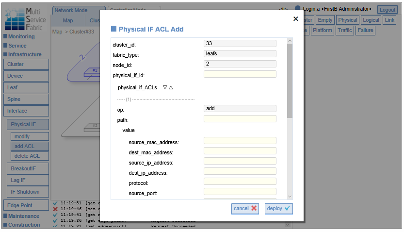  
**Figure 6-46 Physical IF ACL Add dialog box**

#### 6.5.3 Physical IF ACL deletion

Delete a physical IF filter (ACL). 
When you select a node (Leaf) on the Fabric network display screen and press the Physical IF delete ACL menu button, the Physical IF ACL Delete dialog box opens.

  
**Figure 6-47 Physical IF delete ACL menu button**

When you enter parameters on the Physical IF ACL Delete dialog box and press the deploy button, physical IF filter deletion request is sent to MFC.  
\*When you press the up/down-pointing triangle on the dialog box, the parameter input fields open and close. Multiple items can be input.

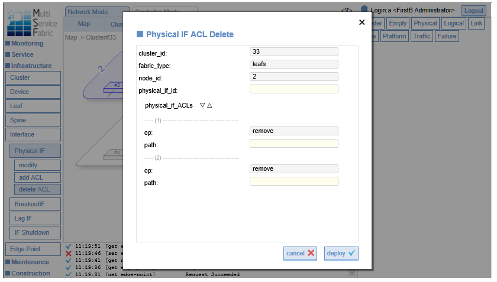  
**Figure 6-48 Physical IF ACL Delete dialog box**

#### 6.5.4 BreakoutIF addition
Add the breakoutIF information.<br>
When you select a node (Leaf/Spine) on the Fabric network display screen and press the BreakoutIF add menu button, Breakout IFs Add dialog box opens.

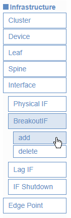  
**Figure 6-49 BreakoutIF add menu button**

When you enter parameters on the Breakout IFs Add dialog box and press the deploy button, breakoutIF addition request is sent to MFC.

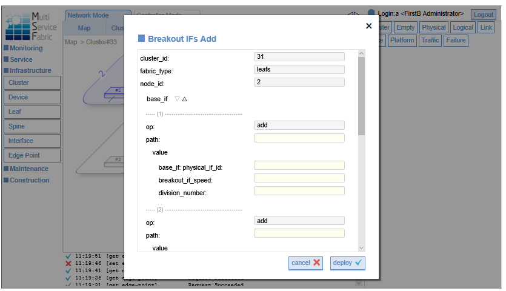  
**Figure 6-50 Breakout IFs Add dialog box**

#### 6.5.5 BreakoutIF deletion
Delete the breakoutIF information.<br>
When you select a node (Leaf/Spine) on the Fabric network display screen and press the BreakoutIF delete menu button, Breakout IFs Delete dialog box opens.

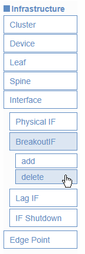  
**Figure 6-51 BreakoutIF delete menu button**

When you enter parameters on the Breakout IFs Delete dialog box and press the deploy button, breakoutIF deletion request is sent to MFC.

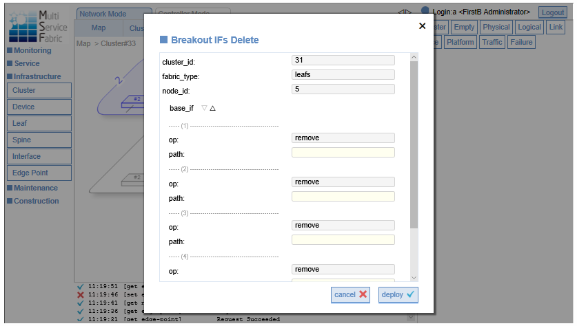  
**Figure 6-52 Breakout IFs Delete dialog box**

#### 6.5.6 LagIF addition
Add the LagIF information.<br>
When you select a node (Leaf/Spine) on the Fabric network display screen and press the Lag IF add menu button, LagIF Add dialog box opens.

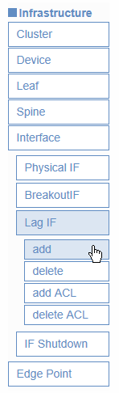  
**Figure 6-53 Lag IF add menu button**

When you enter parameters on the LagIF Add dialog box and press the deploy button, LagIF addition request is sent to MFC.

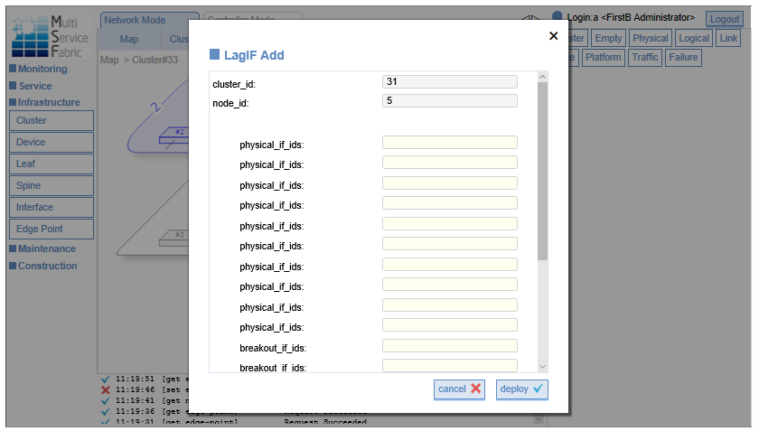  
**Figure 6-54 LagIF Add dialog box**

#### 6.5.7 LagIF deletion

Delete the LagIF information.<br>
When you select a node (Leaf/Spine) and press the Lag IF delete menu button, LagIF Delete dialog box opens.

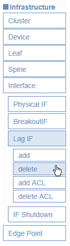  
**Figure 6-55 LagIF delete menu button**

When you enter parameters on the LagIF Delete dialog box and press deploy button, LagIF deletion request is sent to MFC.

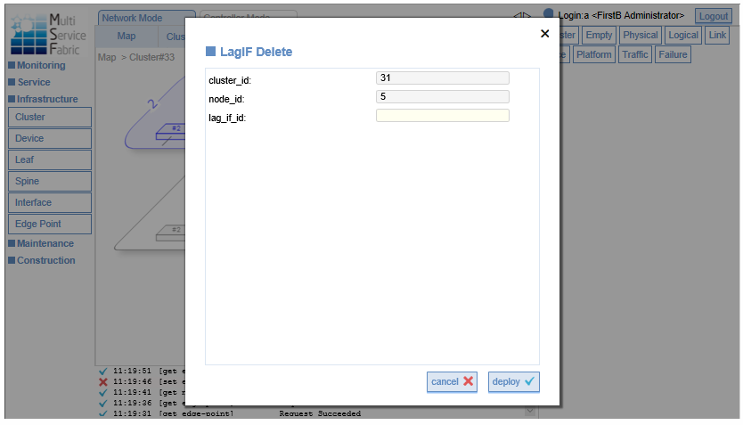  
**Figure 6-56 LagIF Delete dialog box**

#### 6.5.8 LagIF ACL addition

Add a LagIF filter (ACL).<br> 
When you select a node (Leaf) on the Fabric network display screen and press the LagIF add ACL menu button, the LagIF ACL Add dialog box opens.

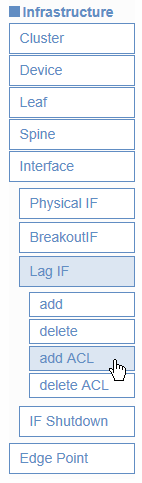  
**Figure 6-57 LagIF add ACL menu button**

When you enter parameters on the LagIF ACL Add dialog box and press the deploy button, LagIF filter addition request is sent to MFC.  
\*When you press the up/down-pointing triangle on the dialog box, the parameter input fields open and close. Multiple items can be input.

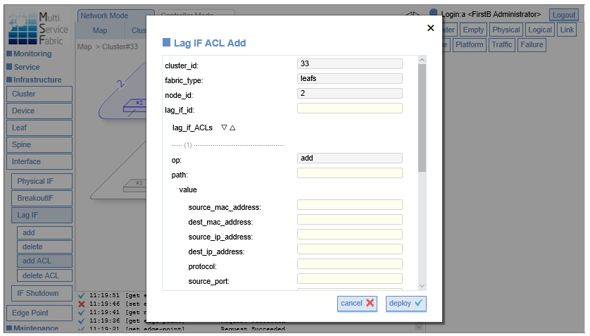  
**Figure 6-58 LagIF ACL Add dialog box**

#### 6.5.9 LagIF ACL deletion

Delete a LagIF filter (ACL).<br> 
When you select a node (Leaf) on the Fabric network display screen and press the LagIF delete ACL menu button, the LagIF ACL Delete dialog box opens.

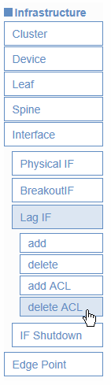  
**Figure 6-59 LagIF delete ACL menu button**

When you enter parameters on the LagIF ACL Delete dialog box and press the deploy button, LagIF filter deletion request is sent to MFC.  
\*When you press the up/down-pointing triangle on the dialog box, the parameter input fields open and close. Multiple items can be input.

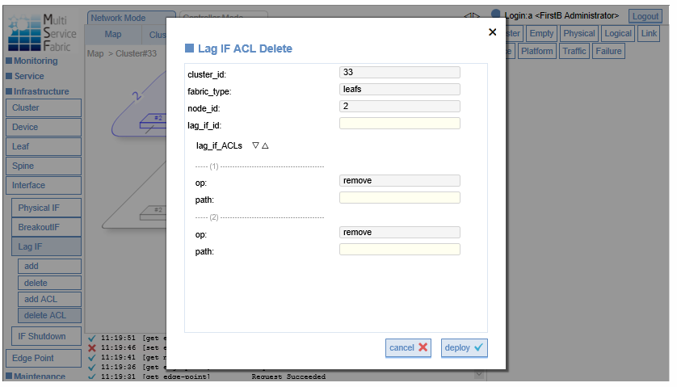  
**Figure 6-60 LagIF ACL Delete dialog box**

#### 6.5.10 IF shutdown modification

Modify an IF shutdown status.<br>
When you select a node (Leaf/Spine) on the Fabric network display screen and press the IF Shutdown menu button, the IF Shutdown dialog box opens.

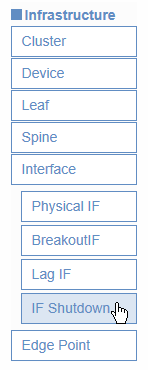  
**Figure 6-61 IF Shutdown menu button**

When you enter parameters on the IF Shutdown dialog box and press the deploy button, IF shutdown modification request is sent to MFC.

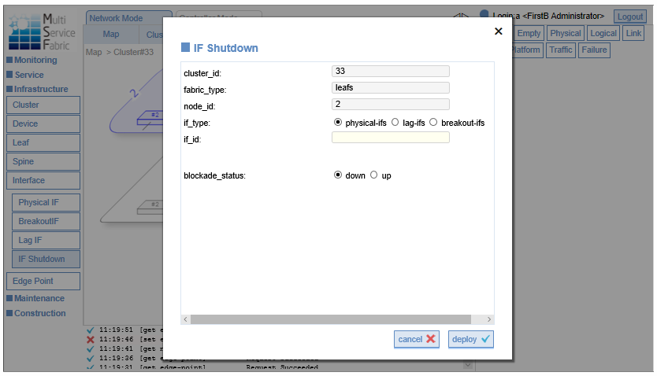  
**Figure 6-62 IF Shutdown dialog box**

### 6.6 Edge-point
#### 6.6.1 Edge-point registration
Register an edge-point.<br>
When you select a node (Leaf) on the Fabric network display screen and press the Edge Point add menu button, Edge-Point Add dialog box opens.

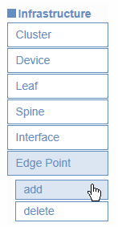  
**Figure 6-63 Edge Point add menu button**

When you enter parameters on the Edge-Point Add dialog box and press the deploy button, edge-point registration request is sent to MFC.

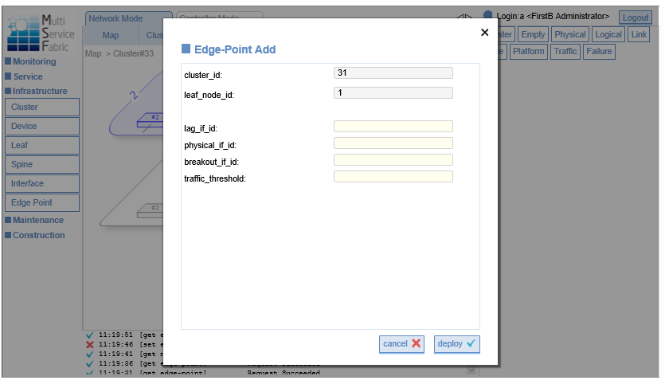  
**Figure 6-64 Edge-Point Add dialog box**

#### 6.6.2 Edge-point deletion
Delete an edge-point.<br>
When you select a node (Leaf) on the Fabric network display screen and press the Edge Point delete menu button, Edge-Point Delete dialog box opens.

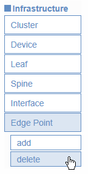  
**Figure 6-65 Edge Point delete menu button**

When you enter parameters on the Edge-Point Delete dialog box and press the deploy button, edge-point deletion request is sent to MFC.

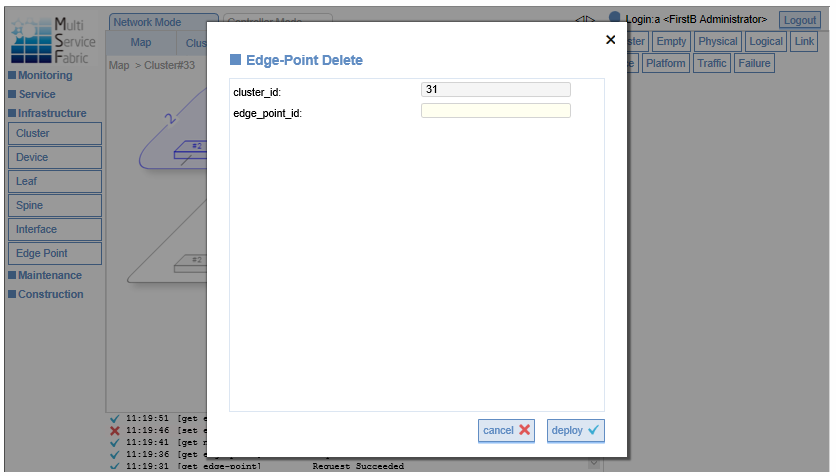  
**Figure 6-66 Edge-Point Delete dialog box**

## 7. Maintenance menu
The following maintenance setting menus can be selected from the side menu of Main screen.

- [Node OS upgrade](#711-node-os-upgrade)

### 7.1 Switch
#### 7.1.1 Node OS upgrade

Register an asynchronous reservation request for upgrading node OS.<br>
When you press the Switch Update menu button on the Fabric network display screen of the target cluster, the Switch Update dialog box opens.

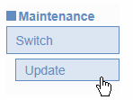  
**Figure 7-1 Switch Update menu button**

When you enter parameters on the Switch Update dialog box and press the deploy button, node OS upgrade request is sent to MFC.  
*When you press the up/down-pointing triangle on the dialog box, the parameter input fields open and close. Multiple items can be input.

  
**Figure 7-2 Switch Update dialog box**

About the notification (dialog display) while the node OS upgrade is being executed, see the chapter [10.3](#103-node-os-upgrade-notification).

## 8. Construction setting menu

The following construction setting menus can be selected from the side menu of Main screen.

- [Node detour, detour reset](#811-node-detour-detour-reset)

### 8.1 Switch
#### 8.1.1 Node detour, detour reset

By this menu, nodes can be detoured around or reset to original state.<br>
When you select a node (Leaf/Spine) on the Fabric network display screen and press the Switch Detour menu button, the Switch Detour dialog box opens.

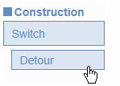  
**Figure 8-1 Switch Detour menu button**

When you enter parameters on the Switch Detour dialog box and press the deploy button, node detour or detour reset request is sent to MFC.

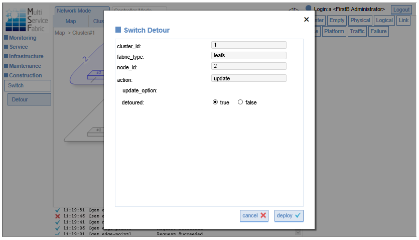  
**Figure 8-2 Switch Detour dialog box**

## 9. Detailed information display
It displays the detailed information based on the information selected at the Figure area on the Main screen.

- [Cluster information](#91-cluster-information)
- [Empty physical IF information](#92-empty-physical-if-information)
- [IF information](#93-if-information)
- [Logical port information](#94-logical-port-information)
- [Link information](#95-link-information)
- [Slice information](#96-slice-information)
- [Node information](#97-node-information)
- [Traffic information](#98-traffic-information)
- [Failure information](#99-failure-information)
- [Controller information](#910-controller-information)

### 9.1 Cluster information
Select the Network display mode tab.<br>
Press the Cluster toggle button on the upper part of the detailed screen.<br>
Cluster information will be displayed based on the selected information.

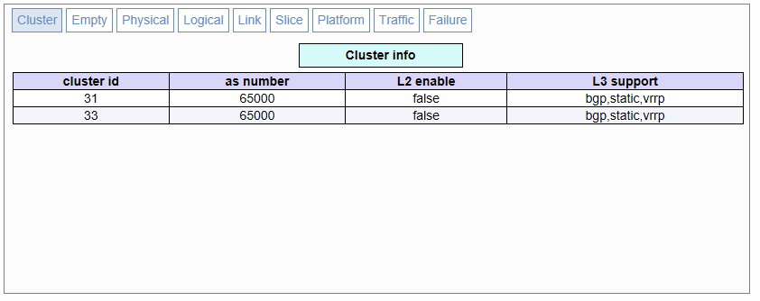  
**Figure 9-1 List of cluster information**

**Table 9-1 List of cluster information**

|No.  |Item        |Description|
|----:|:-----------|:------------|
|1    |cluster id |It displays the cluster ID.|
|2    |as number  |It displays the AS number of the cluster.|
|3    |L2 enable  |It displays the availability of the L2CP supported by the cluster.<br> true/false|
|4    |L3 support |It displays the L3CP protocols supported by the cluster.<br> "bgp": BGP (Border Gateway Protocol) <br> "static": static route <br> "vrrp": VRRP (Virtual Router Redundancy Protocol)|

**Table 9-2 Display condition of cluster information list**

|Screen                            |Condition of selection       |Displayed content|
|:-------------------------------|:--------------------|:------------|
|Multi-cluster display screen    |Not selected              |It displays the information of all clusters.|
|                                |If a cluster is selected         |It displays the information of the selected cluster.|
|                                |If an Inter-cluster link is selected  |(No display)|
|                                |If a Slice is selected         |(No display)|
|Fabric network display screen   |Not selected              |It displays the cluster information that the displayed Fabric network belongs to.|
|                                |If a topology is selected       |Same as above|
|                                |If a node on the topology is selected|Same as above|
|                                |If a Slice is selected         |Same as above|
|                                |If a node on the Slice is selected  |Same as above|
|Node display screen             |Not selected               |It displays the information of the cluster that the displayed node belongs to.|
|                                |If a node is selected             |Same as above|
|                                |If a port is selected           |Same as above|

### 9.2 Empty physical IF information
Select the Network display mode tab.<br>
Press the Empty toggle button on the upper part of the detailed screen.<br>
List of physical IFs whose speed is unset will be displayed based on the selected information.

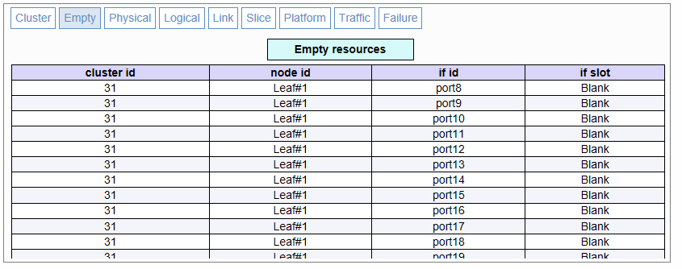  
**Figure 9-2 List of empty physical IF information**

**Table 9-3 List of empty physical IF information**

|No.  |Item        |Description|
|----:|:-----------|:------------|
|1    |cluster id  |It displays the cluster ID of the cluster that the node who has the physical IF belongs to.|
|2    |node id     |It displays the node ID of the node who has the physical IF.|
|3    |if id       |It displays the IF ID of the physical IF.|
|4    |if slot     |Blank fixed.|

**Table 9-4 Display condition of empty physical IF information list**

|Screen                            |Condition of selection              |displayed content|
|:-------------------------------|:--------------------|:------------|
|Multi-cluster display screen    |Not selected              |(No display)|
|                                |If a cluster is selected         |(No display)|
|                                |If an inter-cluster link is selected  |(No display)|
|                                |If a Slice is selected         |(No display)|
|Fabric network display screen   |Not selected              |It displays the ports of all nodes in the cluster.|
|                                |If a topology is selected       |Same as above|
|                                |If a node on the topology is selected|It displays only ports of the selected node.|
|                                |If a Slice is selected         |It displays only ports of the node that belongs to (has one or more CPs on) the selected Slice.|
|                                |If a node on the Slice is selected |It displays only ports of the selected node.|
|Node display screen             |Not selected              |It displays the ports of the displayed node.|
|                                |If a node is selected             |It displays the ports of the selected node.
|                                |If a port is selected           |It displays the selected port information|

### 9.3 IF information
Select the Network display mode tab.<br>
Press the Physical toggle button on the upper part of the detailed screen.<br>
List of physical IF information, breakoutIF information and LagIF information will be displayed based on the selected information.
#### 9.3.1 Physical IF information

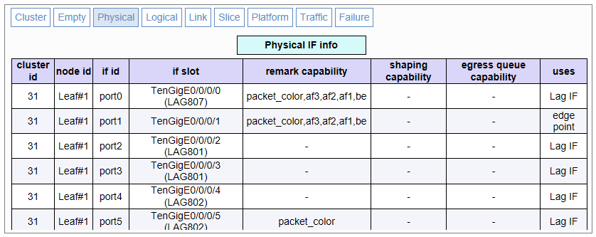  
**Figure 9-3 List of physical IF information**

**Table 9-5 List of physical IF information**

|No.  |Item                   |Description|
|----:|:----------------------|:------------|
|1    |cluster id             |It displays the cluster ID of the cluster that the node who has the physical IF belongs to.|
|2    |node id                |It displays the node ID of the node who has the physical IF.|
|3    |if id                  |It displays the IF ID of the physical IF.|
|4    |if slot                |It displays the SLOT number of the physical IF.|
|5    |remark capability      |It displays the selectable remark menu list.|
|6    |shaping capability     |It displays the availability of the shaping.<br>available / -|
|7    |egress queue capability|It displays the selectable Egress queue rate menu list.|
|8    |uses                   |It displays the usage information of the physical IF.<br>breakout IF: Split into breakoutIFs. <br>LagIF: Used as member link of LAG<br>Intra-Cluster Link: Used for intra-cluster link<br>Inter-Cluster Link: Used for inter-cluster link<br>edge point: Used for edge-point<br>-: None of the above applies|

**Table 9-6 Display condition of physical IF information list**

|Screen                            |Condition of selection       |Displayed content|
|:-------------------------------|:-------------|:------------|
|Multi-cluster display screen    |Not selected       |(No display)|
|                                |If a cluster is selected |(No display)|
|                                |If an inter-cluster link is selected|(No display)|
|                                |If a Slice is selected  |(No display)|
|Fabric network display screen   |Not selected       |It displays the ports of all nodes in the cluster.|
|                                |If a topology is selected |Same as above|
|                                |If a node on the topology is selected|It displays only ports of the selected node.|
|                                |If a Slice is selected|It displays only ports of the node that belongs to (has one or more CPs on) the selected Slice.|
|                                |If a node on the Slice is selected|It displays only ports of the selected node.|
|Node display screen             |Not selected       |It displays the ports of the displayed node.|
|                                |If a node is selected |It displays the ports of the selected node.
|                                |If a port is selected|It displays the information of the selected port.|


#### 9.3.2 breakoutIF information

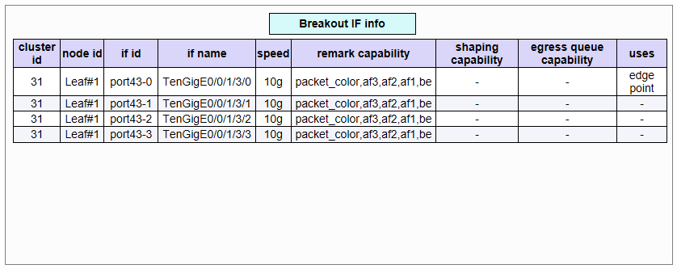  
**Figure 9-4 List of breakoutIF information**

**Table 9-7 List of breakoutIF information**

|No.  |Item        |Description|
|----:|:-----------|:------------|
|1    |cluster id |It displays the cluster ID of the cluster that the node who has the breakoutIF belongs to.|
|2    |node id |It displays the node ID of the node who has breakoutIF.|
|3    |if id |It displays the IF ID of breakoutIF.|
|4    |if name|It displays the IF name of breakoutIF.|
|5    |speed|It displays the IF speed of breakoutIF.|
|6    |remark capability|It displays the selectable remark menu list.|
|7    |shaping capability |It displays the availability of the shaping.<br> available / -|
|8    |egress queue capability|It displays the selectable Egress queue rate menu list.|
|9    |uses |It displays the usage information of breakoutIF.<br>LagIF: Used as member link of LAG<br>Intra-Cluster Link: Used for intra-cluster link<br>Inter-Cluster Link: Used for inter-cluster link<br>edge point: Used for edge-point<br>-: None of the above applies|

**Table 9-8 Display condition of breakoutIF information list**

|Screen                            |Condition of selection       |Displayed content|
|:-------------------------------|:-------------|:------------|
|Multi-cluster display screen    |Not selected       |(No display)|
|                                |If a cluster is selected |(No display)|
|                                |If an inter-cluster link is selected|(No display)|
|                                |If a Slice is selected |(No display)|
|Fabric network display screen   |Not selected       |It displays the ports of all nodes in the cluster.|
|                                |If a topology is selected |Same as above|
|                                |If a node on the topology is selected|It displays only ports of the selected node.|
|                                |If a Slice is selected|(No display)|
|                                |If a node on the Slice is selected|It displays only ports of the selected node.|
|Node display screen             |Not selected       |It displays the port of the displayed node.|
|                                |If a node is selected |It displays the ports of the selected node.
|                                |If a port is selected|It displays the information of the selected port.|

#### 9.3.3 LagIF information

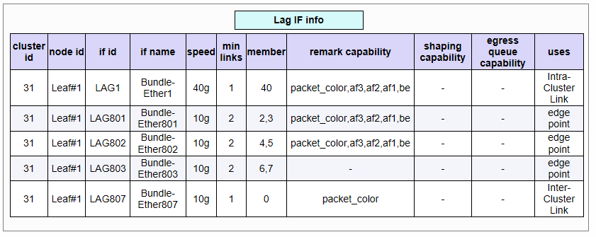  
**Figure 9-5 List of LagIF information**

**Table 9-9 List of LagIF information**

|No.  |Item        |Description|
|----:|:-----------|:------------|
|1    |cluster id |It displays the cluster ID of the cluster that the node who has LagIF belongs to.|
|2    |node id |It displays the node ID of the node who has LagIF.|
|3    |if id |It displays the IF ID of LagIF.|
|4    |if name|It displays the IF name of LagIF.|
|5    |speed|It displays the IF speed of LagIF.|
|6    |min links|It displays the minimum number of the normal links, for that a LAG  is not considered as in a failure.|
|7    |member|It displays the IF ID of IF that is the member link of LAG.|
|8    |remark capability|It displays the selectable remark menu list.|
|9    |shaping capability |It displays the availability of the shaping.<br> available / -|
|10   |egress queue capability|It displays the selectable Egress queue rate menu list.|
|11   |uses |It displays the LagIF usage information.<br>Intra-Cluster Link: Used for intra-cluster link<br>Inter-Cluster Link: Used for inter-cluster link<br>edge point: Used for edge-point.<br>-: None of the above applies|

**Table 9-10 Display condition of LagIF information list**

|Screen                            |Condition of selection       |Displayed content|
|:-------------------------------|:-------------|:------------|
|Multi-cluster display screen    |Not selected       |(No display)|
|                                |If a cluster is selected |(No display)|
|                                |If an inter-cluster link is selected|(No display)|
|                                |If a Slice is selected  |(No display)|
|Fabric network display screen   |Not selected       |It displays the ports of all nodes in the cluster.|
|                                |If a topology is selected |Same as above |
|                                |If a node on the topology is selected|It displays only ports of the selected node.|
|                                |If a Slice is selected|(No display)|
|                                |If a node on the Slice is selected|It displays only ports of the selected node.|
|Node display screen             |Not selected       |It displays the ports of the displayed node.|
|                                |If a node is selected |It displays the ports of the selected node.
|                                |If a port is selected|It displays the information of the selected port.|

### 9.4 Logical port information
Select the Network display mode tab.<br>
Press the Logical toggle button on the upper part of the detailed screen.<br>
List of edge-points will be displayed based on the selected information.

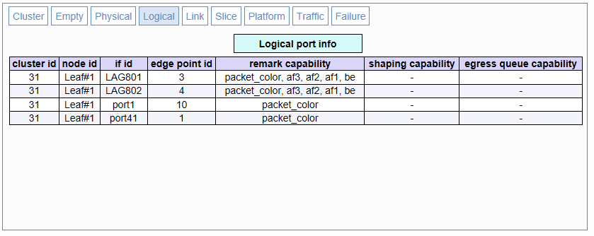  
**Figure 9-6 List of logical port information**

**Table 9-11 List of logical port information**    

|No.  |Item        |Description|
|----:|:-----------|:------------|
|1    |cluster id |It displays the cluster ID of the cluster that the node who has edge-point belongs to.|
|2    |node id |It displays the node ID of the node who has edge-point.|
|3    |if id |It displays the IF ID who has edge-point.|
|4    |edge point id|It displays the edge-point ID.|
|5    |remark capability|It displays the selectable remark menu list.|
|6    |shaping capability |It displays the availability of the shaping.<br> available / -|
|7   |egress queue capability|It displays the selectable Egress queue rate menu list.|

**Table 9-12 Display condition of logical port information list**

|Screen                            |Condition of selection       |Displayed content|
|:-------------------------------|:-------------|:------------|
|Multi-cluster display screen    |Not selected       |(No display)|
|                                |If a cluster is selected |(No display)|
|                                |If an inter-cluster link is selected|(No display)|
|                                |If a Slice is selected  |It displays the edge-points used for the selected Slice.|
|Fabric network display screen   |Not selected       |(No display)|
|                                |If a topology is selected |It displays the edge-points of all nodes in the cluster.|
|                                |If a node on the topology is selected|It displays the edge-point of the selected node.|
|                                |If a Slice is selected|It displays the edge-points used for the selected Slice among the edge-points of all nodes in the cluster.|
|                                |If a node on the Slice is selected|It displays the edge-points used for the selected Slice among the edge-points of the selected node.|
|node display screen             |Not selected       |It displays the edge-point of the displayed node.|
|                                |If a node is selected |It displays the edge-point of the selected node.|
|                                |If a port is selected|It displays the edge-point of the selected port.|

### 9.5 Link information
Select the Network display mode tab.<br>
Press the Link toggle button on the upper part of the detailed screen.<br>
List of inter-cluster link IF information and intra-cluster link IF information will be displayed based on the selected information.
#### 9.5.1 Inter-cluster link IF information

  
**Figure 9-7 List of inter-cluster link IF information**

**Table 9-13 List of inter-cluster link IF**

|No.  |Item        |Description|
|----:|:-----------|:------------|
|1    |cluster id |It displays the cluster ID of the cluster that the node who has the inter-cluster link IF belongs to.|
|2    |node id |It displays the node ID of the node who has the Inter-cluster link IF.|
|3    |link if id |It displays the link IF ID of the inter-cluster link IF.|
|4    |if id   |It displays the IF ID that identifies the physical / Lag / breakout IF information which configures the inter-cluster link IF.|
|5    |igp cost|It displays the IGP cost of the inter-cluster link IF.|
|6    |ipv4 addr|It displays the IPv4 address of the inter-cluster link IF.|
|7    |threshold|It displays the traffic threshold value of the inter-cluster link IF.|

**Table 9-14 Display condition of inter-cluster link IF information list**

|Screen                            |Condition of selection       |Displayed content|
|:-------------------------------|:-------------|:------------|
|Multi-cluster display screen    |Not selected       |It displays all inter-cluster link IFs.|
|                                |If a cluster is selected |It displays the inter-cluster link IFs in the selected cluster. |
|                                |If an inter-cluster link is selected|It displays the inter-cluster link IFs in the selected cluster.|
|                                |If a Slice is selected  |(No display)|
|Fabric network display screen   |Not selected       |It displays all inter-cluster link IFs in the cluster.|
|                                |If a topology is selected |Same as above|
|                                |If a node on the topology is selected|It displays the inter-cluster link IFs of the selected node.|
|                                |IF Slice is selected|(No display)|
|                                |If a node on the Slice is selected|It displays the inter-cluster link IFs of the selected node.|
|Node display screen             |Not selected       |It displays the inter-cluster link IFs of the displayed node.|
|                                |If a node is selected |It displays the inter-cluster link IFs of the selected node.
|                                |If a port is selected|It displays the inter-cluster link IF of the selected port.|

#### 9.5.2 Intra-cluster link IF information

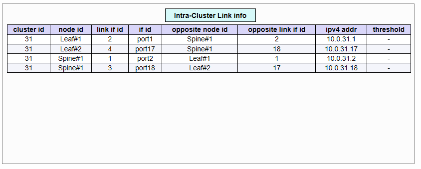  
**Figure 9-8 List of intra-cluster link IF information**

**Table 9-15 List of intra-cluster link IF information**

|No.  |Item        |Description|
|----:|:-----------|:------------|
|1    |cluster id |It displays the cluster ID of the cluster that the node who has the intra-cluster link IF belongs to.|
|2    |node id |It displays the node ID of the node who has the intra-cluster link IF.|
|3    |link if id |It displays the link IF ID of the intra-cluster link IF.|
|4    |if id |It displays the IF ID of the IF that accommodates the intra-cluster link IF. |
|5    |opposite node id|It displays the node ID of the opposite node of the intra-cluster link IF.|
|6    |opposite link if id|It displays the intra-cluster link IF ID of the opposite node of the intra-cluster link IF.|
|7    |ipv4 addr|It displays the IPv4 address of the intra-cluster link IF.|
|8    |threshold|It displays the traffic threshold value of the intra-cluster link IF [Gbps].|

**Table 9-16 Display condition of intra-cluster link IF information list**

|Screen                            |Condition of selection       |displayed content|
|:-------------------------------|:-------------|:------------|
|Multi-cluster display screen    |Not selected       |(No display)|
|                                |If a cluster is selected |(No display)|
|                                |If an inter-cluster link is selected|(No display)|
|                                |If a Slice is selected  |(No display)|
|Fabric network display screen   |Not selected       |It displays all intra-cluster link IFs in the cluster.|
|                                |If a topology is selected |Same as above|
|                                |If a node on the topology is selected|It displays the intra-cluster link IFs of the selected node.|
|                                |If a Slice is selected|(No display)|
|                                |If a node on the Slice is selected|It displays the intra-cluster link IFs of the selected node.|
|Node display screen             |Not selected       |It displays the intra-cluster link IFs of the displayed node.|
|                                |If a node is selected |It displays the intra-cluster link IFs of the selected node.|
|                                |If a port is selected|It displays the intra-cluster link IF of the selected port.|

### 9.6 Slice information
Select the Network display mode tab.<br>
Press the Slice toggle button on the upper part of the detailed screen.<br>
List of L2Slice information and L3Slice information will be displayed based on the selected information.

#### 9.6.1 L2Slice information

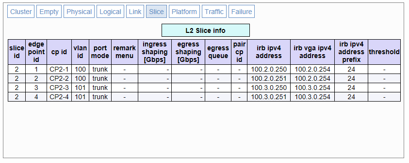  
**Figure 9-9 List of L2Slice information**

**Table 9-17 L2Slice information**

|No.  |Item        |Description|
|----:|:-----------|:------------|
|1    |slice id |It displays the SliceID.|
|2    |edge point id |It displays the edge-point ID of the edge-point.|
|3    |cp id |It displays the CP ID of the CP existing on the edge-point.|
|4    |vlan id |I displays the VLAN ID of the CP.<br>1 - 4096|
|5    |port mode|It displays the port mode of the CP.<br> "access": Access mode <br> "trunk": Trunk mode|
|6    |remark menu|It displays the CP remark menu if remark function is available.|
|7    |ingress shaping|it displays the inflow shaping rate of the CP [Gbps] if the shaping function is available.|
|8    |egress shaping|It displays the outflow shaping rate of the CP [Gbps] if the shaping function is available.|
|9    |egress queue|It displays the Egress queue rate menu.|
|10   |pair cp id|It displays the CP ID of the pair CP in multi-home configuration.|
|11   |irb ipv4 address|It displays the IPv4 address of the IRB IF in the IRB setting.|
|12   |irb vga ipv4 address|It displays the IPv4 address of the virtual gateway in the IRB setting.|
|13   |irb ipv4 address prefix|It displays the prefix of network address in the IRB setting.|
|14   |threshold|It displays the traffic threshold value of the L2CP [Gbps].|

**Table 9-18 Display condition of L2Slice information list**

|Screen                            |Condition of selection       |Displayed content|
|:-------------------------------|:-------------|:------------|
|Multi-cluster display screen    |Not selected       |It displays all L2CPs of the all Slice.|
|                                |If a cluster is selected |(No display)|
|                                |If an inter-cluster link is selected|(No display)|
|                                |If a Slice is selected  |It displays all L2CPs of the selected Slice.|
|Fabric network display screen   |Not selected       |It displays all L2CPs in the cluster.|
|                                |If a topology is selected |(No display)|
|                                |If a node on the topology is selected|(No display)|
|                                |If a Slice is selected|It displays the L2CPs in the cluster among the all L2CPs of the selected Slice.|
|                                |If a node on the Slice is selected|It displays the L2CPs on the selected node among the all L2CPs of the selected Slice.|
|Node display screen             |Not selected       |(No display)|
|                                |If a node is selected |(No display)|
|                                |If a port is selected|(No display)|

#### 9.6.2 L3Slice information

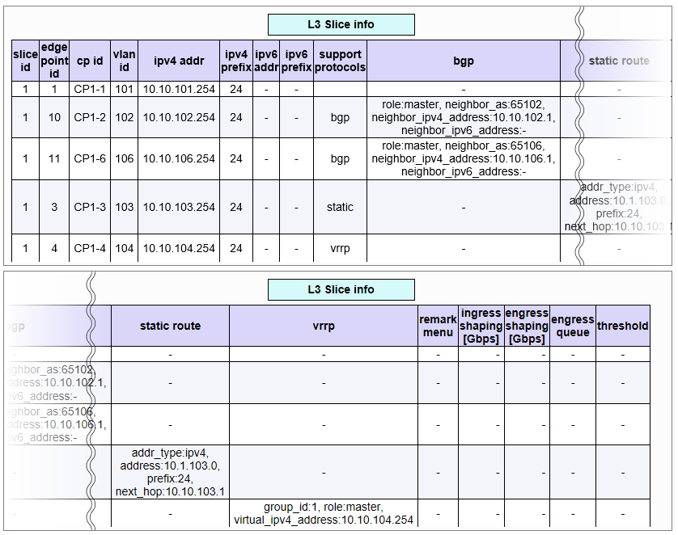  
**Figure 9-10 L3Slice information**

**Table 9-19 List of L3Slice information**

|No.  |Item        |Description|
|----:|:-----------|:------------|
|1   |slice id |It displays the SliceID.|
|2   |edge point id |It displays the edge-point ID of the edge-point.|
|3   |cp id |It displays the CP ID of the CP existing on the edge-point.|
|4   |vlan id |It displays the VLAN ID of the CP.<br>0 - 4096|
|5   |ipv4 addr |It displays the accommodated node IF address (IPv4) of the CP.|
|6   |ipv4 prefix |It displays the accommodated node IF prefix (IPv4) of the CP.<br>0 - 31|
|7   |ipv6 addr |It displays the accommodated node IF address (IPv6) of the CP.|
|8   |ipv6 prefix |It displays the accommodated node IF prefix (IPv6) of the CP.<br> 0 - 64|
|9   |support protocols |It displays the UNI connection protocol information supported by L3CP.<br>"bgp": BGP (Border Gateway Protocol)<br> "static": Static route<br> "vrrp": VRRP (Virtual Router Redundancy Protocol)|
|10   |bgp |It displays the BGP information of the L3CP.|
|11   |static route |It displays the static route information of the L3CP.|
|12   |vrrp |It displays the VRRP information of the L3CP.|
|13   |remark menu |It displays the remark menu of the CP if remark function is available.|
|14   |ingress shaping |It displays the inflow shaping rate of the CP [Gbps] if the shaping function is available.|
|15   |egress shaping |It displays the outflow shaping rate of the CP [Gbps] if the shaping function is available.|
|16   |egress queue |It displays the Egress queue rate menu of the CP.|
|17   |threshold |It displays the traffic threshold value of L3CP [Gbps].|

**Table 9-20 Display condition of L3Slice information list**

|Screen                             |Condition of selection       |Displayed content|
|:-------------------------------|:-------------|:------------|
|Multi-cluster display screen    |Not selected       |It displays all L3CPs of the all Slices.|
|                                |If a cluster is selected |(No display)|
|                                |If an inter-cluster link is selected|(No display)|
|                                |If a Slice is selected  |It displays all L3CPs of the selected Slice.|
|Fabric network display screen   |Not selected       |It displays all L3CPs in the cluster.|
|                                |If a topology is selected |(No display)|
|                                |If a node on the topology is selected|(No display)|
|                                |If a Slice is selected|It displays the L3CPs in the cluster among the all L3CPs of the selected Slice.|
|                                |If a node on the Slice is selected| It displays the L3CPs on the selected node among the all L3CPs of the selected Slice.|
|Node display screen             |Not selected       |(No display)|
|                                |If a node is selected |(No display)|
|                                |If a port is selected|(No display)|


### 9.7 Node information
Select the Network display mode tab.<br>
Press the Platform toggle button on the upper part of the detailed screen.<br>
Node addition (provisioning) status will be displayed based on the selected information.

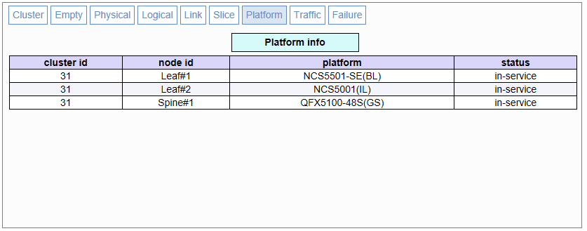  
**Figure 9-11 List of node information**

**Table 9-21 List of node information**

|No.  |Item        |Description|
|----:|:-----------|:------------|
|1    |cluster id |It displays the cluster ID of the cluster that the node belongs to.
|2    |node id |It displays the node ID of the node.
|3    |platform |It displays the platform of the node.
|4    |status |It displays the node addition status.<br>"in-service": In service<br>"before-setting": Waiting for start of the node<br>"ztp-complete": ZTP completed<br>"node-resetting-complete": Infrastructure setting completed<br>"failure-setting": Out of order (Failure of addition)<br>"failure-node-resetting": Failure of infrastructure setting<br>"failure-service-setting": Failure of service setting<br>"failure-other": Out of order (others)<br>"failure-recover-node": Out of order (failure of addition for recovery)

**Table 9-22 Display condition of node information list**

|Screen                             |Condition of selection       |Displayed content|
|:-------------------------------|:-------------|:------------|
|Multi-cluster display screen    |Not selected       |(No display)|
|                                |If a cluster is selected |(No display)|
|                                |If an inter-cluster link is selected|(No display)|
|                                |If a Slice is selected  |(No display)|
|Fabric network display screen   |Not selected       |It displays the information of all nodes in the cluster.|
|                                |If a topology is selected |It displays the information of all nodes in the cluster.|
|                                |If a node on the topology is selected| It displays the information of the selected node.|
|                                |If a Slice is selected|It displays the information of the nodes that belongs to the selected Slice (or has one or more CPs on the selected Slice).|
|                                |If a node on the Slice is selected|It displays the information of the selected node.|
|Node display screen             |Not selected       |It displays the information of the displayed node.|
|                                |If a node is selected |It displays the information of the selected node.
|                                |If a port is selected|(No display)|

### 9.8 Traffic information
Select the Network display mode tab.<br>
Press the Traffic toggle button on the upper part of the detailed screen.<br>
List of IF traffic information and CP traffic information will be displayed based on the selected information.

#### 9.8.1 IF traffic information

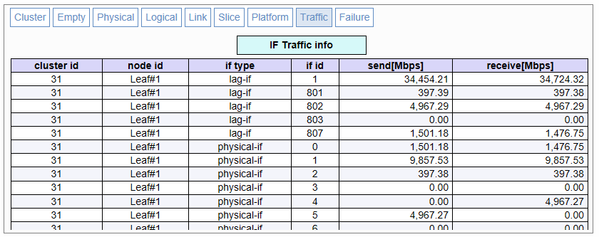  
**Figure 9-12 List of IF traffic information**

**Table 9-23 List of IF traffic information**

|No.  |Item        |Description|
|----:|:-----------|:------------|
|1    |cluster id  |It displays the cluster ID of the cluster that the node belongs to.|
|2    |node id    |It displays the node ID of the node.|
|3    |if type    |It displays the type of IF.<br>"physical-if": Physical IF<br>"breakout-if": breakoutIF<br>"lag-if": LagIF|
|4    |if id      |It displays the IF ID of the IF.|
|5    |send [unit]  |It displays the traffic sending rate of the IF. <br>[Unit] is the unit (Gbps/Mbps) specified in Config.|
|6    |receive [unit] |It displays the traffic receiving rate of the IF.<br>[Unit] is the unit (Gbps/Mbps) specified in Config.|

**Table 9-24 Display condition of IF traffic information list**

|Screen                            |Condition of selection       |Displayed content|
|:-------------------------------|:-------------|:------------|
|Multi-cluster display screen    |Not selected       |(No display)|
|                                |If a cluster is selected |It displays the traffic information of the inter-cluster link IFs of the selected cluster.|
|                                |If the inter-cluster link is selected|It displays the traffic information of the selected inter-cluster link IF.|
|                                |If a Slice is selected  |(No display)|
|Fabric network display screen   |Not selected       |It displays all IF traffic information of the nodes in the cluster.|
|                                |If a topology is selected |It displays all IF traffic information of the nodes in the cluster.|
|                                |If a node on the topology is selected|It displays the IF traffic information of the selected node.|
|                                |If a Slice is selected|(No display)|
|                                |If a node on the Slice is selected|(No display)|
|Node display screen             |Not selected       |It displays the IF traffic information of the displayed node.|
|                                |If a node is selected |It displays the IF traffic information of the selected node.|
|                                |If a port is selected|It displays the IF traffic information of the selected port.|


#### 9.8.2 L2CP traffic information

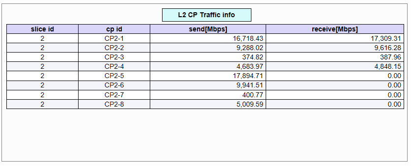  
**Figure 9-13 List of L2CP traffic information**

**Table 9-25 List of L2CP Traffic information**

|No.  |Item        |Description|
|----:|:-----------|:------------|
|1    |slice id |It displays the Slice ID of the Slice.|
|2    |cp id |It displays the CP ID of the L2CP.|
|3    |send [unit] |It displays the traffic sending rate of the L2CP.<br>[Unit] is the unit (Gbps/Mbps) specified by Config.|
|4    |receive [unit] |It displays the traffic receiving rate of the L2CP.<br>[Unit] is the unit (Gbps/Mbps) specified by Config.|

**Table 9-26 Display condition of L2CP traffic information list**

|Screen                            |Condition of selection       |Displayed content|
|:-------------------------------|:-------------|:------------|
|Multi-cluster display screen    |Not selected       |It displays the traffic information of all L2CPs of the all Slices.|
|                                |If a cluster is selected |(No display)|
|                                |If an inter-cluster link is selected|(No display)|
|                                |If a Slice is selected  |It displays the traffic information of all L2CPs of the selected Slice.|
|Fabric network display screen   |Not selected       |It displays all L2CP traffic information of the nodes in the cluster.|
|                                |If a topology is selected |It displays all L2CP traffic information in the cluster.|
|                                |If a node on the topology is selected|It displays the L2CP traffic information of the selected node.|
|                                |If a Slice is selected|It displays the traffic information of the L2CP in the cluster of the selected Slice.|
|                                |If a node on the Slice is selected|It displays the traffic information of the L2CP that belongs to the Slice of the selected node.|
|Node display screen             |Not selected       |(No display)|
|                                |If a node is selected |(No display)|
|                                |If a port is selected|(No display)|

#### 9.8.3 L3CP traffic information

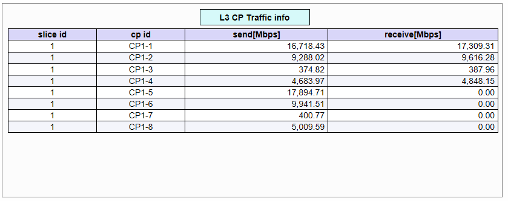  
**Figure 9-14 List of L3CP traffic information**

**Table 9-27 List of L3CP Traffic information**

|No.  |Item        |Description|
|----:|:-----------|:------------|
|1    |slice id |It displays the Slice ID of the Slice.|
|2    |cp id |It displays the CP ID of the L3CP.|
|3    |send [unit] |It displays the traffic sending rate of the L3CP.<br>[Unit] is the unit (Gbps/Mbps) specified by Config.|
|4    |receive [unit] |It displays the traffic receiving rate of the L3CP.<br>[Unit] is the unit (Gbps/Mbps) specified by Config.|

**Table 9-28 Display condition of L3CP traffic information list**

|Screen                            |Condition of selection       |Displayed content|
|:-------------------------------|:-------------|:------------|
|Multi-cluster display screen    |Not selected       |It displays the traffic information of all L3CPs of the all Slices.|
|                                |If a cluster is selected |(No display)|
|                                |If an inter-cluster link is selected|(No display)|
|                                |If a Slice is selected  |It displays the traffic information of all L3CPs of the selected Slice.|
|Fabric network display screen   |Not selected       |It displays all L3CP traffic information of the nodes in the cluster.|
|                                |If a topology is selected |It displays all L3CP traffic information in the cluster.|
|                                |If a node on the topology is selected|It displays the L3CP traffic information of the selected node.|
|                                |If a Slice is selected|It displays the traffic information of the L3CP in the cluster of the selected Slice.|
|                                |If a node on the Slice is selected|It displays the traffic information of the L3CP that belongs to the Slice of the selected node.|
|Node display screen             |Not selected       |(No display)|
|                                |If a node is selected |(No display)|
|                                |If a port is selected|(No display)|

### 9.9 Failure information
Select the Network display mode tab.<br>
Press the Failure toggle button on the upper part of the detailed screen.<br>
Node failure information, IF failure information and Slice failure information will be displayed based on the selected information.
#### 9.9.1 Node failure information

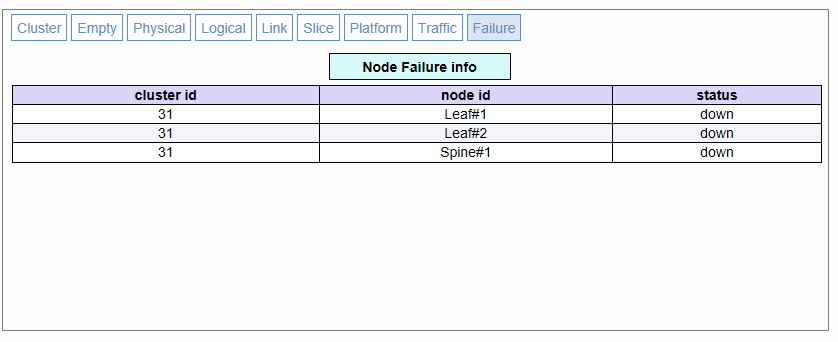  
**Figure 9-15 List of node failure information**

**Table 9-29 List of node failure information**

|No.  |Item        |Description|
|----:|:-----------|:------------|
|1    |cluster id |It displays the cluster ID of the cluster that the node belongs to.|
|2    |node id |It displays the node ID of the node.|
|3    |status |It displays the node status.<br>up/down|

**Table 9-30 Display condition of node failure information list**

|Screen                            |Condition of selection       |Displayed content|
|:-------------------------------|:-------------|:------------|
|Multi-cluster display screen    |Not selected       |(No display)|
|                                |If a cluster is selected |It displays the node failure information of the nodes that belongs to the selected cluster.|
|                                |If an inter-cluster link is selected|(No display)|
|                                |If a Slice is selected  |(No display)|
|Fabric network display screen   |Not selected       |It displays the node failure information in the cluster.|
|                                |If a topology is selected |It displays the node failure information in the cluster.|
|                                |If a node on the topology is selected|It displays the node failure information of the selected node.|
|                                |If a Slice is selected|(No display)|
|                                |If a node on the Slice is selected|It displays the node failure information of the selected node.|
|Node display screen             |Not selected       |It displays the node failure information of the displayed node.|
|                                |If a node is selected |It displays the node failure information of the selected node.|
|                                |If a port is selected|(No display)|

#### 9.9.2 IF failure information

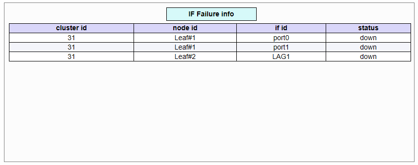  
**Figure 9-16 List of IF failure information**

**Table 9-31 List of IF failure information**

|No.  |Item        |Description|
|----:|:-----------|:------------|
|1    |cluster id |It displays the cluster ID of the cluster that the node belongs to.|
|2    |node id |It displays the node ID of the failure node.|
|3    |if id |It displays the IF ID of the failure IF.|
|4    |status |It displays the failure status.|

**Table 9-32 Display condition of IF failure information list**

|Screen                             |Condition of selection       |Displayed content|
|:-------------------------------|:-------------|:------------|
|Multi-cluster display screen    |Not selected       |(No display)|
|                                |If a cluster is selected |It displays the IF failure information of the nodes that belongs to the selected cluster.|
|                                |If an inter-cluster link is selected|It displays the IF failure information of the selected inter-cluster link IF.|
|                                |If a Slice is selected  |(No display)|
|Fabric network display screen   |Not selected       |It displays the IF failure information of the nodes in the cluster.|
|                                |If a topology is selected |It displays the IF failure information of the nodes in the cluster.|
|                                |If a node on the topology is selected|It displays the IF failure information of the selected node.|
|                                |If a Slice is selected|(No display)|
|                                |If a node on the Slice is selected|It displays the IF failure information of the selected node.|
|Node display screen             |Not selected       |It displays the IF failure information of the displayed node.|
|                                |If a node is selected |It displays the IF failure information of the selected node.|
|                                |If a port is selected|It displays the IF failure information of the selected port.|

#### 9.9.3 Slice failure information

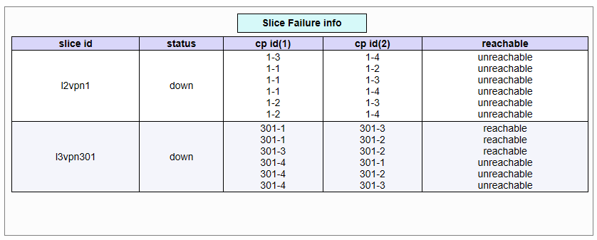  
**Figure 9-17 List of Slice failure information**

**Table 9-33 List of Slice failure information**

|No.  |Item        |Description|
|----:|:-----------|:------------|
|1    |slice id    |It displays the SliceID.|
|2    |status |It displays the Slice failure status.<br>up/down|
|3    |cp id (1) |It displays the CP ID (one side point).|
|4    |cp id (2) |It displays the CP ID (one side point) on the opposite side.<br>up/down|
|5    |reachable |It displays the reachability.<br>reachable/unreachable|

**Table 9-34 Display condition of Slice failure information list**

|Screen                            |Condition of selection       |Displayed content|
|:-------------------------------|:-------------|:------------|
|Multi-cluster display screen    |Not selected       |It displays all Slice failure information.|
|                                |If a cluster is selected |(No display)|
|                                |If an inter-cluster link is selected|(No display)|
|                                |If a Slice is selected  |It displays the Slice failure information of the selected Slice.|
|Fabric network display screen   |Not selected       |(No display)|
|                                |If a topology is selected |(No display)|
|                                |If a node on the topology is selected|(No display)|
|                                |If a Slice is selected|It displays the Slice failure information of the selected Slice.|
|                                |If a node on the Slice is selected|(No display)|
|Node display screen             |Not selected       |(No display)|
|                                |If a node is selected |(No display)|
|                                |If a port is selected|(No display)|

### 9.10 Controller information
Select the Controller display mode tab.<br>
Press the Controller toggle button on the upper part of the detailed screen.<br>
It displays the controller information based on the selected information.

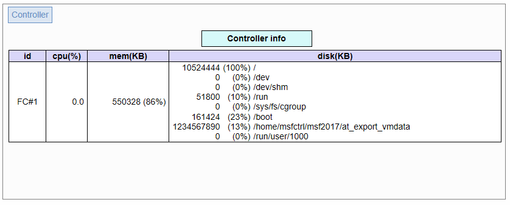  
**Figure 9-18 List of controller information**

**Table 9-35 List of controller information**

|No.  |Item        |Description|
|----:|:-----------|:------------|
|1    |id          |It displays the controller ID.|
|2    |cpu (%)      |It displays the CPU use rate.|
|3    |mem (KB)     |It displays the memory usage [KB] and the memory use rate.|
|4    |disk (KB)    |It displays the disk usage [KB], the disk use rate and the mount point.|

**Table 9-36 Display condition of controller information list**

|Screen                   |Condition of selection       |Displayed content|
|:------------------------|:-------------|:------------|
|Controller display screen|Not selected       |It displays all controllers information.|
|                         |If controllers are selected (Multiple selections available*) |It displays the selected controllers information.|

\*When you click the controller, it turns to be selected status (shown with purple frame border).  
\*When you click the selected controller again, the selected status is cancelled.

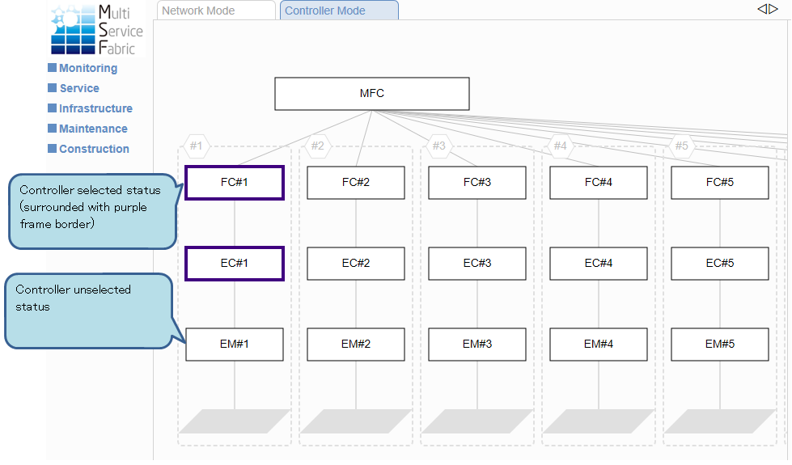  
**Figure 9-19 Selected status/unselected status of controller**

## 10. Notification

The following notifications are displayed on the dialog box.

- [Failure notification](#101-failure-notification)
- [CPU use rate threshold excess notification](#102-cpu-use-rate-threshold-excess-notification)
- [Node OS upgrade notification](#103-node-os-upgrade-notification)
- [Various notifications](#104-various-notifications)

### 10.1 Failure notification
It acquires the failure information from MSF controller periodically and the notification dialog is displayed when a new failure is detected.

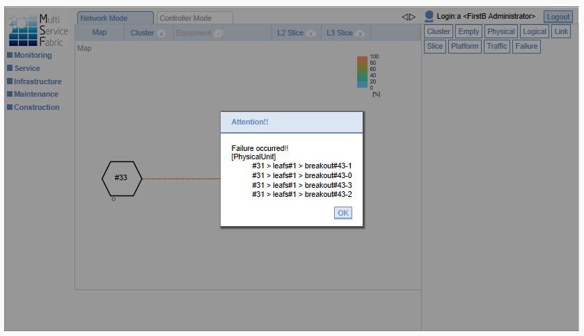  
**Figure 10-1 Failure notification dialog**

### 10.2 CPU use rate threshold excess notification
When the controller status acquisition is On, the notification dialog is displayed if CPU use rate of each controller excesses the threshold value specified in Config.

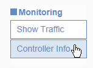  
**Figure 10-2 Controller Info menu button**

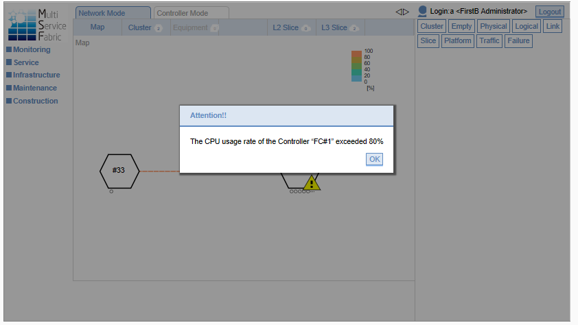  
**Figure 10-3 CPU use rate threshold excess notification dialog**

### 10.3 Node OS upgrade notification

After the node OS upgrade request is sent, the execution status (upgrade failure / upgrade complete) is acquired from the MSF controller and the notification dialog is displayed.
Also, if operation check is set to ON, the notification information (for operation check) is acquired from the event receiving server and the notification dialog is displayed.
There are the following notification types of the node OS upgrade.

**Table 10-1 Notification types of node OS upgrade**

|No.  |Notification type        |Description|
|----:|:------------------------|:------------|
|1    |Operation Check          |It is notified if you set "Operator check" to true when you send the request.|
|2    |Upgrade failure          |It is notified when the upgrade fails.|
|3    |Upgrade complete         |It is notified when all nodes are upgraded.|

\*Other menus cannot be operated while any of the above notifications is displayed.

")  
**Figure 10-4 Node OS upgrade notification dialog (Operation check)**

")  
**Figure 10-5 Node OS upgrade notification dialog (Upgrade failure)**

")  
**Figure 10-6 Node OS upgrade notification dialog (Upgrade complete)**

[Note on Operation]
The notification of node OS upgrade can be suppressed. However, please note that the operation check will not be available if you execute the node OS upgrade in the suppression status.
If you do that by mistake, you need to contact the CTL operation administrator.

### 10.4 Various notifications

It acquires the notification information from the event receiving server and the notification dialog is displayed.  
\*When it acquires multiple pieces of notification information from the event receiving server at the same time, same number of dialogs as received events are displayed.  
\*The notification information acquired from the event receiving server is filterable for each notification type by setting the config.  

Following notification types can be acquired from the event receiving server.

**Table 10-2 Notification types**

|No.  |Notification type        |Description|
|----:|:------------------------|:------------|
|1    |Operation result notification<br>(Operations)|It notifies the result of asynchronous operation.|
|2    |Controller status notification<br>(Status) |It notifies the operation status of the controller.|
|3    |Traffic information notification<br>(Traffic) |It notifies the traffic information.|
|4    |Failure information notification<br>(Failure Status) |It notifies the failure information.|
|5    |Silent failure notification<br>(Silent Failure) |It notifies the Silent failure information.|
|6    |Controller failure notification<br>(Controller Status Notification Failure) |It notifies the Controller failure.|
|7    |Controller log notification<br>(Controller Status Notification Log) |It notifies the Controller log information.|
|8    |Upgrade operation notification<br>(Upgrade Operations) |It notifies a request for operator's check of the node OS upgrade.<br>Because its display format differs from the other dialogs', see the chapter [10.3 Node OS upgrade notification](#103-node-os-upgrade-notification) for details.|

The notification types 1 to 7 use the same display format.

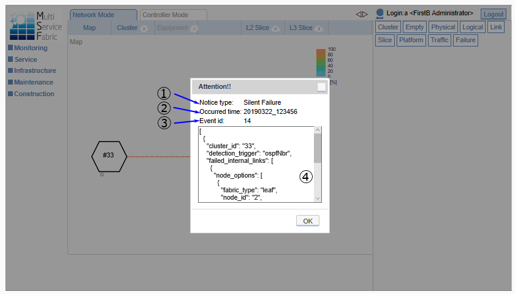  
**Figure 10-7 Various notification dialog**

**Table 10-3 Notification dialogs**

|No.  |Item         |Description|
|----:|:------------|:------------|
|1    |Notice type  |It displays received notification type.|
|2    |Occurred time|It displays received notification date and time.|
|3    |Event id     |It displays ID managed by the event receiving server.|
|4    |Body         |It displays the content of received notification (JSON).|
