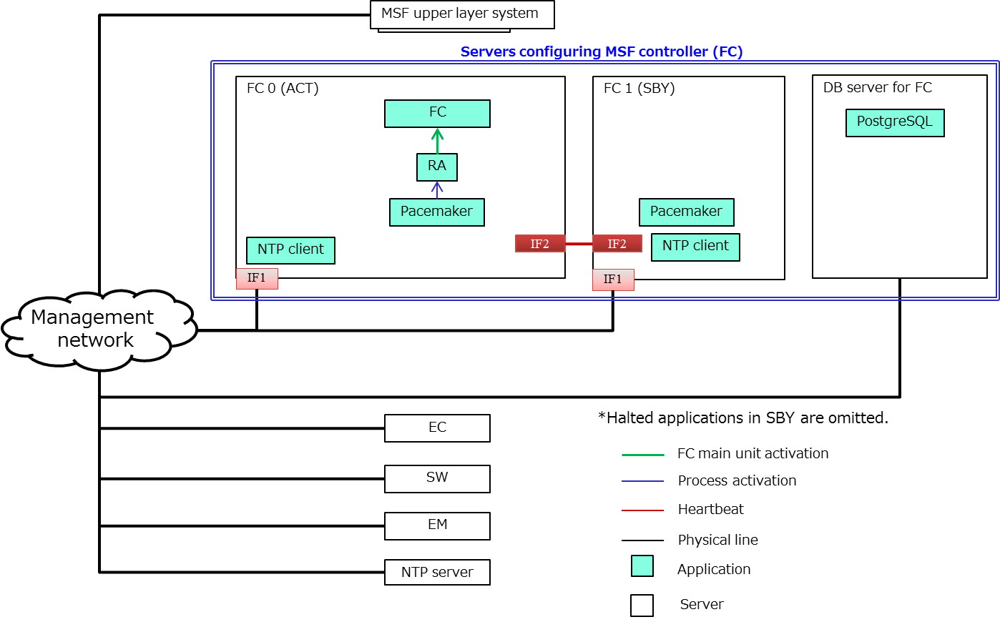

# Fabric Controller Installation Manual
Version 1.0

December.26.2017

NTT Confidential

Copyright (c) 2017 NTT corp. All Rights Reserved.

## Table of Contents

- [*1． Overview*](#1-overview)

  - [*1.1 Relevant manuals*](#11-relevant-manuals)

- [*2． Execution environment*](#2-execution-environment)

  - [*2.1 FC configuration*](#21-fc-configuration)

  - [*2.2 Hardware requirements*](#22-hardware-requirements)

  - [*2.3 Software requirements*](#23-software-requirements)

- [*3． Installation method of FC*](#3-installation-method-of-fc)

  - [*3.1 Installation method of libraries*](#31-installation-method-of-libraries)

    - [*3.1.1 OS settings*](#311-os-settings)

    - [*3.1.2 Java installation*](#312-java-installation)

  - [*3.2 FC installation*](#32-fc-installation)

    - [*3.2.1 Directory configuration on FC server*](#321-directory-configuration-on-fc-server)

    - [*3.2.2 FC main unit installation*](#322-fc-main-unit-installation)

  - [*3.3 FC settings*](#33-fc-settings)

    - [*3.3.1 Preparation of initial data*](#331-preparation-of-initial-data)

    - [*3.3.2 Settings during operation*](#332-settings-during-operation)

    - [*3.3.3 DB settings*](#333-db-settings)

    - [*3.3.4 FC simple startup confirmation*](#334-fc-simple-startup-confirmation)

    - [*3.3.5 Status confirmation with FC startup/shutdown script*](#335-status-confirmation-with-fc-startupshutdown-script)

    - [*3.3.6 FC status confirmation (normal/abnormal)*](#336-fc-status-confirmation-normalabnormal)

- [*4． Redundancy settings*](#4-redundancy-settings)

  - [*4.1 Placement of resource agent*](#41-placement-of-resource-agent)

  - [*4.2 Pacemaker settings*](#42-pacemaker-settings)

    - [*4.2.1 Property settings of cluster*](#421-property-settings-of-cluster)

    - [*4.2.2 Default settings of resource*](#422-default-settings-of-resource)

    - [*4.2.3 Configuration settings of resource*](#423-configuration-settings-of-resource)

    - [*4.2.4 Settings of VIPcheck*](#424-settings-of-vipcheck)

    - [*4.2.5 Settings of resource agent of FC*](#425-settings-of-resource-agent-of-fc)

    - [*4.2.6 Settings of IPaddr2*](#426-settings-of-ipaddr2)

    - [*4.2.7 Settings of diskd*](#427-settings-of-diskd)

    - [*4.2.8 Settings of several constraints*](#428-settings-of-several-constraints)

## Revision History

  |Version  |Date           |Contents     |
  |:--------|:--------------|:------------|
  |1.0      |Dec. 26, 2017  |First edition|

## 1. Overview
This manual describes the installation method and the redundancy
settings of Fabric Controller (hereinafter it is referred to as “FC”).

### 1.1 Relevant manuals
Please refer to the following manuals or information found online as
necessary when installing or using FC.

-   Linux “CentOS ([http://www.centos.org/](<http://www.centos.org/>))”.
-   RDBMS “PostgreSQL ([http://www.postgresql.org/](<http://www.postgresql.org/>))”.
-   Redundancy “Pacemaker ([http://clusterlabs.org/](<[http://clusterlabs.org/]>))”.


## 2. Execution environment
### 2.1 FC configuration
Configuration of fabric ontroller is shown in Figure 2-1.  
FC configuration is illustrated in blue box.  
FC can be executed both in stand-alone configuration and redundancy
configuration.


**Figure 2-1 Configuration of fabric controller**

### 2.2 Hardware requirements
FC is executed on PC which mounts x86 CPU. Minimum hardware requirements
are shown in Table 2-1.

**Table 2-1 Minimum hardware requirements**

|No.  |Item        |Specification|
|:----|:-----------|:------------|
|1    |CPU         |2 Cores or more|
|2    |Memory      |1 GB or more|
|3    |Hard disk   |Available disk size 20 GB or more|
|4    |NIC         |1 port or more (2 ports or more when FC is redundancy configuration)|

Hardware configuration when operability confirmed on FC are shown in
Table 2-2 as reference.

**Table 2-2 Hardware configuration when operability confirmed**

|No.  |Item        |Specification|
|:----|:-----------|:------------|
|1    |CPU         |Xeon E5-2420v2 @ 2.20 GHz 6 Cores/12 Threads|
|2    |Memory      |32 GB|
|3    |Hard disk   |600 GB|
|4    |NIC         |4 ports|


### 2.3 Software requirements

Software requirements are shown in Table 2-3.  
Use particular version of software which listed on Table 2-3 for Java
libraries excluding JAXB.

**Table 2-3 Software requirements**

|No.  |Item        |Software|Version|Software is available from|
|:----|:-----------|:-------|:------|:-------------------------|
|1    |OS          |CentOS  |7(1511)|<http://www.centos.org/> <br> Download  file: <br> CentOS-7-x86\_64-DVD-1511.iso|
|2    |Middleware  |Java    |Oracle JDK 8 <br> Update 101 or later (Oracle JDK 9 or later is not applicable) |<http://www.oracle.com/> <br> Download file:  <br> jdk-8u101-linux-x64.rpm|
|||Pacemaker|1.1.14-1|<http://linux-ha.osdn.jp/wp/dl> <br> Download  file: <br> pacemaker-repo-1.1.14-1.1.el7.x86\_64.rpm
|||Corosync|2.3.5-1|It is included in installation package of Pacemaker.|
|3    |Java library|Jetty   |9.3.11|<http://archive.eclipse.org/jetty/9.3.11.v20160721/dist/> <br> Download file: <br> jetty-distribution-9.3.11.v20160721.tar.gz
|||Gson|2.7|<https://repo1.maven.org/maven2/com/google/code/gson/gson/2.7/> <br> Download file: <br> gson-2.7.jar
|||JAXB|2.2.8|It is included in Java.
|||Jersey|2.23.2|<http://repo1.maven.org/maven2/org/glassfish/jersey/bundles/jaxrs-ri/2.23.2/> <br>Download file: <br> jaxrs-ri-2.23.2.tar.gz
|||Hibernate|5.0.10|<https://sourceforge.net/projects/hibernate/files/hibernate-orm/5.0.10.Final/hibernate-release-5.0.10.Final.tgz/download> <br> Download file: <br> hibernate-release-5.0.10.Final.tgz|
|||SLF4J|1.6.1|<https://sourceforge.net/projects/unirods/files/lib/slf4j-nop-1.6.1.jar/download> <br>Download file: <br> slf4j-nop-1.6.1.jar <br> \* Additional library for Hibernate
|||Log4J|2.6.2|<http://archive.apache.org/dist/logging/log4j/2.6.2> <br> Download file: <br> apache-log4j-2.6.2-bin.tar.gz
|||Apache Commons IO|2.5|<https://commons.apache.org/proper/commons-io/download_io.cgi> <br> Download file: <br> commons-io-2.5-bin.tar.gz
|||Apache Commons Lang|2.6|<https://commons.apache.org/proper/commons-lang/download_lang.cgi> <br> Download file: <br> commons-lang-2.6-bin.tar.gz
|||Apache Commons Collections|3.2.2|<https://commons.apache.org/proper/commons-collections/download_collections.cgi> <br> Download file: <br> commons-collections-3.2.2-bin.tar.gz
|||JDBC|9.4.1209|<https://jdbc.postgresql.org/download.html> <br> Download file: <br> postgresql-9.4.1209.jar

## 3. Installation method of FC
This manual describes the settings of FC server, FC main unit and DB for
FC which are illustrated in Figure 2-1.

### 3.1 Installation method of libraries
This manual refers to a working user as general user “msfctrl”. Replace
this with appropriate user based on your environment.

#### 3.1.1 OS settings

(1) Add a working user to wheel group.
~~~console
$ sudo gpasswd -a msfctrl wheel
$ sudo id msfctrl
-----------------------------------------
uid=1000(msfctrl) gid=1000(msfctrl) groups=1000(msfctrl),10(wheel)
-----------------------------------------
~~~
(2) Execute visudo command and grant sudo access to users in the group wheel.
~~~console
$ sudo visudo
-----------------------------------------
## Allows people in group wheel to run all commands
%wheel  ALL=(ALL)       ALL
-----------------------------------------
~~~
\* Login again after these settings.

(3) Disable SELinux.
~~~console
$ sudo vi /etc/sysconfig/selinux

-----------------------------------------
SELINUX=disabled
-----------------------------------------
~~~

(4) Reflect the settings of SELinux (Reboot the OS to take effect).
~~~console
$ sudo shutdown -r now
~~~
(5) Disable firewall.
~~~console
$ sudo systemctl disable firewalld.service
$ sudo systemctl stop firewalld.service
~~~

(6) Synchronize time with NTP server.  
    \* Install NTP client software to FC server to perform time
    synchronization.

(7) Install sysstat package.  
    \* This is unnecessary if sysstat package is already installed.

#### 3.1.2 Java installation
This section gives the instructions for installing the JDK and deploying
Java libraries.  
In the example below, Java libraries are placed under “\~/java\_lib/”.  
Directory configuration under “\~/java\_lib/” is shown below.
```
/home/msfctrl				Home directory for working user
└-- java_lib				 Preparation directory for Java library
    ├-- gson				 Store directory for Gson library
    ├-- jetty				Store directory for Jetty library
    ├-- postgresql		   Store directory for JDBC library
    ├-- apache-commons	   Store directory for Apache Commons library
    ├-- hibernate		    Store directory for Hibernate library
    ├-- jersey			   Store directory for Jersey library
    └-- log4j				Store directory for Log4J library
```

##### 3.1.2.1 JDK installation
(1) Download rpm file of JDK from <http://www.oracle.com/>.  
    \* In the example below, the downloaded rpm file is referred to as
    “jdk-8u101-linux-x64.rpm”.  
    \* Use JDK 8 update 101 or later version. However, JDK 9 or later
    version is not applicable for current FC server.

(2) Set the downloaded rpm file to the arbitrary location on FC server.  
    In the example below, the rpm file is set under “\~/rpm/”.

(3) Change the working directory to the rpm directory and install JDK.
~~~console
$ cd ~/rpm/
$ sudo rpm -ivh jdk-8u101-linux-x64.rpm
~~~

(4) Set Java version as default.  
    \* Select a number of /usr/java/jdk1.8.0\_101/jre/bin/java.
~~~console
$ sudo alternatives --config java
~~~

##### 3.1.2.2 Set Gson library

(1) Download gson-2.7.ja from
    <https://repo1.maven.org/maven2/com/google/code/gson/gson/2.7/>.

(2) Set the downloaded gson-2.7.jar to the arbitrary location on FC
    server.  
    In the example below, the file is set under “\~/download/”.

(3) Place gson-2.7.jar under “\~/java\_lib/gson/”.
~~~console
$ cd ~/download/
$ mv gson-2.7.jar ~/java_lib/gson/
~~~

##### 3.1.2.3 Set Jetty library

(1) Download jetty-distribution-9.3.11.v20160721.tar.gz from
    <http://archive.eclipse.org/jetty/9.3.11.v20160721/dist/>.

(2) Set the downloaded jetty-distribution-9.3.11.v20160721.tar.gz to the
    arbitrary location on FC server.  
    In the example below, the file is set under “\~/download/”.

(3) Unzip jetty-distribution-9.3.11.v20160721.tar.gz and place a lib
    directory in the unzipped directory under “\~/java\_lib/jetty/”.

~~~console
$ cd ~/download/
$ tar xvfz jetty-distribution-9.3.11.v20160721.tar.gz
$ cd jetty-distribution-9.3.11.v20160721/
$ mv lib ~/java_lib/jetty/
~~~

##### 3.1.2.4 Set JDBC library

(1) Download postgresql-9.4.1209.jar from
    <https://jdbc.postgresql.org/download.html>.

(2) Set the downloaded postgresql-9.4.1209.jar to the arbitrary location
    on FC server.  
    In the example below, the file is set under “\~/download/”.

(3) Set postgresql-9.4.1209.jar under “\~/java\_lib/postgresql”.
~~~console
$ cd ~/download/
$ mv postgresql-9.4.1209.jar ~/java_lib/postgresql/
~~~

##### 3.1.2.5 Set Apache Commons IO library

(1)	Download commons-io-2.5-bin.tar.gz from
<https://commons.apache.org/proper/commons-io/download_io.cgi>.

(2)	Set the downloaded commons-io-2.5-bin.tar.gz to the arbitrary location on FC server.
In the example below, the file is set under “\~/download/”.

(3)	Unzip commons-io-2.5-bin.tar.gz and place commons-io-2.5.jar in the unzipped directory under
“\~/java_lib/apache-commons/”.

~~~console
$ cd ~/download/
$ tar xvfz commons-io-2.5-bin.tar.gz
$ cd commons-io-2.5/
$ mv commons-io-2.5.jar ~/java_lib/apache-commons/
~~~

##### 3.1.2.6 Set Apache Commons Lang library
(1)	Download commons-lang-2.6-bin.tar.gz from <https://commons.apache.org/proper/commons-lang/download_lang.cgi>.

(2)	Set the downloaded commons-lang-2.6-bin.tar.gz to the arbitrary location on FC server.
In the example below, the file is set under “\~/download/”.

(3)	Unzip commons-lang-2.6-bin.tar.gz and place commons-lang-2.6.jar in the unzipped directory under “\~/java_lib/apache-commons/”.

~~~console
$ cd ~/download/
$ tar xvfz commons-lang-2.6-bin.tar.gz
$ cd commons-lang-2.6/
$ mv commons-lang-2.6.jar ~/java_lib/apache-commons/
~~~

##### 3.1.2.7 Set Apache Commons Collections library
(1)	Download commons-collections-3.2.2-bin.tar.gz from
<https://commons.apache.org/proper/commons-collections/download_collections.cgi>.

(2)	Set the downloaded commons-collections-3.2.2-bin.tar.gz to the arbitrary location on FC server.
In the example below, the file is set under “\~/download/”.

(3)	Unzip commons-collections-3.2.2-bin.tar.gz and place commons-collections-3.2.2.jar in the unzipped directory under “\~/java_lib/apache-commons/”.

~~~console
$ cd ~/download/
$ tar xvfz commons-collections-3.2.2-bin.tar.gz
$ cd commons-collections-3.2.2/
$ mv commons-collections-3.2.2.jar ~/java_lib/apache-commons/
~~~

##### 3.1.2.8 Set Hibernate library

Prepare a main unit and additional library for Hibernate library.

(1) Download hibernate-release-5.0.10.Final.tgz from <https://sourceforge.net/projects/hibernate/files/hibernate-orm/5.0.10.Final/hibernate-release-5.0.10.Final.tgz/download>.

(2) Set the downloaded hibernate-release-5.0.10.Final.tgz to the arbitrary location on FC server.  
    In the example below, the file is set under “\~/download/”.

(3) Unzip hibernate-release-5.0.10.Final.tgz and place a lib directory  
    in the unzipped directory under “\~/java\_lib/hibernate/”.
~~~console
$ cd ~/download/
$ tar xvfz hibernate-release-5.0.10.Final.tgz
$ cd hibernate-release-5.0.10.Final/
$ mv lib ~/java_lib/hibernate/
~~~

(4) Add a necessary library to Hibernate.  
    Download slf4j-nop-1.6.1.jar from
    <https://sourceforge.net/projects/unirods/files/lib/slf4j-nop-1.6.1.jar/download>.

(5) Set the downloaded file to the arbitrary location on FC server.  
    In the example below, the file is set under “\~/download/”.

(6) Set slf4j-nop-1.6.1.jar under “~/java_lib/hibernate/lib/optional/ehcache/”.

~~~console
$ cd ~/download/
$ mv slf4j-nop-1.6.1.jar ~/java_lib/hibernate/lib/optional/ehcache/
~~~

##### 3.1.2.9 Set Jersey library

(1) Download jaxrs-ri-2.23.2.tar.gz from  
    <http://repo1.maven.org/maven2/org/glassfish/jersey/bundles/jaxrs-ri/2.23.2/>.


(2) Set the downloaded jaxrs-ri-2.23.2.tar.gz to the arbitrary location
    on FC server.  
    In the example below, the file is set under “\~/download/”.

(3) Unzip jaxrs-ri-2.23.2.tar.gz and place all files and directories in
    the unzipped directory under “\~/java\_lib/jersey/”.
~~~console
$ cd ~/download/
$ tar xvfz jaxrs-ri-2.23.2.tar.gz
$ cd jaxrs-ri/
$ mv * ~/java_lib/jersey/
~~~

##### 3.1.2.10 Set Log4J library

(1) Download apache-log4j-2.6.2-bin.tar.gz from
    <http://archive.apache.org/dist/logging/log4j/2.6.2>.

(2) Set the downloaded apache-log4j-2.6.2-bin.tar.gz to the arbitrary
    location on FC server.  
    In the example below, the file is set under “\~/download/”.

(3) Unzip apache-log4j-2.6.2-bin.tar.gz and place
    log4j-1.2-api-2.6.2.jar, log4j-api-2.6.2.jar, log4j-core- 2.6.2.jar
    in the unzipped directory under “\~/java\_lib/log4j/”.
~~~console
$ cd ~/download/
$ tar xvfz apache-log4j-2.6.2-bin.tar.gz
$ cd apache-log4j-2.6.2-bin/
$ mv log4j-1.2-api-2.6.2.jar ~/java_lib/log4j/
$ mv log4j-api-2.6.2.jar ~/java_lib/log4j/
$ mv log4j-core-2.6.2.jar ~/java_lib/log4j/
~~~

### 3.2 FC installation

FC installation methods are described below.

#### 3.2.1 Directory configuration on FC server

Directory configuration of FC (main files and store directories for
libraries) is shown below.

Installation directory is referred to as “\~/msf-controller/” in this
manual.
```
/home/msfctrl				             Home directory for working user
└-- msf-controller			            Directory for installation
    |-- bin				               Script store directory for FC startup/shutdown
    |  ├-- fc_ctl.sh			           Script for FC startup/shutdown
    |  └-- fc				              Resource agent for FC
    ├-- lib				               FC main unit and store directories for libraries
    |   ├-- FabricController.jar	      FC main unit
    |   ├-- gson			              Store directory for Gson library
    |   ├-- jetty			             Store directory for Jetty library
    |   ├-- postgresql		            Store directory for JDBC library
    |   ├-- apache-commons		        Store directory for Apache Commons library
    |   ├-- hibernate			         Store directory for Hibernate library
    |   ├-- jersey			            Store directory for Jersey library
    |   └-- log4j			             Store directory for Log4J library
    ├-- logs				              Log directory *1
    └-- conf				               Configuration directory
        ├-- fc_system.xml		         FC system setting configuration
        ├-- fc_data.xml		           FC initial setting configuration
        ├-- fc_develop.xml		        FC internal operability setting configuration
        ├-- log4j2.xml			        Log4J configuration
        └-- hibernate.cfg.xml		     Hibernate configuration
```
\*1. Log directory is automatically generated when FC starts running. It
does not exist at the time of FC installation.

#### 3.2.2 FC main unit installation

(1) Set tar file (msf-controller.tar.gz) of FC to the installation
    directory.

(2) Unzip tar file of FC.  
    \* To reinstall the FC server, first, delete all directories in the
    installed directory extracted from the archive before. Then extract
    the archive to it again.
~~~console
$ cd ~/msf-controller/
$ tar xvfz ~/msf-controller/msf-controller.tar.gz
~~~

(3)	Change the name of log output setting file.  
~~~console
$ cd ~/msf-controller/conf
$ mv fc_log4j2.xml log4j2.xml
~~~

(4) Grant permission to the script file (fc\_ctl.sh) in the unzipped
    directory.
~~~console
$ cd ~/msf-controller/bin/
$ chmod 755 fc_ctl.sh
~~~

### 3.3 FC settings

This section describes the settings of FC.

#### 3.3.1 Preparation of initial data

FC initial setting Config should be edited before the first startup of the FC server.

##### 3.3.1.1 Brief description of FC initial setting Config

FC initial setting Config is shown briefly in Table 3-1.

**Table 3-1 Brief description of FC initial setting Config**

  |No.  |Config file name|Config Name|Location|
  |:----|:---------------|:----------|:-------|
  |1    |fc\_data.xml    |FC initial configuration Config| In “*FC install directory*/conf/”|

##### 3.3.1.2 Contents of FC initial setting Config

This section describes the parameters in FC initial setting Config.  
FC initial setting Config file is in xml format.  
An example of FC initial setting Config is shown below.  
Parameters in FC initial setting Config are summarized in Table 3-2.
~~~xml
<?xml version="1.0" encoding="UTF-8" standalone="yes"?>
<dataConf xmlns="http://fc.msf/common/config/type/data">
    <swClustersData>
        <swClusterData>
            <swCluster>
                <swClusterId>1</swClusterId>
                <maxLeafNum>45</maxLeafNum>
                <maxSpineNum>4</maxSpineNum>
                <maxRrNum>2</maxRrNum>
                <spineStartPos>1</spineStartPos>
                <leafStartPos>51</leafStartPos>
                <rrStartPos>101</rrStartPos>
                <fcStartPos>201</fcStartPos>
                <ecStartPos>211</ecStartPos>
                <emStartPos>221</emStartPos>
                <asNum>65000</asNum>
                <ospfArea>10</ospfArea>
                <inchannelStartAddress>1.1.1.1</inchannelStartAddress>
                <outchannelStartAddress>1.1.1.1</outchannelStartAddress>
                <aggrigationStartAddress>1.1.1.1</aggrigationStartAddress>
                <aggrigationAddressPrefix>24</aggrigationAddressPrefix>
            </swCluster>
            <rrs>
                <rr>
                    <rrNodeId>1</rrNodeId>
                    <rrRouterId>1.1.1.1</rrRouterId>
                </rr>
                <leafRr>
                    <leafRrSwClusterId>1</leafRrSwClusterId>
                    <leafRrNodeId>1</leafRrNodeId>
                    <leafRrRouterId>1.1.1.1</leafRrRouterId>
                </leafRr>
            </rrs>
        </swClusterData>
    </swClustersData>
</dataConf>
~~~

**Table 3-2 List of parameters in FC initial setting Config**

|Element|Type	|Setting range	|Number of elements	|Description|
|:------|:----|:--------------|:------------------|:----------|
|dataConf|-    |-              |1                  |Information of FC initial setting|
|&nbsp;&nbsp;swClustersData|-    |-              |1                  |Information of SW cluster which is managed by FC|
|&nbsp;&nbsp;&nbsp;&nbsp;swClusterData|-    |-              |1                  |Equivalent to information of a SW cluster per an element|
|&nbsp;&nbsp;&nbsp;&nbsp;&nbsp;&nbsp;swCluster |-    |-              |1                  |Information of SW cluster|
|&nbsp;&nbsp;&nbsp;&nbsp;&nbsp;&nbsp;&nbsp;&nbsp;swClusterId|integer|1 - 100|1 |ID of SW cluster|
|&nbsp;&nbsp;&nbsp;&nbsp;&nbsp;&nbsp;&nbsp;&nbsp;maxLeafNum|integer|1 - 1000|1 |Maximum number of Leaves in SW cluster|
|&nbsp;&nbsp;&nbsp;&nbsp;&nbsp;&nbsp;&nbsp;&nbsp;maxSpineNum|integer|1 - 1000|1 |Maximum number of Spines in SW cluster|
|&nbsp;&nbsp;&nbsp;&nbsp;&nbsp;&nbsp;&nbsp;&nbsp;maxRrNum|integer|1 - 1000|1 |Maximum number of RRs in SW cluster|
|&nbsp;&nbsp;&nbsp;&nbsp;&nbsp;&nbsp;&nbsp;&nbsp;spineStartPos|integer|1 - 1000|1 |Starting offset value of management address which is assigned at the time of Spine addition.|
|&nbsp;&nbsp;&nbsp;&nbsp;&nbsp;&nbsp;&nbsp;&nbsp;leafStartPos|integer|1 - 1000|1 |Starting offset value of management address which is assigned at the time of Leaf addition.|
|&nbsp;&nbsp;&nbsp;&nbsp;&nbsp;&nbsp;&nbsp;&nbsp;rrStartPos|integer|1 - 1000|1 |Starting offset of management address which is assigned to RR.|
|&nbsp;&nbsp;&nbsp;&nbsp;&nbsp;&nbsp;&nbsp;&nbsp;fcStartPos|integer|1 - 1000|1 |Starting offset of management address which is assigned to FC.|
|&nbsp;&nbsp;&nbsp;&nbsp;&nbsp;&nbsp;&nbsp;&nbsp;ecStartPos|integer|1 - 1000|1 |Starting offset of management address which is assigned to EC.|
|&nbsp;&nbsp;&nbsp;&nbsp;&nbsp;&nbsp;&nbsp;&nbsp;emStartPos|integer|1 - 1000|1 |Starting offset of management address which is assigned to EM.|
|&nbsp;&nbsp;&nbsp;&nbsp;&nbsp;&nbsp;&nbsp;&nbsp;asNum|integer|0 - 65535|1 |AS number of SW cluster|
|&nbsp;&nbsp;&nbsp;&nbsp;&nbsp;&nbsp;&nbsp;&nbsp;ospfArea|integer|0 - 65535|1 |OSPF area number of SW cluster|
|&nbsp;&nbsp;&nbsp;&nbsp;&nbsp;&nbsp;&nbsp;&nbsp;inchannelStartAddress|string|-|1 |Inchannel starting IP address of SW cluster.<BR><BR>Initiating with starting IP address, an suitable IP address is calculated automatically within MSF controller and is assigned when interface (node) is added.|
|&nbsp;&nbsp;&nbsp;&nbsp;&nbsp;&nbsp;&nbsp;&nbsp;outchannelStartAddress|string|-|1 |Outchannel starting IP address of SW cluster.<BR><BR>Initiating with starting IP address, an suitable IP address is calculated automatically within MSF controller and is assigned when interface (node) is added.|
|&nbsp;&nbsp;&nbsp;&nbsp;&nbsp;&nbsp;&nbsp;&nbsp;aggrigationStartAddress|string|-|1 |Aggregation starting IP address.<BR><BR>Starting IP address for aggregation of paths to each node of SW cluster.|
|&nbsp;&nbsp;&nbsp;&nbsp;&nbsp;&nbsp;&nbsp;&nbsp;aggrigationAddressPrefix|integer|1 - 32|1 |Aggregation prefix|
|&nbsp;&nbsp;&nbsp;&nbsp;&nbsp;&nbsp;rrs|-|-|1 |RR information of SW cluster|
|&nbsp;&nbsp;&nbsp;&nbsp;&nbsp;&nbsp;&nbsp;&nbsp;rr|-|-|0 and over |RR information|
|&nbsp;&nbsp;&nbsp;&nbsp;&nbsp;&nbsp;&nbsp;&nbsp;&nbsp;&nbsp;rrNodeId|integer|1 - 65535|1|RR node ID of SW cluster|
|&nbsp;&nbsp;&nbsp;&nbsp;&nbsp;&nbsp;&nbsp;&nbsp;&nbsp;&nbsp;rrRouterId|string|-|1|RR router ID of SW cluster|
|&nbsp;&nbsp;&nbsp;&nbsp;&nbsp;&nbsp;&nbsp;&nbsp;leafRr|-|-|0 and over |RR information of Leaf's peer|
|&nbsp;&nbsp;&nbsp;&nbsp;&nbsp;&nbsp;&nbsp;&nbsp;&nbsp;&nbsp;leafRrSwClusterId|integer|1 - 100|1|RR belonging cluster ID of Leaf's peer|
|&nbsp;&nbsp;&nbsp;&nbsp;&nbsp;&nbsp;&nbsp;&nbsp;&nbsp;&nbsp;leafRrNodeId|integer|1 - 65535|1|RR node ID of Leaf's peer|
|&nbsp;&nbsp;&nbsp;&nbsp;&nbsp;&nbsp;&nbsp;&nbsp;&nbsp;&nbsp;leafRrRouterId|string|-|1|RR router ID of Leaf's peer|

#### 3.3.2 Settings during operation

This section describes the settings during FC operation. Edit FC system
setting Config while FC is not running. Note that any changes of FC
system setting Config while FC is running cannot be reflected in the
behavior of FC.

##### 3.3.2.1 Brief description of FC system setting Config

The brief description of FC system setting Config is shown in Table 3-3.

**Table 3-3 Brief description of system setting Config**

|No.   |Config file name   |Name of Config             |Location|
|:-----|:------------------|:--------------------------|:-------|
|1     |fc\_system.xml     |FC system setting Config   |In “*FC install directory*/conf/”|


##### 3.3.2.2 Contents of FC system setting Config

This section describes the parameters in FC system setting Config.  
FC system setting Config file is in xml format.  
An example of FC system setting Config is shown below.  
Parameters in FC system setting Config are summarized in Table 3-4.  

~~~xml
<?xml version="1.0" encoding="UTF-8" standalone="yes"?>
<systemConf xmlns="http://fc.msf/common/config/type/system">
    <rest>
        <server>
            <listeningAddress>0.0.0.0</listeningAddress>
            <listeningPort>18080</listeningPort>
        </server>
        <client>
            <waitConnectionTimeout>30</waitConnectionTimeout>
            <requestTimeout>600</requestTimeout>
        </client>
        <json>
            <isPrettyPrinting>true</isPrettyPrinting>
            <isSerializeNulls>false</isSerializeNulls>
        </json>
    </rest>
    <slice>
        <l2SlicesMagnificationNum>1</l2SlicesMagnificationNum>
        <l3SlicesMagnificationNum>1</l3SlicesMagnificationNum>
        <l2MaxSlicesNum>100</l2MaxSlicesNum>
        <l3MaxSlicesNum>100</l3MaxSlicesNum>
    </slice>
    <swClustersData>
        <swClusterData>
            <swCluster>
                <swClusterId>1</swClusterId>
                <ecControlAddress>0.0.0.0</ecControlAddress>
                <ecControlPort>18080</ecControlPort>
            </swCluster>
        </swClusterData>
    </swClustersData>
    <status>
        <noticeDestInfo>
            <noticeAddress>1.1.1.1</noticeAddress>
            <noticePort>0</noticePort>
        </noticeDestInfo>
        <noticeRetryNum>5</noticeRetryNum>
        <noticeTimeout>500</noticeTimeout>
        <recvRestRequestUnitTime>3600</recvRestRequestUnitTime>
        <sendRestRequestUnitTime>3600</sendRestRequestUnitTime>
    </status>
    <failure>
        <noticeDestInfo>
            <noticeAddress>1.1.1.1</noticeAddress>
            <noticePort>0</noticePort>
            <isPhysicalUnit>true</isPhysicalUnit>
            <isClusterUnit>true</isClusterUnit>
            <isSliceUnit>true</isSliceUnit>
            <failureLinkNum>1</failureLinkNum>
        </noticeDestInfo>
        <noticeRetryNum>5</noticeRetryNum>
        <noticeTimeout>500</noticeTimeout>
    </failure>
    <traffic>
        <noticeDestInfo>
            <noticeAddress>1.1.1.1</noticeAddress>
            <noticePort>0</noticePort>
            <isPhysicalUnit>true</isPhysicalUnit>
            <isClusterUnit>true</isClusterUnit>
            <isSliceUnit>true</isSliceUnit>
        </noticeDestInfo>
        <noticeRetryNum>5</noticeRetryNum>
        <noticeTimeout>500</noticeTimeout>
        <execCycle>3600</execCycle>
    </traffic>
</systemConf>
~~~

**Table 3-4 List of parameters in FC system setting Config**

|Element|Type	|Setting range \*	|Number of elements	|Description|
|:------|:----|:--------------|:------------------|:----------|
|systemConf|-    |-              |1                  |Information of FC system setting|
|&nbsp;&nbsp;rest|-    |-              |1                  |Information of REST behavior which operates on FC|
|&nbsp;&nbsp;&nbsp;&nbsp;server|-    |-              |1                  |Information of REST server behavior|
|&nbsp;&nbsp;&nbsp;&nbsp;&nbsp;&nbsp;listeningAddress|string|-              |1                  |Address for REST communication|
|&nbsp;&nbsp;&nbsp;&nbsp;&nbsp;&nbsp;listeningPort|integer|0 - 65535|1                  |REST listening port|
|&nbsp;&nbsp;&nbsp;&nbsp;client|-    |-              |1                  |Information of REST client behavior|
|&nbsp;&nbsp;&nbsp;&nbsp;&nbsp;&nbsp;waitConnectionTimeout|integer|0 and over |1                  |REST wait connection timeout (second)|
|&nbsp;&nbsp;&nbsp;&nbsp;&nbsp;&nbsp;requestTimeout|integer|0 and over |1                  |REST request timeout (second)|
|&nbsp;&nbsp;&nbsp;&nbsp;json|-    |-              |1                  |Information of JSON behavior which is sent and received in REST|
|&nbsp;&nbsp;&nbsp;&nbsp;&nbsp;&nbsp;isPrettyPrinting|boolean|true/false|1                  |Whether JSON data that FC responds to REST request is formatted in such a way of line breaking and indenting or not (true/ false)|
|&nbsp;&nbsp;&nbsp;&nbsp;&nbsp;&nbsp;isSerializeNulls|boolean|true/false|1                  |In case there is a null value in JSON data that FC respondes to REST request, whether parameter is described as null or not (true/ false)|
|&nbsp;&nbsp;slice|-    |-              |1                  |Information of slice setting|
|&nbsp;&nbsp;&nbsp;&nbsp;l2SlicesMagnificationNum|integer|1,2 |1                  |Parameter that controls maxmum value of assigned L2 slice ID.<BR>Assigned range of L2 slice ID is equal to l2MaxSlicesNum multiplied by l2SlicesMagnificationNum.<BR>Example 1: If l2MaxSliceNum is 100 and l2SliceMagnificationNum is 1, then assigned range of L2 slice ID is from 1 to 100.<BR>Example 2: If l2MaxSliceNum is 100 and l2SliceMagnificationNum is 2, then assigned range of L2 slice ID is from 1 to 200.|
|&nbsp;&nbsp;&nbsp;&nbsp;l3SlicesMagnificationNum|integer|1,2 |1                  |Parameter that controls maxmum value of assigned L3 slice ID.<BR>Assigned range of L3 slice ID is equal to l3MaxSlicesNum multiplied by l3SlicesMagnificationNum.<BR>Example 1: If l3MaxSliceNum is 100 and l3SliceMagnificationNum is 1, then assigned range of L3 slice ID is from 1 to 100.<BR>Example 2: If l3MaxSliceNum is 100 and l3SliceMagnificationNum is 2, then assigned range of L3 slice ID is from 1 to 200.|
|&nbsp;&nbsp;&nbsp;&nbsp;l2MaxSlicesNum|integer|1 - 1000 |1                  |Maximum L2 slice number|
|&nbsp;&nbsp;&nbsp;&nbsp;l3MaxSlicesNum|integer|1 - 1000 |1                  |Maximum L3 slice number|
|&nbsp;&nbsp;swClustresData|-    |-              |1                  |Information of SW cluster which is managed by FC|
|&nbsp;&nbsp;&nbsp;&nbsp;swClusterData|- |- |1                  |Equivalent to information of a SW cluster per an element|
|&nbsp;&nbsp;&nbsp;&nbsp;&nbsp;&nbsp;swCluster|- |- |1                  |Information of SW cluster|
|&nbsp;&nbsp;&nbsp;&nbsp;&nbsp;&nbsp;&nbsp;&nbsp;swClusterId|integer|1 - 100|1                  |ID of SW cluster|
|&nbsp;&nbsp;&nbsp;&nbsp;&nbsp;&nbsp;&nbsp;&nbsp;ecControlAddress|string|-|1                  |EC connection address of SW cluster|
|&nbsp;&nbsp;&nbsp;&nbsp;&nbsp;&nbsp;&nbsp;&nbsp;ecControlPort|integer|0 - 65535|1                  |EC connection port number of SW cluster|
|&nbsp;&nbsp;status|-    |-              |1                  |Information of notification destination of system status|
|&nbsp;&nbsp;&nbsp;&nbsp;noticeDestInfo|-    | - |0 and over|Information of notification destination|
|&nbsp;&nbsp;&nbsp;&nbsp;&nbsp;&nbsp;noticeAddress|string |- |1|IP address of notification destination|
|&nbsp;&nbsp;&nbsp;&nbsp;&nbsp;&nbsp;noticePort|integer |0 - 65535 |1|Port number of notification destination|
|&nbsp;&nbsp;&nbsp;&nbsp;noticeRetryNum|integer|0 and over|1|Number of notification retry (times)|
|&nbsp;&nbsp;&nbsp;&nbsp;noticeTimeout|integer|0 and over|1|Interval of notification retry (millisecond)|
|&nbsp;&nbsp;&nbsp;&nbsp;recvRestRequestUnitTime|integer|0 and over|1|Unit time for counting the number of receving REST requests (second)|
|&nbsp;&nbsp;&nbsp;&nbsp;sendRestRequestUnitTime|integer|0 and over|1|Unit time for counting the number of sending REST requests (second)|
|&nbsp;&nbsp;failure|-    |-              |1                  |Information of notification destination of failure|
|&nbsp;&nbsp;&nbsp;&nbsp;noticeDestInfo|-|-|0 and over|Information of notification destination|
|&nbsp;&nbsp;&nbsp;&nbsp;&nbsp;&nbsp;noticeAddress|string|-|1|IP address of notification destination|
|&nbsp;&nbsp;&nbsp;&nbsp;&nbsp;&nbsp;noticePort|integer|0 - 65535|1|Port number of notification destination|
|&nbsp;&nbsp;&nbsp;&nbsp;&nbsp;&nbsp;isPhysicalUnit|boolean|true/false|1|Notification unit:<BR>Physical unit|
|&nbsp;&nbsp;&nbsp;&nbsp;&nbsp;&nbsp;isClusterUnit|boolean|true/false|1|Notification unit:<BR>Cluster unit|
|&nbsp;&nbsp;&nbsp;&nbsp;&nbsp;&nbsp;isSliceUnit|boolean|true/false|1|Notification unit:<BR>Slice unit|
|&nbsp;&nbsp;&nbsp;&nbsp;&nbsp;&nbsp;failureLinkNum|integer|0 - 65535|1|Number of failed internal links.<BR><BR>In case of internal link failure, lower limit number of failed internal links to send notification.<BR><BR>Example: If failureLinkNum is set to 5, notification will not be sent until the number of failed internal links reaches 5.|
|&nbsp;&nbsp;&nbsp;&nbsp;noticeRetryNum|integer|0 and over|1|Number of notification retry (times)|
|&nbsp;&nbsp;&nbsp;&nbsp;noticeTimeout|integer|0 and over|1|Interval of notification retry (millisecond)|
|&nbsp;&nbsp;traffic|-    |-              |1                  |Information of notification destication of traffic|
|&nbsp;&nbsp;&nbsp;&nbsp;noticeDestInfo|-|-|0 and over|Information of notification destication|
|&nbsp;&nbsp;&nbsp;&nbsp;&nbsp;&nbsp;noticeAddress|string|-|1|IP address of notification destination|
|&nbsp;&nbsp;&nbsp;&nbsp;&nbsp;&nbsp;noticePort|integer|0 - 65535|1|Port number of notification destination|
|&nbsp;&nbsp;&nbsp;&nbsp;&nbsp;&nbsp;isPhysicalUnit|boolean|true/false|1|Notification unit:<BR>Physical unit|
|&nbsp;&nbsp;&nbsp;&nbsp;&nbsp;&nbsp;isClusterUnit|boolean|true/false|1|Notification unit:<BR>Cluster unit|
|&nbsp;&nbsp;&nbsp;&nbsp;&nbsp;&nbsp;isSliceUnit|boolean|true/false|1|Notification unit:<BR>Slice unit|
|&nbsp;&nbsp;&nbsp;&nbsp;noticeRetryNum|integer|0 and over|1|Number of notification retry (times)|
|&nbsp;&nbsp;&nbsp;&nbsp;noticeTimeout|integer|0 and over|1|Interval of notification retry (millisecond)|
|&nbsp;&nbsp;&nbsp;&nbsp;execCycle|integer|0 and over|1|Interval of acquiring traffic information (second)|


\* If the upper limit of setting range of an attribute is not described,
its upper limit is the maximum number of integer type (2147483647).

#### 3.3.3 DB settings

The initial setting of DB is described below. It is necessary to set DB
in DB server for FC. Make sure that PostgreSQL is installed on the DB
server and you can login as the “postgres” user.

\* The FC server and the DB server for FC are hosted in different
machines.  
\* Any users can work on the DB server for FC.  
\* This section describes the operations on the DB server for FC.

(1) Initialize a database cluster.

~~~console
$ sudo su - postgres
$ initdb --no-locale -E UTF-8
$ exit
~~~

(2) Start PostgreSQL.

~~~console
$ sudo systemctl start postgresql-9.3.service
~~~

(3) Create a new role and a new database.  
    \* The role name and the role password designated here shall be set
    in hibernate Config for FC.  
    To set hibernate Config (hibernate.cfg.xml), please refer to the
    official page of hibernate.

~~~console
$ sudo -u postgres psql
postgres= create role role name with login password 'role password';
postgres= create database msf_fc LC_COLLATE 'en_US.UTF-8' LC_CTYPE 'en_US.UTF-8' TEMPLATE template0;
postgres= \q
~~~

(4) Create a table and a table schema.   
    \* Set “msf\_fc.sql” under “\~/” in the DB server for FC in advance,
    which is included in the tar file that was unzipped in section [3.2.2](#322-fc-main-unit-installation)
    .
~~~console
$ cd ~/
$ sudo -u postgres psql -U role name -d msf_fc < msf_fc.sql
~~~

#### 3.3.4 FC simple startup confirmation

This section gives the simple FC startup confirmation methods.

In the case of FC redundancy configuration, FC server startup/shutdown
is executed by Pacemaker. To configure redundancy settings, please refer
to section [4](#4-redundancy-settings)． in this document, while it is advised for Pacemaker to
refer to the official page of it.

(1) Change FC Config (FC initial setting Config, FC system setting
    Config, and Hibernate Config) appropriately.

(2) Execute the following command after changing to the directory where
    FC startup/shutdown script resides.

~~~console
$ sh fc_ctl.sh start
~~~

Command prompts for both FC normal startup and FC startup failed are
described here.

In the case of FC normal startup, the command prompt is as follows.  
(Nothing is shown except for the prompt “\$”.)

~~~console
$
~~~

In the case of FC startup failed, the command prompt is as follows.

~~~console
ERROR. foo
$
~~~

\* “foo” explains either why FC can’t startup correctly or what the
status of FC is.  
When FC cannot startup correctly, it would be likely that either the
Config setting or network setting is not correctly configured.

(3) Shutdown FC.  
    Change the working directory to the directory where FC startup/shutdown
    script resides and execute the following command.

~~~console
$ sh fc_ctl.sh stop
~~~

Command prompts for both FC normal shutdown and FC shutdown failed are
described here.

In the case of FC normal shutdown, the command prompt is as follows.

~~~console
INFO. FabricController stopped.
$
~~~

In the case of FC shutdown failed, the command prompt is as follows.

~~~console
ERROR. bar
$
~~~

\* “bar” explains either why FC cannot shutdown correctly or what the
status of FC is.

#### 3.3.5 Status confirmation with FC startup/shutdown script

This section gives the procedure for status confirmation with FC
starup/shutdown script.  
This procedure gives status confirmation of FC startup, whether a
process is running or not.  
Change the working directory to the directory where FC startup/shutdown
script resides and then execute the following command.

~~~console
$ sh fc_ctl.sh status
~~~

FC startup status can be determined based on the result of the above
command (standard output log). The standard output logs are summarized
in the Table 3-5.

**Table 3-5 FC startup status**

|FC startup status |Standard output log|Remarks|
|:-----------------|:------------------|:------|
|Running (normal)  |INFO. FabricController\[pid=PID\] is running.|PID shows actual pid of FC.|
|Running (abnormal: double startup)|WARN. FabricController is running (two or more applications are running).|More than or equal to 2 FCs are running. In order to get back normal condition, it is necessary to shutdown the FC that started up by mistake.In this case, since it is not possible to shutdown FC with FC startup/shutdown script, kill command is required to shutdown the FC.|
|Not running       |INFO. FabricController is not running.|-|

#### 3.3.6 FC status confirmation (normal/abnormal)

This section describes how to validate FC status.  
In order to validate FC status, the REST message in Table 3-6 needs to
be sent to management address of the FC.

**Table 3-6 REST request for status confirmation**

|method|URI                     |
|:-----|:-----------------------|
|GET   |/v1/internal/MSFcontroller/status|

FC status is validated by the response code of the REST message sent
above. However, if there is no response, either the FC isn’t running or
there are transmission errors.  
Table 3-7 summarizes response codes.

**Table 3-7 List of response codes of status confirmation**

|Response code|Status of FC|
|:------------|:-----------|
|200          |normal      |
|500          |abnormal    |

When the response code is 200, relevant body field of its response
consists of the following information shown in Table 3-8.

**Table 3-8 Response body field of status confirmation**

|body parameter name|Brief description of body parameter|body parameter value| Brief description of body parameter|
|:------------------|:----------------------------------|--------------------|------------------------------------|
|service\_status    |Service status                     |start-up in progress|Start-up is in progress             |
|                   |                                   |running             |Running                             |
|                   |                                   |shutdown in progress|Shutdown is in progress             |
|                   |                                   |system switching    |System switching is in progress     |
|blockade\_status   |Maintenance blockade status        |blockade            |Under blockade                      |
|                   |                                   |none                |No blockade                         |

## 4. Redundancy settings

FC redundancy is executed by Pacemaker. This section describes the FC
redundancy settings. To install Pacemaker and make the basic settings,
please refer to the official page of Pacemaker.

### 4.1 Placement of resource agent

Resource agent of FC is placed in a designated directory.  
Resource agent of FC resides in msf-controller.tar.gz.  
File name of resource agent of FC is “fc”.

(1) Resource agent of FC is placed in 0-system node and 1-system node.
    Note that this execution needs to be carried out with root
    privileges.

~~~console
$ sudo cp -p ~/msf-controller/bin/fc /usr/lib/ocf/resource.d/heartbeat/fc
~~~

(2) Grant an execution right and an ownership (root) to the resource
    agent file of FC in 0-system node and 1-system node.

~~~console
$ sudo cd /usr/lib/ocf/resource.d/heartbeat/
$ sudo chmod 755 fc
$ sudo chown root:root fc
~~~


### 4.2 Pacemaker settings

This section describes how to configure Pacemaker with some examples.

### 4.2.1 Property settings of cluster

Property settings of cluster are shown in Table 4-1.  
FC invalidates the STONITH function.

**Table 4-1 Settings of cluster property**

  |Item             |Value   |Brief description                                |Remarks                  |
  |:----------------|:-------|:------------------------------------------------|:------------------------|
  |no-quorum-policy |Ignore  |Resource assignment based on the number of nodes |-                        |
  |stonith-enabled  |false   |Handling of failed node (STONITH control)        |STONITH is not used.     |

#### 4.2.2 Default settings of resource

Default settings of resource are shown in Table 4-2.

**Table 4-2 Default settings of resource**

 |Item                 |Value     |Brief description                      |Remarks                         |
 |:--------------------|:---------|:--------------------------------------|:-------------------------------|
 |resource-stickiness  |INFINITY  |Resource assignment                    |No automatic failback           |
 |migration-threshold  |1         |Number of allowable failed conditions  |Failover with one failed event  |

#### 4.2.3 Configuration settings of resource

Configuration settings of resource are shown in Table 4-3.  
Settings of various resource agents are explained in section [4.2.4](#424-settings-of-vipcheck) ,
[4.2.5](#425-settings-of-resource-agent-of-fc) , [4.2.6](#426-settings-of-ipaddr2) , and [4.2.7](#427-settings-of-diskd) for reference.

**Table 4-3 Configuration settings of resource**

 |Resource agent         |Type of resource  |Brief description            |Necessity of group settings  |Startup sequence within group (reverse sequence for shutdown)|
 |:----------------------|:-----------------|:----------------------------|:----------------------------|:------------------------------------------------------|
 |VIPcheck               |Primitive         |Virtual IP check             |YES                          |1|
 |Resource agent for FC  |Primitive         |FC process monitoring        |                             |2|
 |IPaddr2                |Primitive         |Assignment of virtual IP     |                             |3|
 |diskd                  |Clone             |Monitoring of internal disk  |NO                           |-|

#### 4.2.4 Settings of VIPcheck

Example of OCF parameters settings of VIPcheck are shown in Table 4-4.

**Table 4-4 Examples of OCF parameters settings of VIPcheck**

 |OCF parameter  |Brief description         |Settings example |
 |:--------------|:-------------------------|:----------------|
 |target\_ip     |Virtual IP to be checked  |192.168.10.100   |
 |count          |Number of checks          |1                |
 |wait           |Waiting time (second)     |10               |

Examples of settings for operation of VIPcheck are shown in Table 4-5.

**Table 4-5 Examples of settings for operation of VIPcheck**

 |Operation  |Timeout value (second)  |Monitoring interval (second)  |Behavior with failed conditions  |Start-up delay time (second)|
 |:----------|:-----------------------|:-----------------------------|:--------------------------------| :----------------------------|
 |start      |90                      |0                             |restart                          |6|

#### 4.2.5 Settings of resource agent of FC

Table 4-6 explains OCF parameter of FC resource agent with setting
examples.

**Table 4-6 Brief description and setting examples of FC resource agent**

 |OCF parameter    |Brief description                       |Setting example                                  |
 |:----------------|:---------------------------------------|:------------------------------------------------|
 |host\_0          |Host name of 0-system of FC             |FC1-1                                            |
 |host\_1          |Host name of 1-system of FC             |FC1-2                                            |
 |fc\_system\_xml  |Location of FC system setting Config    |/home/msfctrl/msf-controller/conf/fc\_system.xml |
 |fc\_ctl          |Location of FC startup/shutdown script  |/home/msfctrl/msf-controller/bin/fc\_ctl.sh      |
 |fc\_username     |User name of FC                         |msfctrl                                          |

Configuration examples of operations of FC resource agent are described
in Table 4-7.

**Table 4-7 Setting examples of operations of FC resource agent**

 |Operation  |Timeout value (second)  |Monitoring interval (second)  |Behavior with failed conditions  |Start-up delay time (second)
 |:----------|:-----------------------|:-----------------------------|:--------------------------------|:-----------------------------|
 |start      |60                      |0                             |restart                          |No settings|
 |monitor    |60                      |60                            |restart                          |No settings|
 |stop       |3600                    |0                             |block                            |No settings|

#### 4.2.6 Settings of IPaddr2

Table 4-8 explains OCF parameter of IPaddr2 with configuration examples.

**Table 4-8 Setting examples of OFC parameter of IPaddr2**

 |OCF parameter  |Brief description                 |Configuration example |
 |:--------------|:---------------------------------|:---------------------|
 |ip             |Virtual IP address                |192.168.10.100        |
 |nic            |IF that sets virtual IP address   |enp0s99               |
 |cidr\_netmask  |Subnetmask of virtual IP address  |24                    |

Setting examples of operations of IPaddr2 are described in Table 4-9.

**Table 4-9 Setting examples of operations of IPaddr2**

 |Operation  |Timeout value (second)  |Monitoring interval (second)  |Behavior with failed conditions  |Start-up delay time (second)           |
 |:----------|:-----------------------|:-----------------------------|:--------------------------------|:------------------------------|
 |start      |60                      |0                             |restart                          |No settings|
 |monitor    |60                      |10                            |restart                          |No settings|
 |stop       |60                      |0                             |ignore                           |No settings|

#### 4.2.7 Settings of diskd

Table 4-10 explains OCF parameter of diskd with setting examples.

**Table 4-10 Setting examples of OFC parameter of diskd**

 |OCF parameter  |Brief description               |Setting example             |
 |:--------------|:-------------------------------|:---------------------------|
 |name           |Monitoring object name          |diskcheck\_status\_internal |
 |device         |Disk name of monitoring object  |/dev/sda1                   |
 |interval       |Monitoring interval (second)    |10                          |

Setting examples of operations of diskd are described in Table 4-11.

**Table 4-11 Setting examples of operations of diskd**

 |Operation  |Timeout value (second)  |Monitoring interval (second)  |Behavior with failed conditions  |Start-up delay time (second) |
 |:----------|:-----------------------|:-----------------------------|:--------------------------------|:----------------------------|
 |start      |60                      |0                             |restart                          |No settings|
 |monitor    |60                      |10                            |restart                          |No settings|
 |stop       |60                      |0                             |ignore                           |No settings|

#### 4.2.8 Settings of several constraints

This manual describes the settings of resource constraints with grpFC,
which is making resource ID grouped, and clnDiskd for Clone resource
among resource settings shown in Table 4-3.  
Settings are described based on the official Pacemaker file
“pm\_crmgen\_env.xls”.

##### 4.2.8.1 Settings of resource placement constraints

Setting examples of resource placement constraints are described in
Table 4-12.

**Table 4-12 Setting examples of resource placement constraints**

 |Resource ID  |Score  |bool op (and/or)|Conditions attribute name    |Conditions    |Conditions value  |Role       |
 |:------------|:------|:---------------|:----------------------------|:-------------|:-----------------|:----------|
 |grpFC        |-inf   |or              |diskcheck\_status\_internal  |not\_defined  |                  |No settings|
 |             |       |                |                             |eq            |ERROR             |No settings|

##### 4.2.8.2 Settings of resource colocation constraints

Setting examples of resource colocation constraints are described in
Table 4-13.

**Table 4-13 Setting examples of resource colocation constraints**

 |Control related Resource ID |Resource ID of Control object |Score (Weighting) |Role of constraint related resource |Role of constraint object resource|
 |:---------------------------|:-----------------------------|:-----------------|:-----------------------------------|:---------------------------------|
 |grpFC                       |clnDiskd                      |inf               |No settings                         |No settings                       |

##### 4.2.8.3 Settings of resource start-up sequence constraints

Setting examples of resource start-up sequence constraints are described
in Table 4-14.

**Table 4-14 Setting examples of resource start-up sequence constraints**

 |Starter resource ID  |Subsequent resource ID  |Score (Weighting)  |Starter resource action  |Subsequent resource action  |Shutdown sequence         |
 |:--------------------|:-----------------------|:------------------|:------------------------|:---------------------------|:-------------------------|
 |clnDiskd             |grpFC                   |0                  |No settings              |No settings                 |Same sequence as start-up |
